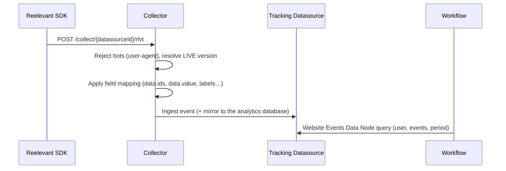

## Overview

Reelevant SDKs send behavioural events (product views, cart additions, purchases, custom events) to a **tracking Datasource** in DataHub. Once ingested, the events are queryable from a [Website Events Data Node](/product-guide/workflows/data-nodes/website-events) and usable in any Workflow.

Every SDK posts the same envelope to the same collector endpoint, so web and app events land in one Datasource and share one identity.

```bash
curl -X POST "https://collector.reelevant.com/collect/{datasourceId}/rlvt" \
  -H "content-type: application/json" \
  -d '{
    "key": "{companyId}",
    "name": "product_page",
    "url": "https://shop.example.com/p/SKU-12345",
    "tmpId": "cl9x8k2p00000qz6h7f3b1n4d",
    "clientId": "user@example.com",
    "data": { "ids": ["SKU-12345"], "locale": "EN-GB" },
    "eventId": "cl9x8k2p00001qz6h9d4c2m5e",
    "v": 1
  }'
```

The endpoint answers `200` with an empty body. It never returns the ingestion result — malformed fields are dropped per field and reported in the [Datasource logs](/advanced-guide/datahub/logs), not to the caller.

<CardGroup cols={3}>
  <Card title="Websites" icon="browser" href="/developer-docs/data-collection/web">
    Tracking tag or Google Tag Manager template, `window.reel` API, identity cookies.
  </Card>
  <Card title="Mobile apps" icon="mobile" href="/developer-docs/data-collection/mobile">
    Android, iOS, and Flutter SDKs — same event builders, on-device identity and retry queue.
  </Card>
  <Card title="Event reference" icon="table-list" href="/developer-docs/data-collection/events-reference">
    Envelope schema, event catalogue, payload validation rules, server-to-server calls.
  </Card>
</CardGroup>

## Prerequisites

You need a tracking Datasource before any SDK call is accepted. Create it in DataHub with the **Tracking** template, then read the two identifiers from the wizard:

| Identifier | Where it comes from | Used as |
|------------|---------------------|---------|
| `companyId` | The **Configure Reelevant Script** or **Setup Google Tag Manager** step | `key` in the envelope |
| `datasourceId` | Same step — it is the Datasource being configured | Path segment of the collector URL |

The wizard's last step (**Validate**) only succeeds once the collector has received events, so keep it open while you test your integration. Setup details are documented in [special configurations](/advanced-guide/datahub/special-configurations).

## Pipeline



Ingestion is real time: events are queryable seconds after the call. Two behaviours are worth knowing when you integrate:

- Requests whose `user-agent` is a known bot are answered `202` and dropped, so crawler traffic never pollutes the Datasource.
- Events are retained for 90 days in the Datasource. Configure an [analytics database sync](/advanced-guide/datahub/analytics-database-sync) if you need longer history.

## Identity

Every event carries two identity fields, and both the web tag and the mobile SDKs manage them for you:

| Field | Meaning | Web | Mobile |
|-------|---------|-----|--------|
| `tmpId` | Anonymous device identity, always sent | `rlvt_tmpId` cookie (cuid, 365 days) | Device identifier stored on device |
| `clientId` | Known user identity, sent once identified | `rlvt_clientId` cookie (180 days) | `setUser()` value in local storage |

Identify the user as soon as you know who they are — `identify` on the web, `setUser()` on mobile. Events sent before that point keep only `tmpId`, and Reelevant stitches them to the user afterwards through the shared `tmpId`.

The same identifiers are used when the Runner personalises content (`rlvt-u` parameter), so a user tracked by an SDK is immediately targetable in a Workflow.

## Consent

The SDKs do not read consent frameworks. Gate collection yourself:

- **Web** — inject the tracking tag only after consent is granted, or route events through your consent-aware tag manager.
- **Mobile** — instantiate the SDK, or call `send()`, only once the user opted in.

Nothing is buffered before the SDK loads, except events pushed to `window.reel.queue` on the web (see [website collection](/developer-docs/data-collection/web)).

## Related

- [Website collection](/developer-docs/data-collection/web) — tag, Google Tag Manager, `window.reel` API
- [Mobile collection](/developer-docs/data-collection/mobile) — Android, iOS, Flutter
- [Event reference](/developer-docs/data-collection/events-reference) — envelope, catalogue, validation
- [Website Events Data Node](/product-guide/workflows/data-nodes/website-events) — consuming collected events in a Workflow
