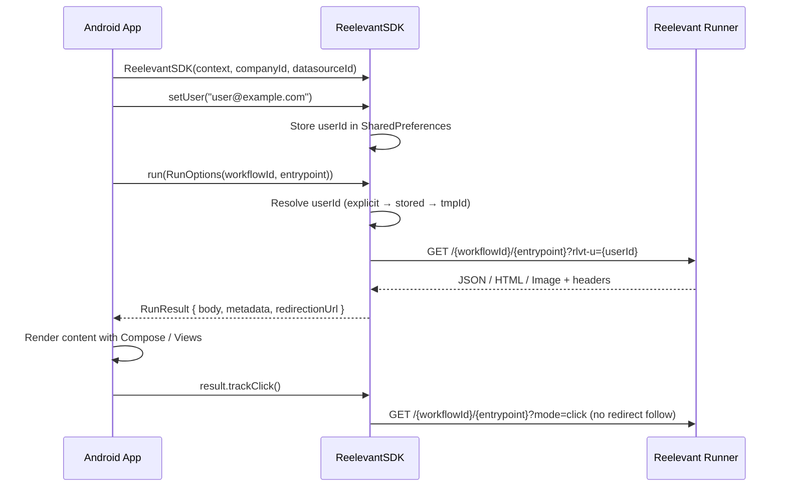

## Request flow



## Installation

Add the GitHub Packages repository and dependency to your `build.gradle.kts`:

```kotlin
// settings.gradle.kts
dependencyResolutionManagement {
    repositories {
        maven {
            url = uri("https://maven.pkg.github.com/reelevant-tech/reelevant-sdk-android")
        }
    }
}

// app/build.gradle.kts
dependencies {
    implementation("com.reelevant.analytics:analytics-android:0.0.3-SNAPSHOT")
}
```

## Initialization

```kotlin
import com.reelevant.analytics_android.*

val rlvt = ReelevantSDK(
    context = applicationContext,
    companyId = "your-company-id",
    datasourceId = "your-datasource-id",
    // Optional personalization config
    runnerUrl = "https://reelevant.run",       // default
    personalizationTimeout = 5000L,            // ms, default
    fallback = FallbackStrategy.Empty           // default
)

// Set user identity (shared between analytics and personalization)
rlvt.setUser("user@example.com")
```

## Analytics (event tracking)

```kotlin
// Page view
rlvt.send(rlvt.pageView(mapOf("lang" to "en")))

// Product page
rlvt.send(rlvt.productPage("product-123", mapOf("category" to "shoes")))

// Purchase
rlvt.send(rlvt.purchase(listOf("p1", "p2"), 99.99f, mapOf(), "order-456"))

// Add to cart
rlvt.send(rlvt.addCart(listOf("p1"), mapOf()))
```

## Personalization

### Single workflow run

```kotlin
val result = rlvt.run(RunOptions(
    workflowId = "wf-hero",
    entrypoint = "43a490a0"
))

when (result.body) {
    is RunContent.Json  -> renderCard((result.body as RunContent.Json).content)
    is RunContent.Html  -> renderWebView((result.body as RunContent.Html).content)
    is RunContent.Image -> renderImage((result.body as RunContent.Image).content)
    is RunContent.Empty -> showDefault()
}
```

### Multiple workflows in parallel

```kotlin
val results = rlvt.runAll(listOf(
    RunOptions(workflowId = "wf-hero", entrypoint = "entry1"),
    RunOptions(workflowId = "wf-reco", entrypoint = "entry2")
))
// results[0] corresponds to wf-hero, results[1] to wf-reco
```

### Click tracking

```kotlin
// Fire-and-forget — registers the click without following redirects
result.trackClick()
```

### RunOptions

| Parameter | Type | Required | Description |
|-----------|------|----------|-------------|
| `workflowId` | `String` | Yes | Workflow ID from the platform |
| `entrypoint` | `String` | Yes | Entrypoint ID within the workflow |
| `userId` | `String?` | No | Override identity (default: auto-resolved from `setUser()` / device ID) |
| `params` | `Map<String, String>?` | No | Additional URL parameters forwarded to the runner |
| `locale` | `String?` | No | Locale for content resolution |
| `timeout` | `Long?` | No | Per-call timeout override in milliseconds |

### RunResult

| Field | Type | Description |
|-------|------|-------------|
| `status` | `Int` | HTTP status code (0 for fallback) |
| `source` | `RunSource` | `.RUNNER` or `.FALLBACK` |
| `body` | `RunContent` | Discriminated content: `Json`, `Html`, `Image`, or `Empty` |
| `metadata` | `Map<String, Any>` | Metadata from `x-rlvt-output-node-metadata` header |
| `properties` | `Map<String, Any>` | Properties from `x-rlvt-output-properties` header |
| `runId` | `String?` | Workflow run ID for tracking correlation |
| `executionPath` | `List<String>` | Branch IDs taken during execution |
| `redirectionUrl` | `String` | Pre-built click-through URL |

### Fallback strategies

```kotlin
// Return empty result on error (default)
FallbackStrategy.Empty

// Re-throw the error
FallbackStrategy.Error

// Custom handler
FallbackStrategy.Custom { options, error ->
    RunResult(/* your fallback result */)
}
```
