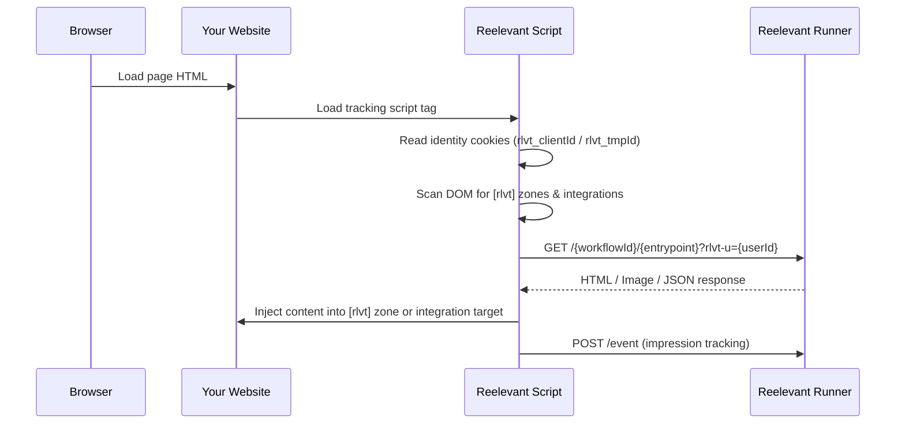

## Overview

Client-side personalisation uses a JavaScript tracking script that loads in the browser. It fetches personalised content after the page renders and injects it into designated DOM zones. This is the original integration method and works alongside the [Server Side SDK](/platform-guide/omni-channels/websites/server-side-sdk/overview).



## When to use client-side personalisation

| Use case | Recommended approach |
|----------|---------------------|
| Content that must be visible immediately (no flash) | [Server-side SDK](/platform-guide/omni-channels/websites/server-side-sdk/overview) |
| SEO-critical personalised content | [Server-side SDK](/platform-guide/omni-channels/websites/server-side-sdk/overview) |
| Event tracking (clicks, impressions, conversions) | Client-side script |
| Consent-dependent content | Client-side script |
| Overlays, popups, and floating elements | Client-side script |
| Pages without server-side rendering (SPAs) | Client-side script |
| Quick integration without code changes | Client-side script + [Browser Extension](/product-guide/browser-extension/overview) |

## Integration methods

### 1. Script tag (manual)

Add the Reelevant tracking script to your page. The integration URL is generated from the [Integration modal](/platform-guide/workflows/integration) in the workflow editor.

```html
<!-- Add in your <head> or before </body> -->
<script src="https://reelevant.run/your-script-url.js" async></script>
```

The script automatically:
- Creates an anonymous identity (`rlvt_tmpId` cookie) if none exists
- Scans the DOM for `[rlvt]` attribute zones
- Fetches personalised content from the runner
- Injects content into matching zones
- Tracks impressions and clicks

### 2. HTML zones

Mark elements on your page where personalised content should appear:

```html
<div rlvt
     rlvt-wid="your-workflow-id"
     rlvt-ep="hero">
  <!-- Fallback content shown until personalised content loads -->
  <p>Default content</p>
</div>
```

| Attribute | Description |
|-----------|-------------|
| `rlvt` | Marks the element as a Reelevant zone |
| `rlvt-wid` | Workflow ID |
| `rlvt-ep` | Entrypoint shortId within the workflow |

### 3. Browser extension integrations

The [Reelevant Browser Extension](/product-guide/browser-extension/overview) provides a no-code way to set up client-side integrations:

<Steps>
  <Step title="Install the extension">
    Install from the [Chrome Web Store](https://chromewebstore.google.com/detail/reelevant/lgacfbhgdhamkljnljckjhogkmifijla?hl=en) or [Microsoft Edge Add-ons](https://microsoftedge.microsoft.com/addons/detail/aocpmahppepplambefpfnbnifdgolncb) and sign in with your Reelevant email and password or SSO.
  </Step>
  <Step title="Navigate to your website">
    Open the page where you want personalised content to appear.
  </Step>
  <Step title="Select a workflow">
    In the extension side panel, browse your [workflow list](/product-guide/browser-extension/workflows) and select the one to integrate.
  </Step>
  <Step title="Configure the on-site integration">
    Use the [content script UI](/developer-docs/guides/browser-extension-content-script) to pick a DOM selector, set emplacement, and define integration conditions. Click **Save** to persist the configuration.
  </Step>
  <Step title="Copy integration URLs (optional)">
    For channels that need direct URLs, open the [integration instructions](/developer-docs/guides/browser-extension-integration) to copy image and redirection links.
  </Step>
</Steps>

### Integration triggers

Browser extension integrations support three types of triggers:

| Trigger | Description |
|---------|-------------|
| **URL pattern** | Content loads when the page URL matches a pattern (e.g., `/products/*`) |
| **DataLayer variable** | Content loads when a specific value is present in the `dataLayer` (e.g., GTM events) |
| **CSS selector** | Content is injected into a specific DOM element selected via the extension |

## Identity management

The client-side script manages two identity cookies:

| Cookie | Purpose | Lifetime |
|--------|---------|----------|
| `rlvt_tmpId` | Anonymous visitor ID, created automatically | 365 days |
| `rlvt_clientId` | Known user ID, set by your application | 365 days |

To associate a known user identity:

```javascript
// Option 1: URL parameter
// Add ?rlvt_clientId=user@example.com to the page URL

// Option 2: dataLayer
window.dataLayer = window.dataLayer || []
window.dataLayer.push({ rlvt_clientId: 'user@example.com' })
```

## Combining with server-side SDK

When using both the server-side Web SDK and the client-side script on the same page:

1. **Server-rendered zones** should include `data-rlvt-ssr="true"` on the wrapper element
2. The client-side script automatically **skips** zones marked with `data-rlvt-ssr`
3. The client script still handles **event tracking**, client-only zones, and integrations

```html
<!-- Server-rendered zone (SDK) — script will skip this -->
<div data-rlvt-ssr="true">
  <div class="hero-banner">Personalised hero content from SSR</div>
</div>

<!-- Client-rendered zone — script will handle this -->
<div rlvt rlvt-wid="wf-sidebar" rlvt-ep="sidebar">
  <p>Loading...</p>
</div>
```

## DataLayer integration

The script reads values from the `window.dataLayer` array (Google Tag Manager compatible):

```javascript
window.dataLayer = window.dataLayer || []
window.dataLayer.push({
  locale: 'en-GB',
  country: 'UK',
  event: 'product_view',
  productId: 'SKU-12345',
})
```

These values are automatically forwarded to workflows as URL parameters for use in [data nodes](/platform-guide/workflows/data-nodes/url-parameter).
