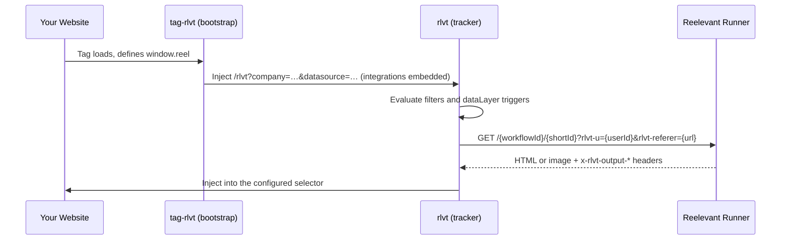

## Overview

The same tag that [collects website events](/developer-docs/data-collection/web) also injects personalised content in the browser. Content is placed through **on-site integrations**: a CSS selector, an emplacement and trigger conditions, all configured from the [Browser Extension](/product-guide/browser-extension/overview) and stored on the Workflow — no markup or deploy on your side.


```mermaid
sequenceDiagram
    participant Page as Your Website
    participant Tag as tag-rlvt (bootstrap)
    participant Script as rlvt (tracker)
    participant Runner as Reelevant Runner

    Page->>Tag: Tag loads, defines window.reel
    Tag->>Script: Inject /rlvt?company=…&datasource=… (integrations embedded)
    Script->>Script: Evaluate filters and dataLayer triggers
    Script->>Runner: GET /{workflowId}/{shortId}?rlvt-u={userId}&rlvt-referer={url}
    Runner-->>Script: HTML or image + x-rlvt-output-* headers
    Script->>Page: Inject into the configured selector
```

Installation, the `window.reel` API and identity resolution are covered in [Website Collection](/developer-docs/data-collection/web) — there is nothing extra to install for personalisation.

<Note>
Server-rendered personalisation is usually the better default: the [Server Side SDK](/developer-docs/web-integration/server-side-sdk/overview) returns content in the initial HTML, with no layout shift and no dependency on the visitor's network.
</Note>

## On-site integrations

Integrations are resolved when the tracker is served, not at runtime: the script service lists every Workflow that has a `web` entrypoint integration for the company and embeds them, base64-encoded, into the `rlvt` file. The file is then cached for 60 seconds instead of the default 300, so extension changes propagate quickly.

Each integration is attached on tracker boot, on `load`, and on every `window.reel.loadZones()` call — call `loadZones()` after client-side navigation in an SPA.

| Field | Behaviour |
|-------|-----------|
| `selector` | CSS selector of the target element. Skipped when the element is absent, or already carries `rlvt_loaded` |
| `emplacement` | `replace` fills the matched element, `before` / `after` inject an adjacent `<div>` |
| `filters` | Conditions (`contains`, `notcontains`, `empty`, `nempty`, `eq`, `ne`) evaluated against the page query parameters plus `url`, `rlvt-u` and `isLogged` |
| `waitForEvents` | The integration is attached only once that event name is pushed on the dataLayer — the tracker patches `dataLayer.push` to detect it |
| `includeContext` | Forwards the page query parameters to the Runner |
| `includeDatalayerPath` | Forwards specific dataLayer paths to the Runner, using the deepest path segment as the parameter name |
| `code` | Executed with `eval` right after the injection |
| `enabled` | Disabled integrations are skipped, unless `sessionStorage._rlvt_debug_` is `'true'` |

The Runner is called with the identity returned by `window.reel.getClientId()`, falling back to `rlvt_tmpId`:

```
GET https://reelevant.run/{workflowId}/{shortId}?rlvt-u=user@example.com&rlvt-referer=https://www.example.com/products/1234
```

The response headers drive the injection:

| Header | Effect |
|--------|--------|
| `x-rlvt-output-node-metadata` empty | Nothing is injected — the Workflow decided not to display content |
| `x-rlvt-output-properties` with `backgroundColor` | Applied as the background colour of the target element |
| `x-rlvt-workflow-run-id` | Exposed on the target element as the `rlvt_run_id` attribute |

`text/html` responses are injected into a shadow root attached to the target element, with the `.rlvt-body` font size scaled to the container width so the Content stays responsive. `image/png` and `image/gif` responses are injected as an `` wrapped in an `<a>` pointing at the same URL with `mode=click`, which is what records the click.

<Warning>
Content is injected into a shadow root: your page stylesheets do not apply to it, and it is not reachable with `document.querySelector`. Query the target element's `shadowRoot` instead.
</Warning>

## Reacting to injections

```typescript
document.addEventListener('reelevant_ready', (event) => {
  const reel = (event as CustomEvent<{ reel: Window['reel'] }>).detail.reel
  console.info('Reelevant tracker ready', reel.getClientId())
})

document.addEventListener('reelevant_personalization', (event) => {
  const { url, targetDiv } = (event as CustomEvent<{ url: string; targetDiv: HTMLElement }>).detail
  // Content is in targetDiv.shadowRoot for HTML outputs
  console.info('Reelevant injected content', { url, runId: targetDiv.getAttribute('rlvt_run_id') })
})
```

| Event | Dispatched on `document` |
|-------|--------------------------|
| `reelevant_ready` | Once the tracker is initialised; `detail.reel` is the tracker instance |
| `reelevant_personalization` | On every integration injection, with `detail.url`, `detail.targetDiv` and `detail.response` |

The tracker also re-attaches integrations on the `abtasty_executedCampaign` event when AB Tasty is present, so integrations survive campaigns that rewrite the DOM.

## Debugging

| Signal | Usage |
|--------|-------|
| `sessionStorage._rlvt_debug_ = 'true'` | Attaches integrations that are disabled, so you can preview them before enabling |
| `rlvt_run_id` attribute | Workflow run ID of the injected Content — quote it when reporting an unexpected output |
| `[RLVT] Failed to load zone` | The Runner answered above `205`; the response is logged next to the message |
| `Reelevant error: Missing key` / `Missing datasource` | `window.reel.companyId` or `window.reel.datasourceId` is absent — the tag snippet was altered |

<Warning>
The tracker skips any element carrying `data-rlvt-ssr`, which is how the [Server Side SDK](/developer-docs/web-integration/server-side-sdk/overview) marks the content it already rendered. The attribute must sit on the element itself, not on a wrapper.
</Warning>

## Related

- [Website Collection](/developer-docs/data-collection/web) — installing the tag, `window.reel`, identity
- [Server Side SDK](/developer-docs/web-integration/server-side-sdk/overview) — personalisation rendered server-side
- [Reelevant as API (JSON)](/developer-docs/web-integration/api-json/overview) — headless personalisation
- [Browser Extension content script](/developer-docs/guides/browser-extension-content-script) — configuring integrations
