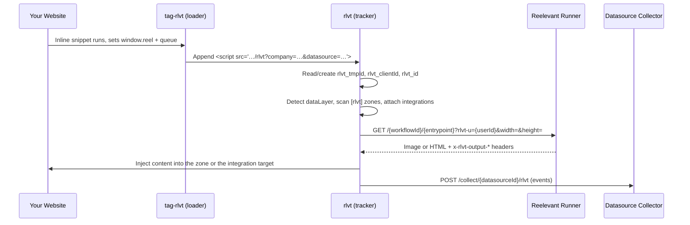

## Overview

The client side script is a browser script served per company and per Tracking Datasource. It sends tracking events to the Datasource collector, maintains identity cookies, and injects personalised content into `[rlvt]` DOM zones or into selectors configured with the [Browser Extension](/product-guide/browser-extension/overview).

Two files are involved:

| File | Role |
|------|------|
| `tag-rlvt` | Small loader you paste on your pages. Creates `window.reel` with a queue, then appends `rlvt` asynchronously |
| `rlvt` | Full tracker. Replaces the queued calls with the real implementation, scans the DOM, attaches integrations |

Both are served by the script service with the company ID and the Datasource ID as query parameters. The service interpolates the collector URL, the Runner URL and the workflow web integrations into the file before streaming it.


```mermaid
sequenceDiagram
    participant Page as Your Website
    participant Tag as tag-rlvt (loader)
    participant Script as rlvt (tracker)
    participant Runner as Reelevant Runner
    participant Collector as Datasource Collector

    Page->>Tag: Inline snippet runs, sets window.reel + queue
    Tag->>Script: Append <script src="…/rlvt?company=…&datasource=…">
    Script->>Script: Read/create rlvt_tmpId, rlvt_clientId, rlvt_id
    Script->>Script: Detect dataLayer, scan [rlvt] zones, attach integrations
    Script->>Runner: GET /{workflowId}/{entrypoint}?rlvt-u={userId}&width=&height=
    Runner-->>Script: Image or HTML + x-rlvt-output-* headers
    Script->>Page: Inject content into the zone or the integration target
    Script->>Collector: POST /collect/{datasourceId}/rlvt (events)
```

## Installation

The snippet is generated by the **Configure Reelevant Script** step of the Tracking Datasource in [DataHub](/product-guide/datahub/overview) — it embeds your company ID and Datasource ID. Copy it as-is; it is the response body of:

```
GET https://scripts-repo.reelevant.com/tag-rlvt?company={companyId}&datasource={datasourceId}
```

Its logic is equivalent to:

```html
<script>
  (function () {
    if (window.reel) return
    var reel = {
      companyId: '61f2d2320d460f56ce926e5f',
      datasourceId: '652f9b5c31f90003009839a1',
      queue: [],
      event: function (name, data) { reel.queue.push([name, data]) },
      identify: function (clientId) { reel.event('identify', clientId) }
    }
    window.reel = reel
    var firstScriptTag = document.getElementsByTagName('script')[0]
    var element = document.createElement('script')
    element.src =
      'https://scripts-repo.reelevant.com/rlvt?company=61f2d2320d460f56ce926e5f&datasource=652f9b5c31f90003009839a1'
    element.type = 'text/javascript'
    element.async = true
    firstScriptTag.parentNode.insertBefore(element, firstScriptTag)
  })()
</script>
```

Calls made before `rlvt` is loaded are pushed to `window.reel.queue` and drained once per second by the tracker, so Google Tag Manager tags can fire immediately.

The Datasource step only validates once the collector has received at least one event: navigate a few pages before clicking **Validate**.

## Tracking API

`window.reel` exposes four methods once the tracker is loaded:

```typescript
declare global {
  interface Window {
    reel: {
      event: (name: string, data?: unknown) => void
      identify: (clientId: string) => void
      loadZones: () => Promise<void>
      getClientId: () => string | undefined
    }
  }
}

window.reel.event('product_page', { ids: ['SKU-12345'], locale: 'en-GB' })
window.reel.event('purchase', { ids: ['SKU-12345'], value: 49.9, transId: 'ORDER-8891' })
window.reel.identify('user@example.com')
```

| Method | Behaviour |
|--------|-----------|
| `event(name, data)` | Builds and sends an event. `data` must be a plain object (`identify` excepted) |
| `identify(clientId)` | Stores `rlvt_clientId` and sends an `identify` event when the value changed |
| `loadZones()` | Re-runs zone loading and integration attachment — call it after client side navigation in an SPA |
| `getClientId()` | Returns `rlvt_clientId`, falling back to `rlvt_id` |

### Event payload

Events are sent as JSON over `XMLHttpRequest` to the collector endpoint of the Tracking Datasource:

```
POST https://{collector-host}/collect/{datasourceId}/rlvt
```

```json
{
  "key": "61f2d2320d460f56ce926e5f",
  "name": "purchase",
  "url": "https://www.example.com/checkout/confirmation",
  "tmpId": "cl9k2v3x40000qwer1234abcd",
  "clientId": "user@example.com",
  "data": { "ids": ["SKU-12345"], "value": "49.90", "transId": "ORDER-8891", "locale": "EN-GB" },
  "eventId": "cl9k2v3x40001qwer5678efgh",
  "v": 1
}
```

Reserved keys inside `data`: `ids` (product references), `value` (amount) and `transId` (transaction ID). Every other key is stored as a label.

### Validation and error handling

The tracker never throws; it logs to the console and drops the event. Watch for these cases:

| Situation | Result |
|-----------|--------|
| `name` is `page_view` | Ignored — page views are not collected |
| Same `name` + `data` already sent on this page | Ignored (de-duplication) |
| `data` is not an object, or not serialisable | `console.error`, event dropped |
| `ids` is neither a string nor an array | `console.error`, event dropped |
| `ids` values are all invalid (`"undefined"`, `"null"`, `"0"`, `"-1"`, `"NaN"`, `"unknown"`, …) | `console.error`, event dropped |
| `ids` contains `;`, `,` or `\|` | `console.warn`, the string is split into several IDs — except for `category_view` and `brand_view` |
| `value` contains `;`, `,` or `\|`, or is not a number | `console.warn`, event dropped |
| `value` is valid | Truncated to two decimals |
| `identify` with an empty or invalid `clientId` | `console.error`, no cookie written |
| Network error, or HTTP status ≥ 500 | Event stored in `localStorage.rlvt_fail_queue` |

The fail queue is retried one event per minute, and entries older than 30 minutes are discarded.

## Identity management

| Cookie | Purpose | Lifetime |
|--------|---------|----------|
| `rlvt_tmpId` | Anonymous visitor ID, generated on first load | 365 days |
| `rlvt_clientId` | Known identity, resolved from the sources below | 180 days |
| `rlvt_id` | Encrypted Reelevant user identifier, read from the `rlvt_id` query parameter that the Runner appends to click redirections | 30 days |

Cookies are written on the top level domain (`.example.com`, and `.example.co.uk` for two-part TLDs).

`rlvt_clientId` is resolved in this order, each source overwriting the previous one:

1. The existing `rlvt_clientId` cookie
2. `window.reelevant_user`
3. The `rlvt-u`, `rlvt_u` or `clientUid` query parameter
4. `rlvt-u=` in the URL fragment
5. `window.reel.identify(clientId)`

```html
<!-- Set the identity before the loader runs -->
<script>window.reelevant_user = 'user@example.com'</script>
```

When `rlvt_id` is present, events are sent with `id` and without `clientId`, so they are attributed to the identity resolved by the Runner rather than to the on-site one.

## HTML zones

Mark an element with the `rlvt` attribute to have the tracker call the Runner and inject the result. Zones are loaded on the next tick after the tracker boots, on `load`, on `abtasty_executedCampaign`, and on every `window.reel.loadZones()` call.

```html
<div rlvt
     workflow="62b339a71334cb00073db8ef"
     entrypoint="0"
     variables="locale,productId"
     anonymous></div>
```

| Attribute | Description |
|-----------|-------------|
| `rlvt` | Marks the element as a zone |
| `workflow` | Workflow ID |
| `entrypoint` | Entrypoint short ID; defaults to `0` |
| `variables` | Comma separated list of query parameter or dataLayer paths to forward (`[order][currency]` for nested paths) |
| `replace` | CSS selector of the element to fill instead of this one |
| `anonymous` | Load the zone even when no known identity is available (falls back to `rlvt_tmpId`) |
| `loading` / `done` | Set by the tracker; a zone is never loaded twice |
| Any other attribute | Forwarded to the Runner as a query parameter |

<Warning>
A zone is skipped when it already has child nodes. Do not put fallback markup inside it — use a sibling element that you hide yourself if you need a placeholder.
</Warning>

Without a known identity and without `anonymous`, nothing is requested. The identity used is the `rlvt-u` query parameter of the page, then `rlvt_clientId`, then `rlvt_tmpId`.

The tracker calls the Runner with the resolved parameters plus the viewport `width` and `height`, and a `rlvt_referer` header carrying the current origin and pathname:

```
GET https://reelevant.run/{workflowId}/{entrypoint}?rlvt-u=user@example.com&locale=en-GB&width=1280&height=720
```

The response drives the injection:

| Response | Result |
|----------|--------|
| `x-rlvt-output-node-metadata` empty | The zone element is removed from the DOM |
| `x-rlvt-output-properties.backgroundColor` set | Applied as the background colour of the target element |
| Otherwise | Content injected as an `` wrapped in an `<a>` pointing at the same URL with `mode=click` |

Zones carrying `data-rlvt-ssr` are always skipped — see [combining with the server side SDK](#combining-with-the-server-side-sdk).

## Browser Extension integrations

Integrations configured with the [Browser Extension](/product-guide/browser-extension/overview) are stored on the Workflow. The script service reads every Workflow that has a `web` entrypoint integration and embeds them into the served `rlvt` file, so no extra request is made at runtime. The file is then cached for 60 seconds instead of the default 300 seconds.

Each integration is evaluated as follows:

| Field | Behaviour |
|-------|-----------|
| `filters` | Conditions (`contains`, `notcontains`, `empty`, `nempty`, `eq`, `ne`) evaluated against the page query parameters plus `url`, `rlvt-u` and `isLogged` |
| `waitForEvents` | The integration is attached only once that event name is pushed on the dataLayer — the tracker patches `dataLayer.push` to detect it |
| `selector` | CSS selector of the target element; skipped when not found or already marked `rlvt_loaded` |
| `emplacement` | `replace` fills the matched element, `before` / `after` inject an adjacent `<div>` |
| `includeContext` | Forwards the page query parameters to the Runner |
| `includeDatalayerPath` | Forwards specific dataLayer paths to the Runner |
| `code` | Executed with `eval` after the injection |
| `enabled` | Disabled integrations are skipped, unless `sessionStorage._rlvt_debug_` is `'true'` |

Unlike HTML zones, integrations render both content types: `text/html` responses are injected into a shadow root (with font size scaled to the container width), while `image/png` and `image/gif` responses are injected as an `` wrapped in a click link. The Workflow run ID is exposed on the target element as `rlvt_run_id`, and a `reelevant_personalization` DOM event is dispatched on every injection.

## DataLayer integration

The tracker uses the first `window` key containing `dataLayer` or `tc_vars` (Google Tag Manager and Commanders Act are both supported). Values from every object pushed on it are merged into a single lookup table, used for three things:

- **Well-knowns**: a key containing `locale` or `language` sets `data.locale`, a key containing `country` sets `data.country` (only when no locale was found). Both are upper-cased.
- **Zone variables**: only the paths listed in the `variables` attribute of a zone are forwarded, and only the deepest path segment is used as the parameter name.
- **Integration triggers**: `waitForEvents` and `includeDatalayerPath`.

```javascript
window.dataLayer = window.dataLayer || []
window.dataLayer.push({ locale: 'en-GB', productId: 'SKU-12345', event: 'product_view' })
```

<Note>
Pushing on the dataLayer never sends an event by itself. Use a Google Tag Manager tag calling `window.reel.event(...)`, or the [Google Tag Manager Datasource](/product-guide/workflows/data-nodes/website-events) template.
</Note>

## Combining with the server side SDK

The [Server Side SDK](/developer-docs/web-integration/server-side-sdk/overview) marks the content it renders with `data-rlvt-ssr`. The tracker skips those zones, and keeps handling event tracking, client-only zones and integrations.

```html
<!-- Server rendered zone (SDK) — the tracker skips it -->
<div rlvt data-rlvt-ssr workflow="62b339a71334cb00073db8ef" entrypoint="0">
  <div class="hero-banner">Personalised hero content from SSR</div>
</div>

<!-- Client rendered zone — the tracker loads it -->
<div rlvt workflow="6512f0a71334cb00073db901" entrypoint="1" anonymous></div>
```

<Warning>
`data-rlvt-ssr` must sit on the element carrying the `rlvt` attribute, not on a wrapper.
</Warning>

## Debugging

| Signal | Usage |
|--------|-------|
| `reelevant_ready` DOM event | Dispatched on `document` once `window.reel` is usable; `detail.reel` is the tracker |
| `reelevant_personalization` DOM event | Dispatched on every integration injection with `detail.url`, `detail.targetDiv` and `detail.response` |
| `sessionStorage._rlvt_debug_ = 'true'` | Attaches integrations that are disabled |
| `Reelevant error: Missing key` / `Missing datasource` | `window.reel.companyId` or `window.reel.datasourceId` is absent — the loader snippet was altered |

## Related

- [Website personalisation overview](/developer-docs/web-integration/overview)
- [Server Side SDK](/developer-docs/web-integration/server-side-sdk/overview)
- [Reelevant as API (JSON)](/developer-docs/web-integration/api-json/overview)
- [Browser Extension content script](/developer-docs/guides/browser-extension-content-script)
