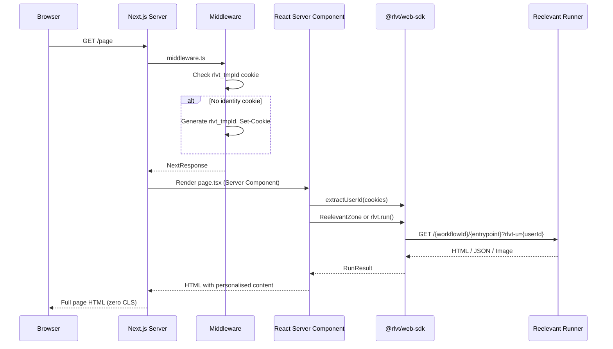

## Installation

```bash
npm install @rlvt/web-sdk react
```

## Setup

### 1. Create the client instance

Create a shared client instance in a server-only module:

```typescript
// lib/reelevant.ts
import { ReelevantClient } from '@rlvt/web-sdk'

export const rlvt = new ReelevantClient({
  timeout: 50,  // tight timeout for SSR — falls back gracefully
})
```

### 2. Add identity middleware

Create `middleware.ts` at the root of your project:

```typescript
// middleware.ts
import { createMiddleware } from '@rlvt/web-sdk/next'
import { NextResponse } from 'next/server'
import type { NextRequest } from 'next/server'

const ensureIdentity = createMiddleware()

export function middleware(request: NextRequest) {
  const response = NextResponse.next()
  ensureIdentity(request, response)
  return response
}

export const config = {
  matcher: ['/((?!_next/static|_next/image|favicon.ico).*)'],
}
```

This ensures every visitor has an `rlvt_tmpId` cookie before any personalised content is requested.

## Request flow



## Using ReelevantZone (recommended)

The `ReelevantZone` is an async React Server Component that fetches and renders personalised content:

```tsx
// app/page.tsx
import { ReelevantZone } from '@rlvt/web-sdk/next'
import { extractUserId } from '@rlvt/web-sdk'
import { cookies } from 'next/headers'
import { rlvt } from '@/lib/reelevant'

export default async function Page() {
  const cookieStore = await cookies()
  const userId = extractUserId(cookieStore.toString())

  return (
    <main>
      <ReelevantZone
        client={rlvt}
        workflowId="wf-hero-banner"
        entrypoint="43a490a0"
        userId={userId}
        className="hero-section"
        fallback={<DefaultHero />}
      />
    </main>
  )
}

function DefaultHero() {
  return <div className="hero-section">Welcome to our store</div>
}
```

### ZoneProps

| Prop | Type | Description |
|------|------|-------------|
| `client` | `ReelevantClient` | Pre-configured client instance |
| `workflowId` | `string` | Workflow ID |
| `entrypoint` | `string` | Entrypoint shortId (8-char alphanumeric, e.g. `43a490a0`) |
| `userId` | `string?` | Visitor identity |
| `params` | `Record<string, string>?` | URL parameters |
| `locale` | `string?` | Locale |
| `userAgent` | `string?` | User-Agent |
| `ip` | `string?` | Client IP |
| `referer` | `string?` | Page URL |
| `className` | `string?` | CSS class on wrapper |
| `fallback` | `ReactNode?` | Shown when content is empty |
| `render` | `(result: RunResult) => ReactNode` | Custom render for JSON |

### Custom rendering with JSON

For headless personalisation where you want to build your own UI:

```tsx
<ReelevantZone
  client={rlvt}
  workflowId="wf-products"
  entrypoint="f6a83d09"
  userId={userId}
  render={(result) => {
    if (result.body.type !== 'json') return null
    const { products } = result.body.content as { products: Product[] }
    return (
      <div className="grid grid-cols-3 gap-4">
        {products.map(p => <ProductCard key={p.id} product={p} />)}
      </div>
    )
  }}
/>
```

## Manual usage (without ReelevantZone)

If you prefer direct control:

```tsx
// app/page.tsx
import { rlvt } from '@/lib/reelevant'
import { extractUserId } from '@rlvt/web-sdk'
import { cookies, headers } from 'next/headers'

export default async function Page() {
  const cookieStore = await cookies()
  const headersList = await headers()
  const userId = extractUserId(cookieStore.toString())

  const result = await rlvt.run({
    workflowId: 'wf-hero',
    entrypoint: '43a490a0',
    userId,
    userAgent: headersList.get('user-agent') ?? undefined,
  })

  if (result.body.type === 'html') {
    return (
      <div
        data-rlvt-ssr="true"
        dangerouslySetInnerHTML={{ __html: result.body.content }}
      />
    )
  }

  return <DefaultContent />
}
```

## Multiple zones on a page

Fetch multiple zones in parallel for optimal performance:

```tsx
export default async function Page() {
  const cookieStore = await cookies()
  const userId = extractUserId(cookieStore.toString())

  const [hero, sidebar] = await rlvt.runAll([
    { workflowId: 'wf-hero', entrypoint: '43a490a0', userId },
    { workflowId: 'wf-sidebar', entrypoint: 'e5f302b8', userId },
  ])

  return (
    <main>
      <ReelevantZone client={rlvt} workflowId="wf-hero" entrypoint="43a490a0" userId={userId} />
      <aside>
        <ReelevantZone client={rlvt} workflowId="wf-sidebar" entrypoint="e5f302b8" userId={userId} />
      </aside>
    </main>
  )
}
```

<Note>
Each `ReelevantZone` is an independent async component that fetches in parallel when rendered at the same level. You don't need to use `runAll` explicitly with components — Next.js handles the parallel fetching automatically.
</Note>

## Click tracking

<Warning>
**Click tracking must always be set up after display.** Every content display should have a corresponding click tracking mechanism — either a redirect link or a `trackClick()` call.
</Warning>

Every `RunResult` includes `redirectionUrl` and `trackClick()`. Two patterns:

### Redirect link

Use `redirectionUrl` directly as an `<a href>`:

```tsx
export default async function Page() {
  const cookieStore = await cookies()
  const userId = extractUserId(cookieStore.toString())

  const result = await rlvt.run({ workflowId: 'wf-promo', entrypoint: '1a7bc4d2', userId })

  return (
    <div data-rlvt-ssr="true">
      {result.body.type === 'html' && (
        <>
          <div dangerouslySetInnerHTML={{ __html: result.body.content }} />
          <a href={result.redirectionUrl}>Shop now</a>
        </>
      )}
    </div>
  )
}
```

### Server-side fire-and-forget

Call `result.trackClick()` from a Server Action — it records the click and swallows all errors:

```tsx
// app/actions.ts
'use server'
import { rlvt } from '@/lib/reelevant'

export async function handleClick(workflowId: string, entrypoint: string, userId: string) {
  const result = await rlvt.run({ workflowId, entrypoint, userId })
  await result.trackClick()
}
```

See [Core SDK — Click tracking](/platform-guide/omni-channels/websites/server-side-sdk/core#click-tracking) for full details.

## Compatibility with the client tracker

The SDK adds `data-rlvt-ssr="true"` to rendered elements. The client-side Reelevant tracker automatically skips zones with this attribute, so there is no double-loading or flickering.

You can still use the client tracker on the same page for:
- Event tracking (clicks, impressions, conversions)
- Client-only zones (consent-dependent content, overlays)
- On-site integrations (datalayer triggers, URL rules)
