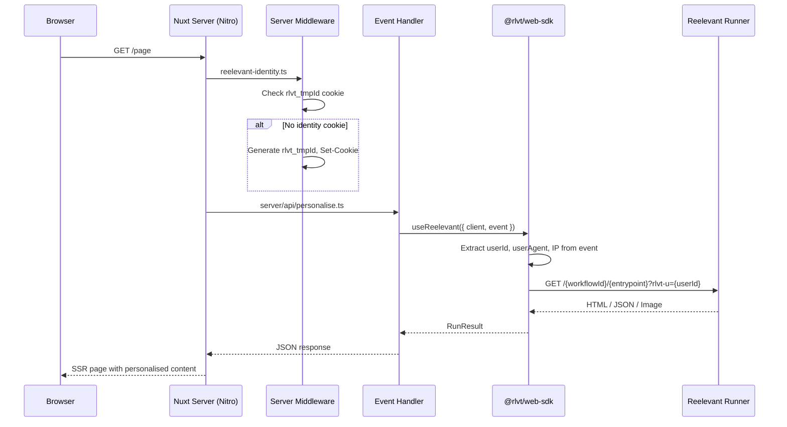

## Installation

```bash
npm install @rlvt/web-sdk
```

No additional dependencies are needed. The Nuxt adapter uses structural typing — it does not import from the `nuxt` or `h3` packages.

## Setup

### 1. Create the client instance

```typescript
// server/utils/reelevant.ts
import { ReelevantClient } from '@rlvt/web-sdk'

export const rlvt = new ReelevantClient({
  timeout: 50,
})
```

### 2. Add identity middleware

Create a server middleware that ensures every visitor has an identity cookie:

```typescript
// server/middleware/reelevant-identity.ts
import { ensureIdentity } from '@rlvt/web-sdk/nuxt'

export default defineEventHandler((event) => {
  ensureIdentity(event, useCookies(event))
})
```

## Request flow



## Using useReelevant

The `useReelevant` helper auto-extracts visitor identity, user-agent, IP, and referer from the H3 event:

```typescript
// server/api/personalise.ts
import { useReelevant } from '@rlvt/web-sdk/nuxt'
import { rlvt } from '~/server/utils/reelevant'

export default defineEventHandler(async (event) => {
  const { run, runAll } = useReelevant({ client: rlvt, event })

  const hero = await run({ workflowId: 'wf-hero', entrypoint: '43a490a0' })
  return { hero }
})
```

### Fetching multiple zones

```typescript
export default defineEventHandler(async (event) => {
  const { runAll } = useReelevant({ client: rlvt, event })

  const [hero, sidebar, footer] = await runAll([
    { workflowId: 'wf-hero', entrypoint: '43a490a0' },
    { workflowId: 'wf-sidebar', entrypoint: 'b7e21f3c' },
    { workflowId: 'wf-footer', entrypoint: 'd9c84e1a' },
  ])

  return { hero, sidebar, footer }
})
```

## In a Nuxt page (SSR)

Fetch personalised content in a server route or plugin, then use it in your page:

```vue
<!-- pages/index.vue -->
<script setup lang="ts">
const { data } = await useFetch('/api/personalise')
</script>

<template>
  <main>
    <div
      v-if="data?.hero?.body?.type === 'html'"
      data-rlvt-ssr="true"
      v-html="data.hero.body.content"
    />
    <DefaultHero v-else />
  </main>
</template>
```

## Lower-level helpers

### `extractUserIdFromEvent(event)`

Extract the user ID directly from an H3 event's cookie header:

```typescript
import { extractUserIdFromEvent } from '@rlvt/web-sdk/nuxt'

export default defineEventHandler((event) => {
  const userId = extractUserIdFromEvent(event)
  // ...
})
```

### `runOptionsFromEvent(event)`

Get all context fields (userId, userAgent, ip, referer) from an event:

```typescript
import { runOptionsFromEvent } from '@rlvt/web-sdk/nuxt'

export default defineEventHandler(async (event) => {
  const context = runOptionsFromEvent(event)
  const result = await rlvt.run({
    workflowId: 'wf-hero',
    entrypoint: '43a490a0',
    ...context,
  })
  return result
})
```

## Handling JSON responses

For headless personalisation where the workflow returns JSON:

```vue
<script setup lang="ts">
const { data } = await useFetch('/api/personalise')
const products = computed(() => {
  if (data.value?.hero?.body?.type === 'json') {
    return (data.value.hero.body.content as { products: Product[] }).products
  }
  return []
})
</script>

<template>
  <div class="grid grid-cols-3 gap-4">
    <ProductCard v-for="p in products" :key="p.id" :product="p" />
  </div>
</template>
```

## Click tracking

<Warning>
**Click tracking must always be set up after display.** Every content display should have a corresponding click tracking mechanism — either a redirect link or a `trackClick()` call.
</Warning>

Every `RunResult` includes `redirectionUrl` and `trackClick()`. Use one of the two patterns:

```vue
<!-- Redirect link -->
<template>
  <div v-if="data?.hero?.body?.type === 'html'" data-rlvt-ssr="true">
    <div v-html="data.hero.body.content" />
    <a :href="data.hero.redirectionUrl">Shop now</a>
  </div>
</template>
```

```typescript
// Server-side fire-and-forget (in an API route)
export default defineEventHandler(async (event) => {
  const { run } = useReelevant({ client: rlvt, event })
  const result = await run({ workflowId: 'wf-hero', entrypoint: '43a490a0' })

  // Later, when the user clicks (must be after display):
  await result.trackClick()
})
```

See [Core SDK — Click tracking](/developer-docs/web-integration/server-side-sdk/core#click-tracking) for full details.

## Compatibility with the client tracker

Server-rendered zones should include `data-rlvt-ssr="true"` in the wrapper element. The client-side tracker automatically skips these zones.
