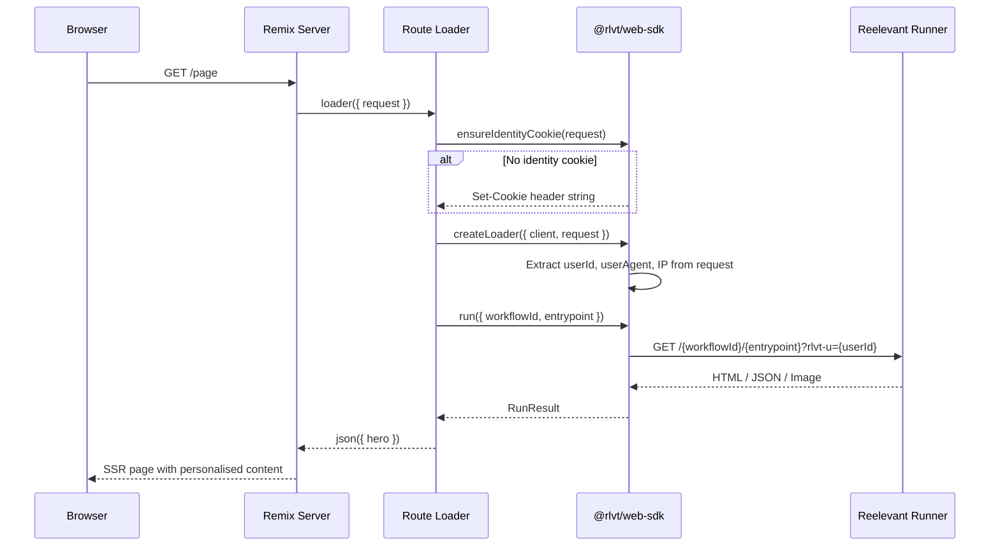

## Installation

```bash
npm install @rlvt/web-sdk
```

No additional dependencies. The adapter uses structural typing — it does not import from `@remix-run/node` or `@remix-run/server-runtime`.

## Setup

### 1. Create the client instance

```typescript
// app/lib/reelevant.server.ts
import { ReelevantClient } from '@rlvt/web-sdk'

export const rlvt = new ReelevantClient({
  timeout: 50,
})
```

### 2. Ensure identity in the root loader

```typescript
// app/root.tsx
import { ensureIdentityCookie } from '@rlvt/web-sdk/remix'
import type { LoaderFunctionArgs } from '@remix-run/node'

export async function loader({ request }: LoaderFunctionArgs) {
  const identityCookie = ensureIdentityCookie(request)

  return new Response(JSON.stringify({}), {
    headers: identityCookie ? { 'Set-Cookie': identityCookie } : {},
  })
}
```

## Request flow



## Using createLoader

The `createLoader` helper auto-extracts identity and context from the Remix request:

```typescript
// app/routes/_index.tsx
import { json, type LoaderFunctionArgs } from '@remix-run/node'
import { useLoaderData } from '@remix-run/react'
import { createLoader } from '@rlvt/web-sdk/remix'
import { rlvt } from '~/lib/reelevant.server'

export async function loader({ request }: LoaderFunctionArgs) {
  const { run, runAll } = createLoader({ client: rlvt, request })

  const hero = await run({ workflowId: 'wf-hero', entrypoint: '43a490a0' })
  return json({ hero })
}

export default function Index() {
  const { hero } = useLoaderData<typeof loader>()

  if (hero.body.type === 'html') {
    return (
      <div
        data-rlvt-ssr="true"
        dangerouslySetInnerHTML={{ __html: hero.body.content }}
      />
    )
  }

  return <DefaultHero />
}
```

### Multiple zones

```typescript
export async function loader({ request }: LoaderFunctionArgs) {
  const { runAll } = createLoader({ client: rlvt, request })

  const [hero, sidebar] = await runAll([
    { workflowId: 'wf-hero', entrypoint: '43a490a0' },
    { workflowId: 'wf-sidebar', entrypoint: 'b7e21f3c' },
  ])

  return json({ hero, sidebar })
}
```

## Lower-level helpers

### `runOptionsFromRequest(request)`

Extract identity and context fields manually:

```typescript
import { runOptionsFromRequest } from '@rlvt/web-sdk/remix'

export async function loader({ request }: LoaderFunctionArgs) {
  const context = runOptionsFromRequest(request)
  // context = { userId, userAgent, ip, referer }

  const result = await rlvt.run({
    workflowId: 'wf-hero',
    entrypoint: '43a490a0',
    ...context,
  })

  return json({ result })
}
```

### `ensureIdentityCookie(request)`

Returns a `Set-Cookie` header string if no identity exists, or `null` if the visitor already has one:

```typescript
import { ensureIdentityCookie } from '@rlvt/web-sdk/remix'

export async function loader({ request }: LoaderFunctionArgs) {
  const identity = ensureIdentityCookie(request)
  const data = { /* ... */ }

  return json(data, {
    headers: identity ? { 'Set-Cookie': identity } : {},
  })
}
```

## Handling JSON responses

```tsx
export default function Page() {
  const { zone } = useLoaderData<typeof loader>()

  if (zone.body.type === 'json') {
    const { products } = zone.body.content as { products: Product[] }
    return (
      <div className="grid grid-cols-3 gap-4">
        {products.map(p => <ProductCard key={p.id} product={p} />)}
      </div>
    )
  }

  return <DefaultContent />
}
```

## Click tracking

<Warning>
**Click tracking must always be set up after display.** Every content display should have a corresponding click tracking mechanism — either a redirect link or a `trackClick()` call.
</Warning>

Every `RunResult` includes `redirectionUrl` and `trackClick()`. Two patterns:

```tsx
// Redirect link — use redirectionUrl as <a href>
export default function Page() {
  const { hero } = useLoaderData<typeof loader>()

  return (
    <div data-rlvt-ssr="true">
      {hero.body.type === 'html' && (
        <>
          <div dangerouslySetInnerHTML={{ __html: hero.body.content }} />
          <a href={hero.redirectionUrl}>Shop now</a>
        </>
      )}
    </div>
  )
}
```

```typescript
// Server-side fire-and-forget (in an action)
export async function action({ request }: ActionFunctionArgs) {
  const { run } = createLoader({ client: rlvt, request })
  const result = await run({ workflowId: 'wf-hero', entrypoint: '43a490a0' })
  await result.trackClick()
  return json({ ok: true })
}
```

See [Core SDK — Click tracking](/platform-guide/omni-channels/websites/server-side-sdk/core#click-tracking) for full details.

## Compatibility with the client tracker

Add `data-rlvt-ssr="true"` to your wrapper element. The client-side tracker automatically skips server-rendered zones.
