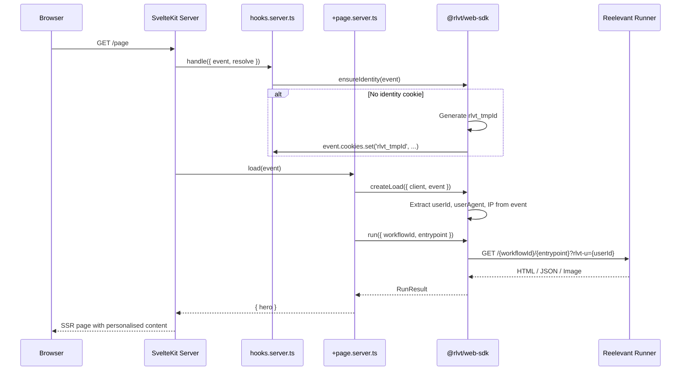

## Installation

```bash
npm install @rlvt/web-sdk
```

No additional dependencies. The adapter uses structural typing — it does not import from `@sveltejs/kit`.

## Setup

### 1. Create the client instance

```typescript
// src/lib/server/reelevant.ts
import { ReelevantClient } from '@rlvt/web-sdk'

export const rlvt = new ReelevantClient({
  timeout: 50,
})
```

### 2. Add identity hook

Ensure every visitor has an identity cookie using a server hook:

```typescript
// src/hooks.server.ts
import { ensureIdentity } from '@rlvt/web-sdk/sveltekit'

export async function handle({ event, resolve }) {
  ensureIdentity(event)
  return resolve(event)
}
```

## Request flow



## Using createLoad

The `createLoad` helper auto-extracts visitor identity and context from the SvelteKit event:

```typescript
// src/routes/+page.server.ts
import { createLoad } from '@rlvt/web-sdk/sveltekit'
import { rlvt } from '$lib/server/reelevant'

export async function load(event) {
  const { run, runAll } = createLoad({ client: rlvt, event })

  const hero = await run({ workflowId: 'wf-hero', entrypoint: '43a490a0' })
  return { hero }
}
```

Then use the data in your page:

```svelte
<!-- src/routes/+page.svelte -->
<script lang="ts">
  let { data } = $props()
</script>

{#if data.hero.body.type === 'html'}
  <div data-rlvt-ssr="true">
    {@html data.hero.body.content}
  </div>
{:else}
  <DefaultHero />
{/if}
```

### Multiple zones

```typescript
export async function load(event) {
  const { runAll } = createLoad({ client: rlvt, event })

  const [hero, sidebar] = await runAll([
    { workflowId: 'wf-hero', entrypoint: '43a490a0' },
    { workflowId: 'wf-sidebar', entrypoint: 'b7e21f3c' },
  ])

  return { hero, sidebar }
}
```

## Lower-level helpers

### `runOptionsFromEvent(event)`

Extract identity and context fields manually:

```typescript
import { runOptionsFromEvent } from '@rlvt/web-sdk/sveltekit'

export async function load(event) {
  const context = runOptionsFromEvent(event)
  // context = { userId, userAgent, ip, referer }

  const result = await rlvt.run({
    workflowId: 'wf-hero',
    entrypoint: '43a490a0',
    ...context,
  })

  return { result }
}
```

### `ensureIdentity(event)`

Sets an `rlvt_tmpId` cookie on the event if no identity cookie exists. Use in hooks or load functions:

```typescript
import { ensureIdentity } from '@rlvt/web-sdk/sveltekit'

export async function handle({ event, resolve }) {
  ensureIdentity(event)
  return resolve(event)
}
```

## Handling JSON responses

```svelte
<script lang="ts">
  let { data } = $props()

  const products = $derived(
    data.zone.body.type === 'json'
      ? (data.zone.body.content as { products: Product[] }).products
      : []
  )
</script>

<div class="grid grid-cols-3 gap-4">
  {#each products as product (product.id)}
    <ProductCard {product} />
  {/each}
</div>
```

## Click tracking

<Warning>
**Click tracking must always be set up after display.** Every content display should have a corresponding click tracking mechanism — either a redirect link or a `trackClick()` call.
</Warning>

Every `RunResult` includes `redirectionUrl` and `trackClick()`. Two patterns:

```svelte
<!-- Redirect link -->
{#if data.hero.body.type === 'html'}
  <div data-rlvt-ssr="true">
    {@html data.hero.body.content}
    <a href={data.hero.redirectionUrl}>Shop now</a>
  </div>
{/if}
```

```typescript
// Server-side fire-and-forget (in a form action)
// src/routes/+page.server.ts
import { createLoad } from '@rlvt/web-sdk/sveltekit'
import { rlvt } from '$lib/server/reelevant'

export const actions = {
  trackClick: async (event) => {
    const { run } = createLoad({ client: rlvt, event })
    const result = await run({ workflowId: 'wf-hero', entrypoint: '43a490a0' })
    await result.trackClick()
  }
}
```

See [Core SDK — Click tracking](/platform-guide/omni-channels/websites/server-side-sdk/core#click-tracking) for full details.

## Compatibility with the client tracker

Add `data-rlvt-ssr="true"` to your wrapper element. The client-side tracker automatically skips server-rendered zones.
