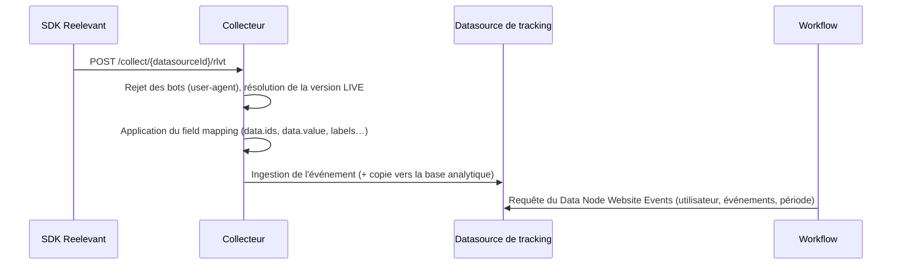

## Vue d'ensemble

Les SDK Reelevant envoient des événements comportementaux (vues produit, ajouts au panier, achats, événements personnalisés) vers une **Datasource de tracking** dans DataHub. Une fois ingérés, les événements sont interrogeables depuis un [Data Node Website Events](/fr/product-guide/workflows/data-nodes/website-events) et utilisables dans n'importe quel Workflow.

Tous les SDK envoient la même enveloppe au même endpoint de collecte : les événements web et applicatifs arrivent dans une seule Datasource et partagent une seule identité.

```bash
curl -X POST "https://collector.reelevant.com/collect/{datasourceId}/rlvt" \
  -H "content-type: application/json" \
  -d '{
    "key": "{companyId}",
    "name": "product_page",
    "url": "https://shop.example.com/p/SKU-12345",
    "tmpId": "cl9x8k2p00000qz6h7f3b1n4d",
    "clientId": "user@example.com",
    "data": { "ids": ["SKU-12345"], "locale": "EN-GB" },
    "eventId": "cl9x8k2p00001qz6h9d4c2m5e",
    "v": 1
  }'
```

L'endpoint répond `200` avec un corps vide. Il ne renvoie jamais le résultat de l'ingestion : les champs invalides sont écartés champ par champ et signalés dans les [logs de la Datasource](/fr/advanced-guide/datahub/logs), pas à l'appelant.

<CardGroup cols={3}>
  <Card title="Sites web" icon="browser" href="/fr/developer-docs/data-collection/web">
    Tag de tracking ou template Google Tag Manager, API `window.reel`, cookies d'identité.
  </Card>
  <Card title="Applications mobiles" icon="mobile" href="/fr/developer-docs/data-collection/mobile">
    SDK Android, iOS et Flutter — mêmes constructeurs d'événements, identité et file de retry sur l'appareil.
  </Card>
  <Card title="Référence des événements" icon="table-list" href="/fr/developer-docs/data-collection/events-reference">
    Schéma de l'enveloppe, catalogue d'événements, règles de validation, appels serveur à serveur.
  </Card>
</CardGroup>

## Prérequis

Une Datasource de tracking est nécessaire avant tout appel SDK. Créez-la dans DataHub avec le template **Tracking**, puis relevez les deux identifiants dans l'assistant :

| Identifiant | Où le trouver | Utilisé comme |
|-------------|---------------|---------------|
| `companyId` | Étape **Configure Reelevant Script** ou **Setup Google Tag Manager** | `key` dans l'enveloppe |
| `datasourceId` | Même étape — il s'agit de la Datasource en cours de configuration | Segment de l'URL de collecte |

La dernière étape de l'assistant (**Validate**) n'aboutit que lorsque le collecteur a reçu des événements : gardez-la ouverte pendant vos tests. La configuration est détaillée dans les [configurations spéciales](/fr/advanced-guide/datahub/special-configurations).

## Chaîne de traitement



L'ingestion est temps réel : les événements sont interrogeables quelques secondes après l'appel. Deux comportements sont à connaître lors de l'intégration :

- Les requêtes dont le `user-agent` correspond à un bot connu reçoivent un `202` et sont écartées : le trafic des crawlers ne pollue pas la Datasource.
- Les événements sont conservés 90 jours dans la Datasource. Configurez une [synchronisation vers la base analytique](/fr/advanced-guide/datahub/analytics-database-sync) si vous avez besoin d'un historique plus long.

## Identité

Chaque événement porte deux champs d'identité, gérés pour vous par le tag web comme par les SDK mobiles :

| Champ | Signification | Web | Mobile |
|-------|---------------|-----|--------|
| `tmpId` | Identité anonyme de l'appareil, toujours envoyée | Cookie `rlvt_tmpId` (cuid, 365 jours) | Identifiant d'appareil stocké localement |
| `clientId` | Identité connue de l'utilisateur, envoyée après identification | Cookie `rlvt_clientId` (180 jours) | Valeur de `setUser()` en stockage local |

Identifiez l'utilisateur dès que vous savez qui il est — `identify` sur le web, `setUser()` sur mobile. Les événements envoyés avant ne portent que le `tmpId`, et Reelevant les rattache ensuite à l'utilisateur grâce à ce `tmpId` partagé.

Ces mêmes identifiants servent lorsque le Runner personnalise un contenu (paramètre `rlvt-u`) : un utilisateur suivi par un SDK est immédiatement ciblable dans un Workflow.

## Consentement

Les SDK ne lisent aucun gestionnaire de consentement. Le contrôle vous appartient :

- **Web** — n'injectez le tag qu'après obtention du consentement, ou faites passer les événements par votre gestionnaire de tags.
- **Mobile** — n'instanciez le SDK, ou n'appelez `send()`, qu'après l'opt-in de l'utilisateur.

Rien n'est mis en mémoire tampon avant le chargement du SDK, hormis les événements poussés dans `window.reel.queue` sur le web (voir [collecte web](/fr/developer-docs/data-collection/web)).

## Ressources associées

- [Collecte web](/fr/developer-docs/data-collection/web) — tag, Google Tag Manager, API `window.reel`
- [Collecte mobile](/fr/developer-docs/data-collection/mobile) — Android, iOS, Flutter
- [Référence des événements](/fr/developer-docs/data-collection/events-reference) — enveloppe, catalogue, validation
- [Data Node Website Events](/fr/product-guide/workflows/data-nodes/website-events) — exploiter les événements collectés dans un Workflow
