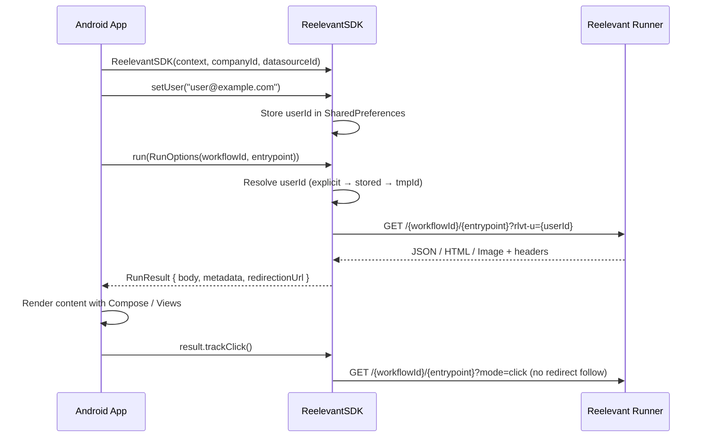

## Flux de requête



## Installation

Ajoutez le dépôt GitHub Packages et la dépendance à votre `build.gradle.kts` :

```kotlin
// settings.gradle.kts
dependencyResolutionManagement {
    repositories {
        maven {
            url = uri("https://maven.pkg.github.com/reelevant-tech/reelevant-sdk-android")
        }
    }
}

// app/build.gradle.kts
dependencies {
    implementation("com.reelevant.analytics:analytics-android:0.0.3-SNAPSHOT")
}
```

## Initialisation

```kotlin
import com.reelevant.analytics_android.*

val rlvt = ReelevantSDK(
    context = applicationContext,
    companyId = "your-company-id",
    datasourceId = "your-datasource-id",
    // Optional personalization config
    runnerUrl = "https://reelevant.run",       // default
    personalizationTimeout = 5000L,            // ms, default
    fallback = FallbackStrategy.Empty           // default
)

// Set user identity (shared between analytics and personalization)
rlvt.setUser("user@example.com")
```

## Analytics (tracking d'événements)

```kotlin
// Page view
rlvt.send(rlvt.pageView(mapOf("lang" to "en")))

// Product page
rlvt.send(rlvt.productPage("product-123", mapOf("category" to "shoes")))

// Purchase
rlvt.send(rlvt.purchase(listOf("p1", "p2"), 99.99f, mapOf(), "order-456"))

// Add to cart
rlvt.send(rlvt.addCart(listOf("p1"), mapOf()))
```

## Personnalisation

### Exécution d'un seul Workflow

```kotlin
val result = rlvt.run(RunOptions(
    workflowId = "wf-hero",
    entrypoint = "43a490a0"
))

when (result.body) {
    is RunContent.Json  -> renderCard((result.body as RunContent.Json).content)
    is RunContent.Html  -> renderWebView((result.body as RunContent.Html).content)
    is RunContent.Image -> renderImage((result.body as RunContent.Image).content)
    is RunContent.Empty -> showDefault()
}
```

### Plusieurs Workflows en parallèle

```kotlin
val results = rlvt.runAll(listOf(
    RunOptions(workflowId = "wf-hero", entrypoint = "entry1"),
    RunOptions(workflowId = "wf-reco", entrypoint = "entry2")
))
// results[0] corresponds to wf-hero, results[1] to wf-reco
```

### Tracking des clics

```kotlin
// Fire-and-forget — registers the click without following redirects
result.trackClick()
```

### RunOptions

| Paramètre | Type | Requis | Description |
|-----------|------|----------|-------------|
| `workflowId` | `String` | Oui | ID du Workflow issu de la plateforme |
| `entrypoint` | `String` | Oui | ID de l'entrypoint au sein du Workflow |
| `userId` | `String?` | Non | Remplace l'identité (par défaut : résolue automatiquement à partir de `setUser()` / ID d'appareil) |
| `params` | `Map<String, String>?` | Non | Paramètres d'URL supplémentaires transmis au Runner |
| `locale` | `String?` | Non | Locale pour la résolution du contenu |
| `timeout` | `Long?` | Non | Remplacement du timeout par appel, en millisecondes |

### RunResult

| Champ | Type | Description |
|-------|------|-------------|
| `status` | `Int` | Code de statut HTTP (0 pour le repli) |
| `source` | `RunSource` | `.RUNNER` ou `.FALLBACK` |
| `body` | `RunContent` | Contenu discriminé : `Json`, `Html`, `Image` ou `Empty` |
| `metadata` | `Map<String, Any>` | Métadonnées issues de l'en-tête `x-rlvt-output-node-metadata` |
| `properties` | `Map<String, Any>` | Propriétés issues de l'en-tête `x-rlvt-output-properties` |
| `runId` | `String?` | ID d'exécution du Workflow pour la corrélation du tracking |
| `executionPath` | `List<String>` | ID des Branches empruntées durant l'exécution |
| `redirectionUrl` | `String` | URL de redirection au clic préconstruite |

### Stratégies de repli

```kotlin
// Return empty result on error (default)
FallbackStrategy.Empty

// Re-throw the error
FallbackStrategy.Error

// Custom handler
FallbackStrategy.Custom { options, error ->
    RunResult(/* your fallback result */)
}
```
