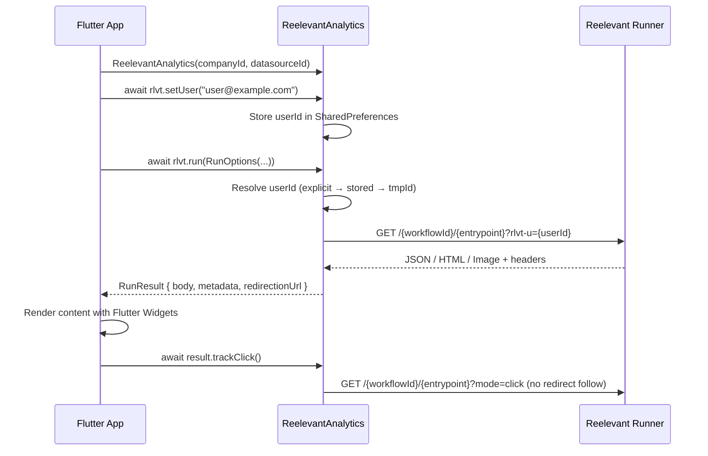

## Flux de requête



## Installation

Ajoutez la dépendance à votre `pubspec.yaml` :

```yaml
dependencies:
  reelevant_analytics:
    git:
      url: https://github.com/reelevant-tech/reelevant-sdk-flutter.git
      ref: main
```

Puis exécutez :

```bash
flutter pub get
```

## Initialisation

```dart
import 'package:reelevant_analytics/reelevant_analytics.dart';

final rlvt = ReelevantAnalytics(
  companyId: 'your-company-id',
  datasourceId: 'your-datasource-id',
  // Optional personalization config
  runnerUrl: 'https://reelevant.run',          // default
  runnerTimeout: Duration(seconds: 5),          // default
  fallback: FallbackStrategy.empty,             // default
);

// Set user identity (shared between analytics and personalization)
await rlvt.setUser('user@example.com');
```

## Analytics (tracking d'événements)

```dart
// Page view
await rlvt.send(rlvt.pageView(labels: {'lang': 'en'}));

// Product page
await rlvt.send(rlvt.productPage('product-123', labels: {'category': 'shoes'}));

// Purchase
await rlvt.send(rlvt.purchase(
  ids: ['p1', 'p2'],
  totalAmount: 99.99,
  labels: {},
  transId: 'order-456',
));

// Add to cart
await rlvt.send(rlvt.addCart(ids: ['p1'], labels: {}));
```

## Personnalisation

### Exécution d'un seul Workflow

```dart
final result = await rlvt.run(RunOptions(
  workflowId: 'wf-hero',
  entrypoint: '43a490a0',
));

if (result.body is JsonRunContent) {
  final data = (result.body as JsonRunContent).content;
  renderCard(data);
} else if (result.body is HtmlRunContent) {
  final html = (result.body as HtmlRunContent).content;
  renderWebView(html);
} else if (result.body is ImageRunContent) {
  final bytes = (result.body as ImageRunContent).content;
  renderImage(bytes);
} else {
  showDefault();
}
```

### Plusieurs Workflows en parallèle

```dart
final results = await rlvt.runAll([
  RunOptions(workflowId: 'wf-hero', entrypoint: 'entry1'),
  RunOptions(workflowId: 'wf-reco', entrypoint: 'entry2'),
]);
// results[0] corresponds to wf-hero, results[1] to wf-reco
```

### Tracking des clics

```dart
// Fire-and-forget — registers the click without following redirects
await result.trackClick();
```

### RunOptions

| Paramètre | Type | Requis | Description |
|-----------|------|----------|-------------|
| `workflowId` | `String` | Oui | ID du Workflow issu de la plateforme |
| `entrypoint` | `String` | Oui | ID de l'entrypoint au sein du Workflow |
| `userId` | `String?` | Non | Remplace l'identité (par défaut : résolue automatiquement à partir de `setUser()` / ID d'appareil) |
| `params` | `Map<String, String>?` | Non | Paramètres d'URL supplémentaires transmis au Runner |
| `locale` | `String?` | Non | Locale pour la résolution du contenu |
| `timeout` | `Duration?` | Non | Remplacement du timeout par appel |

### RunResult

| Champ | Type | Description |
|-------|------|-------------|
| `status` | `int` | Code de statut HTTP (0 pour le repli) |
| `source` | `RunSource` | `.runner` ou `.fallback` |
| `body` | `RunContent` | Contenu discriminé : `JsonRunContent`, `HtmlRunContent`, `ImageRunContent` ou `EmptyRunContent` |
| `metadata` | `Map<String, dynamic>` | Métadonnées issues de l'en-tête `x-rlvt-output-node-metadata` |
| `properties` | `Map<String, dynamic>` | Propriétés issues de l'en-tête `x-rlvt-output-properties` |
| `runId` | `String?` | ID d'exécution du Workflow pour la corrélation du tracking |
| `executionPath` | `List<String>` | ID des Branches empruntées durant l'exécution |
| `redirectionUrl` | `String` | URL de redirection au clic préconstruite |

### Stratégies de repli

```dart
// Return empty result on error (default)
FallbackStrategy.empty

// Re-throw the error
FallbackStrategy.error

// Custom handler
ReelevantAnalytics(
  // ...
  fallbackHandler: (options, error) async {
    return RunResult(/* your fallback result */);
  },
);
```
