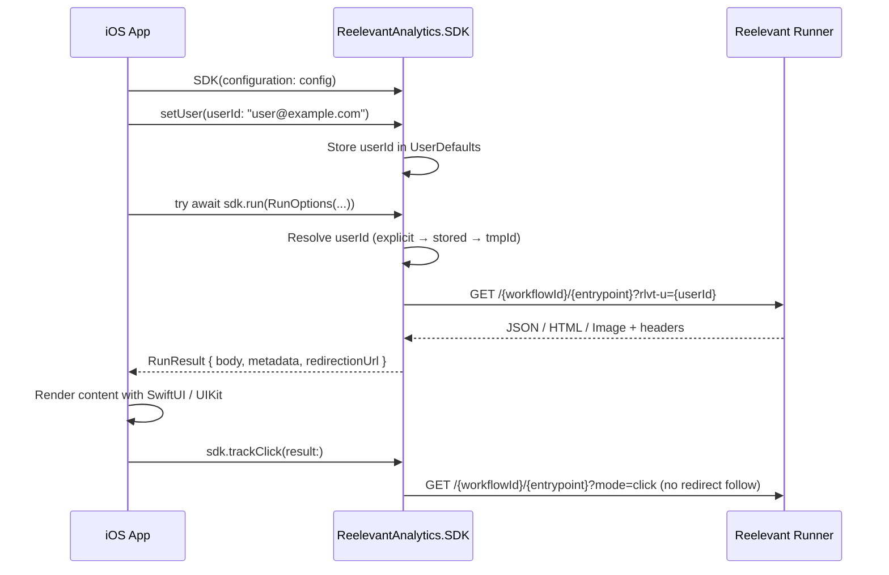

## Flux de requête



## Installation

Ajoutez le package via Swift Package Manager :

```
https://github.com/reelevant-tech/reelevant-sdk-ios.git
```

Dans Xcode : **File → Add Package Dependencies** → collez l'URL ci-dessus.

## Initialisation

```swift
import ReelevantAnalytics

let config = ReelevantAnalytics.Configuration(
    companyId: "your-company-id",
    datasourceId: "your-datasource-id"
)
// Optional personalization config
config.runnerUrl = "https://reelevant.run"   // default
config.personalizationTimeout = 5.0           // seconds, default
config.fallback = .empty                      // default

let sdk = ReelevantAnalytics.SDK(configuration: config)

// Set user identity (shared between analytics and personalization)
sdk.setUser(userId: "user@example.com")
```

## Analytics (tracking d'événements)

```swift
// Page view
sdk.send(event: ReelevantAnalytics.EventBuilder.page_view(labels: ["lang": "en"]))

// Product page
sdk.send(event: ReelevantAnalytics.EventBuilder.product_page(
    productId: "product-123",
    labels: ["category": "shoes"]
))

// Purchase
sdk.send(event: ReelevantAnalytics.EventBuilder.purchase(
    ids: ["p1", "p2"],
    totalAmount: 99.99,
    labels: [:],
    transId: "order-456"
))
```

## Personnalisation

### Exécution d'un seul Workflow

```swift
let result = try await sdk.run(RunOptions(
    workflowId: "wf-hero",
    entrypoint: "43a490a0"
))

switch result.body {
case .json(let data):  renderCard(data)
case .html(let html):  renderWebView(html)
case .image(let data): renderImage(data)
case .empty:           showDefault()
}
```

### Plusieurs Workflows en parallèle

```swift
let results = try await sdk.runAll([
    RunOptions(workflowId: "wf-hero", entrypoint: "entry1"),
    RunOptions(workflowId: "wf-reco", entrypoint: "entry2")
])
// results[0] corresponds to wf-hero, results[1] to wf-reco
```

### Tracking des clics

```swift
// Fire-and-forget — registers the click without following redirects
sdk.trackClick(result: result)
// or
result._trackClick()
```

### RunOptions

| Paramètre | Type | Requis | Description |
|-----------|------|----------|-------------|
| `workflowId` | `String` | Oui | ID du Workflow issu de la plateforme |
| `entrypoint` | `String` | Oui | ID de l'entrypoint au sein du Workflow |
| `userId` | `String?` | Non | Remplace l'identité (par défaut : résolue automatiquement à partir de `setUser()` / ID d'appareil) |
| `params` | `[String: String]?` | Non | Paramètres d'URL supplémentaires transmis au Runner |
| `locale` | `String?` | Non | Locale pour la résolution du contenu |
| `timeout` | `TimeInterval?` | Non | Remplacement du timeout par appel, en secondes |

### RunResult

| Champ | Type | Description |
|-------|------|-------------|
| `status` | `Int` | Code de statut HTTP (0 pour le repli) |
| `source` | `RunSource` | `.runner` ou `.fallback` |
| `body` | `RunContent` | Contenu discriminé : `.json`, `.html`, `.image` ou `.empty` |
| `metadata` | `[String: Any]` | Métadonnées issues de l'en-tête `x-rlvt-output-node-metadata` |
| `properties` | `[String: Any]` | Propriétés issues de l'en-tête `x-rlvt-output-properties` |
| `runId` | `String?` | ID d'exécution du Workflow pour la corrélation du tracking |
| `executionPath` | `[String]` | ID des Branches empruntées durant l'exécution |
| `redirectionUrl` | `String` | URL de redirection au clic préconstruite |

### Stratégies de repli

```swift
// Return empty result on error (default)
config.fallback = .empty

// Re-throw the error
config.fallback = .error

// Custom handler
config.fallback = .custom { options, error in
    return RunResult(/* your fallback result */)
}
```

<Note>
La personnalisation nécessite **iOS 13+** / **macOS 10.15+** pour la prise en charge de `async`/`await`. L'analytics fonctionne sur iOS 10+.
</Note>
