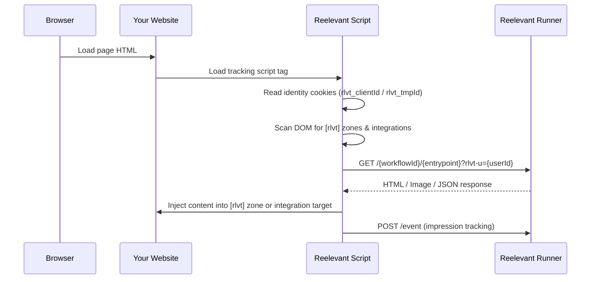

## Vue d'ensemble

La personnalisation côté client utilise un script de tracking JavaScript qui se charge dans le navigateur. Il récupère du contenu personnalisé après le rendu de la page et l'injecte dans des zones désignées du DOM. C'est la méthode d'intégration d'origine et elle fonctionne conjointement avec le [Server Side SDK](/fr/developer-docs/web-integration/server-side-sdk/overview).



## Quand utiliser la personnalisation côté client

| Cas d'usage | Approche recommandée |
|----------|---------------------|
| Contenu qui doit être visible immédiatement (pas de flash) | [Server-side SDK](/fr/developer-docs/web-integration/server-side-sdk/overview) |
| Contenu personnalisé critique pour le SEO | [Server-side SDK](/fr/developer-docs/web-integration/server-side-sdk/overview) |
| Tracking d'événements (clics, impressions, conversions) | Script côté client |
| Contenu dépendant du consentement | Script côté client |
| Overlays, popups et éléments flottants | Script côté client |
| Pages sans rendu côté serveur (SPA) | Script côté client |
| Intégration rapide sans modification de code | Script côté client + [Extension de navigateur](/fr/product-guide/browser-extension/overview) |

## Méthodes d'intégration

### 1. Balise de script (manuelle)

Ajoutez le script de tracking Reelevant à votre page. L'URL d'intégration est générée depuis la [fenêtre modale d'intégration](/fr/product-guide/workflows/integration) dans l'éditeur de Workflow.

```html
<!-- Add in your <head> or before </body> -->
<script src="https://reelevant.run/your-script-url.js" async></script>
```

Le script effectue automatiquement les opérations suivantes :
- Crée une identité anonyme (cookie `rlvt_tmpId`) s'il n'en existe pas
- Analyse le DOM à la recherche de zones à attribut `[rlvt]`
- Récupère le contenu personnalisé depuis le Runner
- Injecte le contenu dans les zones correspondantes
- Suit les impressions et les clics

### 2. Zones HTML

Marquez les éléments de votre page où le contenu personnalisé doit apparaître :

```html
<div rlvt
     rlvt-wid="your-workflow-id"
     rlvt-ep="hero">
  <!-- Fallback content shown until personalised content loads -->
  <p>Default content</p>
</div>
```

| Attribut | Description |
|-----------|-------------|
| `rlvt` | Marque l'élément comme une zone Reelevant |
| `rlvt-wid` | ID du Workflow |
| `rlvt-ep` | shortId de l'entrypoint au sein du Workflow |

### 3. Intégrations via l'extension de navigateur

L'[extension de navigateur Reelevant](/fr/product-guide/browser-extension/overview) offre un moyen no-code de configurer des intégrations côté client :

<Steps>
  <Step title="Installer l'extension">
    Installez-la depuis le [Chrome Web Store](https://chromewebstore.google.com/detail/reelevant/lgacfbhgdhamkljnljckjhogkmifijla?hl=en) ou les [modules complémentaires Microsoft Edge](https://microsoftedge.microsoft.com/addons/detail/aocpmahppepplambefpfnbnifdgolncb) et connectez-vous avec votre email et mot de passe Reelevant ou via le SSO.
  </Step>
  <Step title="Naviguer vers votre site web">
    Ouvrez la page où vous souhaitez que le contenu personnalisé apparaisse.
  </Step>
  <Step title="Sélectionner un Workflow">
    Dans le panneau latéral de l'extension, parcourez votre [liste de Workflows](/fr/product-guide/browser-extension/workflows) et sélectionnez celui à intégrer.
  </Step>
  <Step title="Configurer l'intégration on-site">
    Utilisez l'[interface du content script](/fr/developer-docs/guides/browser-extension-content-script) pour choisir un sélecteur DOM, définir l'emplacement et définir les conditions d'intégration. Cliquez sur **Save** pour enregistrer la configuration.
  </Step>
  <Step title="Copier les URL d'intégration (facultatif)">
    Pour les Channels qui nécessitent des URL directes, ouvrez les [instructions d'intégration](/fr/developer-docs/guides/browser-extension-integration) pour copier les liens image et de redirection.
  </Step>
</Steps>

### Déclencheurs d'intégration

Les intégrations via l'extension de navigateur prennent en charge trois types de déclencheurs :

| Déclencheur | Description |
|---------|-------------|
| **URL pattern** | Le contenu se charge lorsque l'URL de la page correspond à un pattern (par exemple, `/products/*`) |
| **DataLayer variable** | Le contenu se charge lorsqu'une valeur spécifique est présente dans le `dataLayer` (par exemple, les événements GTM) |
| **CSS selector** | Le contenu est injecté dans un élément DOM spécifique sélectionné via l'extension |

## Gestion de l'identité

Le script côté client gère deux cookies d'identité :

| Cookie | Rôle | Durée de vie |
|--------|---------|----------|
| `rlvt_tmpId` | ID de visiteur anonyme, créé automatiquement | 365 jours |
| `rlvt_clientId` | ID d'utilisateur connu, défini par votre application | 365 jours |

Pour associer l'identité d'un utilisateur connu :

```javascript
// Option 1: URL parameter
// Add ?rlvt_clientId=user@example.com to the page URL

// Option 2: dataLayer
window.dataLayer = window.dataLayer || []
window.dataLayer.push({ rlvt_clientId: 'user@example.com' })
```

## Combinaison avec le Server-Side SDK

Lorsque vous utilisez à la fois le Web SDK côté serveur et le script côté client sur la même page :

1. Les **zones rendues côté serveur** doivent inclure `data-rlvt-ssr="true"` sur l'élément conteneur
2. Le script côté client **ignore** automatiquement les zones marquées avec `data-rlvt-ssr`
3. Le script client gère toujours le **tracking d'événements**, les zones uniquement côté client et les intégrations

```html
<!-- Server-rendered zone (SDK) — script will skip this -->
<div data-rlvt-ssr="true">
  <div class="hero-banner">Personalised hero content from SSR</div>
</div>

<!-- Client-rendered zone — script will handle this -->
<div rlvt rlvt-wid="wf-sidebar" rlvt-ep="sidebar">
  <p>Loading...</p>
</div>
```

## Intégration du DataLayer

Le script lit les valeurs du tableau `window.dataLayer` (compatible Google Tag Manager) :

```javascript
window.dataLayer = window.dataLayer || []
window.dataLayer.push({
  locale: 'en-GB',
  country: 'UK',
  event: 'product_view',
  productId: 'SKU-12345',
})
```

Ces valeurs sont automatiquement transmises aux Workflows sous forme de paramètres d'URL pour être utilisées dans les [Data Nodes](/fr/product-guide/workflows/data-nodes/url-parameter).
