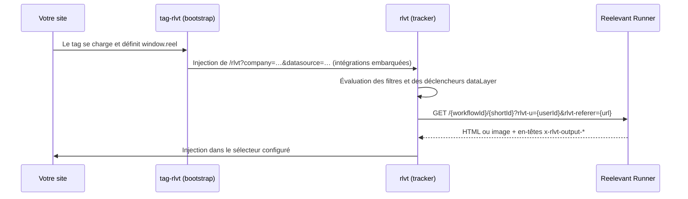

## Vue d'ensemble

Le tag qui [collecte les événements web](/fr/developer-docs/data-collection/web) sert aussi à injecter du contenu personnalisé dans le navigateur. Le contenu est placé via des **intégrations on-site** : un sélecteur CSS, un emplacement et des conditions de déclenchement, configurés depuis l'[Extension navigateur](/fr/product-guide/browser-extension/overview) et stockés sur le Workflow — aucun markup ni déploiement de votre côté.


```mermaid
sequenceDiagram
    participant Page as Votre site
    participant Tag as tag-rlvt (bootstrap)
    participant Script as rlvt (tracker)
    participant Runner as Reelevant Runner

    Page->>Tag: Le tag se charge et définit window.reel
    Tag->>Script: Injection de /rlvt?company=…&datasource=… (intégrations embarquées)
    Script->>Script: Évaluation des filtres et des déclencheurs dataLayer
    Script->>Runner: GET /{workflowId}/{shortId}?rlvt-u={userId}&rlvt-referer={url}
    Runner-->>Script: HTML ou image + en-têtes x-rlvt-output-*
    Script->>Page: Injection dans le sélecteur configuré
```

L'installation, l'API `window.reel` et la résolution de l'identité sont documentées dans [Collecte web](/fr/developer-docs/data-collection/web) — il n'y a rien de plus à installer pour la personnalisation.

<Note>
La personnalisation rendue côté serveur est généralement le meilleur choix par défaut : le [SDK serveur](/fr/developer-docs/web-integration/server-side-sdk/overview) renvoie le contenu dans le HTML initial, sans layout shift et sans dépendre du réseau du visiteur.
</Note>

## Intégrations on-site

Les intégrations sont résolues au moment où le tracker est servi, pas à l'exécution : le service de scripts liste tous les Workflows de la company ayant une intégration d'entrypoint `web` et les embarque, encodées en base64, dans le fichier `rlvt`. Le fichier est alors mis en cache 60 secondes au lieu de 300, pour que les changements faits dans l'extension se propagent rapidement.

Chaque intégration est attachée au démarrage du tracker, sur `load`, et à chaque appel de `window.reel.loadZones()` — appelez `loadZones()` après une navigation client dans une SPA.

| Champ | Comportement |
|-------|--------------|
| `selector` | Sélecteur CSS de l'élément cible. Ignoré si l'élément est absent, ou s'il porte déjà `rlvt_loaded` |
| `emplacement` | `replace` remplit l'élément trouvé, `before` / `after` injectent un `<div>` adjacent |
| `filters` | Conditions (`contains`, `notcontains`, `empty`, `nempty`, `eq`, `ne`) évaluées sur les paramètres de requête de la page plus `url`, `rlvt-u` et `isLogged` |
| `waitForEvents` | L'intégration n'est attachée qu'une fois ce nom d'événement poussé sur le dataLayer — le tracker patche `dataLayer.push` pour le détecter |
| `includeContext` | Transmet les paramètres de requête de la page au Runner |
| `includeDatalayerPath` | Transmet des chemins dataLayer spécifiques au Runner, en utilisant le dernier segment du chemin comme nom de paramètre |
| `code` | Exécuté avec `eval` juste après l'injection |
| `enabled` | Les intégrations désactivées sont ignorées, sauf si `sessionStorage._rlvt_debug_` vaut `'true'` |

Le Runner est appelé avec l'identité renvoyée par `window.reel.getClientId()`, avec `rlvt_tmpId` en repli :

```
GET https://reelevant.run/{workflowId}/{shortId}?rlvt-u=user@example.com&rlvt-referer=https://www.example.com/products/1234
```

Les en-têtes de réponse déterminent l'injection :

| En-tête | Effet |
|---------|-------|
| `x-rlvt-output-node-metadata` vide | Rien n'est injecté — le Workflow a décidé de ne pas afficher de contenu |
| `x-rlvt-output-properties` avec `backgroundColor` | Appliqué comme couleur de fond de l'élément cible |
| `x-rlvt-workflow-run-id` | Exposé sur l'élément cible via l'attribut `rlvt_run_id` |

Les réponses `text/html` sont injectées dans un shadow root attaché à l'élément cible, avec la taille de police de `.rlvt-body` adaptée à la largeur du conteneur pour que le Content reste responsive. Les réponses `image/png` et `image/gif` sont injectées dans un `` encapsulé dans un `<a>` pointant vers la même URL avec `mode=click`, ce qui enregistre le clic.

<Warning>
Le contenu est injecté dans un shadow root : les feuilles de style de votre page ne s'y appliquent pas, et il n'est pas accessible via `document.querySelector`. Interrogez le `shadowRoot` de l'élément cible.
</Warning>

## Réagir aux injections

```typescript
document.addEventListener('reelevant_ready', (event) => {
  const reel = (event as CustomEvent<{ reel: Window['reel'] }>).detail.reel
  console.info('Tracker Reelevant prêt', reel.getClientId())
})

document.addEventListener('reelevant_personalization', (event) => {
  const { url, targetDiv } = (event as CustomEvent<{ url: string; targetDiv: HTMLElement }>).detail
  // Pour les sorties HTML, le contenu est dans targetDiv.shadowRoot
  console.info('Contenu Reelevant injecté', { url, runId: targetDiv.getAttribute('rlvt_run_id') })
})
```

| Événement | Émis sur `document` |
|-----------|---------------------|
| `reelevant_ready` | Dès que le tracker est initialisé ; `detail.reel` est l'instance du tracker |
| `reelevant_personalization` | À chaque injection d'intégration, avec `detail.url`, `detail.targetDiv` et `detail.response` |

Le tracker ré-attache également les intégrations sur l'événement `abtasty_executedCampaign` quand AB Tasty est présent, afin de survivre aux campagnes qui réécrivent le DOM.

## Débogage

| Signal | Usage |
|--------|-------|
| `sessionStorage._rlvt_debug_ = 'true'` | Attache aussi les intégrations désactivées, pour les prévisualiser avant activation |
| Attribut `rlvt_run_id` | ID de run du Workflow du Content injecté — à communiquer en cas de sortie inattendue |
| `[RLVT] Failed to load zone` | Le Runner a répondu au-delà de `205` ; la réponse est loggée avec le message |
| `Reelevant error: Missing key` / `Missing datasource` | `window.reel.companyId` ou `window.reel.datasourceId` est absent — le snippet du tag a été modifié |

<Warning>
Le tracker ignore tout élément portant `data-rlvt-ssr`, l'attribut avec lequel le [SDK serveur](/fr/developer-docs/web-integration/server-side-sdk/overview) marque le contenu qu'il a déjà rendu. L'attribut doit être porté par l'élément lui-même, pas par un conteneur parent.
</Warning>

## Liens utiles

- [Collecte web](/fr/developer-docs/data-collection/web) — installation du tag, `window.reel`, identité
- [SDK serveur](/fr/developer-docs/web-integration/server-side-sdk/overview) — personnalisation rendue côté serveur
- [Reelevant en API (JSON)](/fr/developer-docs/web-integration/api-json/overview) — personnalisation headless
- [Content script de l'extension navigateur](/fr/developer-docs/guides/browser-extension-content-script) — configuration des intégrations
