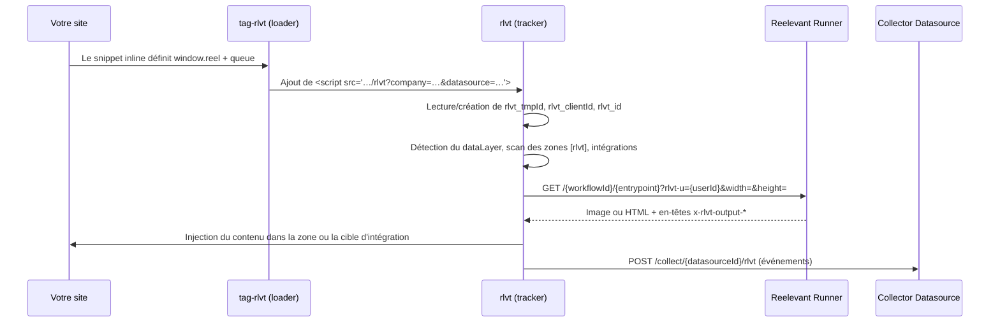

## Vue d'ensemble

Le script client est un script navigateur servi par company et par Datasource Tracking. Il envoie les événements de tracking au collector de la Datasource, gère les cookies d'identité et injecte le contenu personnalisé dans les zones DOM `[rlvt]` ou dans les sélecteurs configurés avec l'[Extension navigateur](/fr/product-guide/browser-extension/overview).

Deux fichiers sont impliqués :

| Fichier | Rôle |
|---------|------|
| `tag-rlvt` | Petit loader à coller sur vos pages. Crée `window.reel` avec une file d'attente, puis ajoute `rlvt` de façon asynchrone |
| `rlvt` | Tracker complet. Remplace les appels mis en file par la vraie implémentation, scanne le DOM, attache les intégrations |

Les deux fichiers sont servis par le service de scripts avec l'ID de company et l'ID de Datasource en paramètres de requête. Le service interpole l'URL du collector, l'URL du Runner et les intégrations web des Workflows dans le fichier avant de le streamer.


```mermaid
sequenceDiagram
    participant Page as Votre site
    participant Tag as tag-rlvt (loader)
    participant Script as rlvt (tracker)
    participant Runner as Reelevant Runner
    participant Collector as Collector Datasource

    Page->>Tag: Le snippet inline définit window.reel + queue
    Tag->>Script: Ajout de <script src="…/rlvt?company=…&datasource=…">
    Script->>Script: Lecture/création de rlvt_tmpId, rlvt_clientId, rlvt_id
    Script->>Script: Détection du dataLayer, scan des zones [rlvt], intégrations
    Script->>Runner: GET /{workflowId}/{entrypoint}?rlvt-u={userId}&width=&height=
    Runner-->>Script: Image ou HTML + en-têtes x-rlvt-output-*
    Script->>Page: Injection du contenu dans la zone ou la cible d'intégration
    Script->>Collector: POST /collect/{datasourceId}/rlvt (événements)
```

## Installation

Le snippet est généré par l'étape **Configure Reelevant Script** de la Datasource Tracking dans [DataHub](/fr/product-guide/datahub/overview) — il contient votre ID de company et votre ID de Datasource. Copiez-le tel quel ; il correspond au corps de la réponse de :

```
GET https://scripts-repo.reelevant.com/tag-rlvt?company={companyId}&datasource={datasourceId}
```

Sa logique équivaut à :

```html
<script>
  (function () {
    if (window.reel) return
    var reel = {
      companyId: '61f2d2320d460f56ce926e5f',
      datasourceId: '652f9b5c31f90003009839a1',
      queue: [],
      event: function (name, data) { reel.queue.push([name, data]) },
      identify: function (clientId) { reel.event('identify', clientId) }
    }
    window.reel = reel
    var firstScriptTag = document.getElementsByTagName('script')[0]
    var element = document.createElement('script')
    element.src =
      'https://scripts-repo.reelevant.com/rlvt?company=61f2d2320d460f56ce926e5f&datasource=652f9b5c31f90003009839a1'
    element.type = 'text/javascript'
    element.async = true
    firstScriptTag.parentNode.insertBefore(element, firstScriptTag)
  })()
</script>
```

Les appels effectués avant le chargement de `rlvt` sont empilés dans `window.reel.queue` et dépilés une fois par seconde par le tracker : les tags Google Tag Manager peuvent donc se déclencher immédiatement.

L'étape de la Datasource ne se valide qu'une fois que le collector a reçu au moins un événement : naviguez sur quelques pages avant de cliquer sur **Valider**.

## API de tracking

`window.reel` expose quatre méthodes une fois le tracker chargé :

```typescript
declare global {
  interface Window {
    reel: {
      event: (name: string, data?: unknown) => void
      identify: (clientId: string) => void
      loadZones: () => Promise<void>
      getClientId: () => string | undefined
    }
  }
}

window.reel.event('product_page', { ids: ['SKU-12345'], locale: 'fr-FR' })
window.reel.event('purchase', { ids: ['SKU-12345'], value: 49.9, transId: 'ORDER-8891' })
window.reel.identify('user@example.com')
```

| Méthode | Comportement |
|---------|--------------|
| `event(name, data)` | Construit et envoie un événement. `data` doit être un objet simple (sauf pour `identify`) |
| `identify(clientId)` | Stocke `rlvt_clientId` et envoie un événement `identify` si la valeur a changé |
| `loadZones()` | Relance le chargement des zones et l'attachement des intégrations — à appeler après une navigation client dans une SPA |
| `getClientId()` | Retourne `rlvt_clientId`, avec `rlvt_id` en repli |

### Payload d'événement

Les événements sont envoyés en JSON via `XMLHttpRequest` vers le endpoint collector de la Datasource Tracking :

```
POST https://{collector-host}/collect/{datasourceId}/rlvt
```

```json
{
  "key": "61f2d2320d460f56ce926e5f",
  "name": "purchase",
  "url": "https://www.example.com/checkout/confirmation",
  "tmpId": "cl9k2v3x40000qwer1234abcd",
  "clientId": "user@example.com",
  "data": { "ids": ["SKU-12345"], "value": "49.90", "transId": "ORDER-8891", "locale": "FR-FR" },
  "eventId": "cl9k2v3x40001qwer5678efgh",
  "v": 1
}
```

Clés réservées dans `data` : `ids` (références produit), `value` (montant) et `transId` (identifiant de transaction). Toutes les autres clés sont stockées comme labels.

### Validation et gestion des erreurs

Le tracker ne lève jamais d'exception : il logge dans la console et abandonne l'événement. Les cas à connaître :

| Situation | Résultat |
|-----------|----------|
| `name` vaut `page_view` | Ignoré — les page views ne sont pas collectées |
| Même `name` + `data` déjà envoyés sur la page | Ignoré (déduplication) |
| `data` n'est pas un objet, ou n'est pas sérialisable | `console.error`, événement abandonné |
| `ids` n'est ni une chaîne ni un tableau | `console.error`, événement abandonné |
| Toutes les valeurs de `ids` sont invalides (`"undefined"`, `"null"`, `"0"`, `"-1"`, `"NaN"`, `"inconnu"`, …) | `console.error`, événement abandonné |
| `ids` contient `;`, `,` ou `\|` | `console.warn`, la chaîne est découpée en plusieurs IDs — sauf pour `category_view` et `brand_view` |
| `value` contient `;`, `,` ou `\|`, ou n'est pas un nombre | `console.warn`, événement abandonné |
| `value` est valide | Tronqué à deux décimales |
| `identify` avec un `clientId` vide ou invalide | `console.error`, aucun cookie écrit |
| Erreur réseau, ou statut HTTP ≥ 500 | Événement stocké dans `localStorage.rlvt_fail_queue` |

La file d'échec est rejouée à raison d'un événement par minute, et les entrées de plus de 30 minutes sont supprimées.

## Gestion de l'identité

| Cookie | Rôle | Durée de vie |
|--------|------|--------------|
| `rlvt_tmpId` | ID visiteur anonyme, généré au premier chargement | 365 jours |
| `rlvt_clientId` | Identité connue, résolue depuis les sources ci-dessous | 180 jours |
| `rlvt_id` | Identifiant utilisateur Reelevant chiffré, lu depuis le paramètre `rlvt_id` que le Runner ajoute aux redirections de clic | 30 jours |

Les cookies sont écrits sur le domaine de premier niveau (`.example.com`, et `.example.co.uk` pour les TLD en deux parties).

`rlvt_clientId` est résolu dans cet ordre, chaque source écrasant la précédente :

1. Le cookie `rlvt_clientId` existant
2. `window.reelevant_user`
3. Le paramètre de requête `rlvt-u`, `rlvt_u` ou `clientUid`
4. `rlvt-u=` dans le fragment d'URL
5. `window.reel.identify(clientId)`

```html
<!-- Définir l'identité avant l'exécution du loader -->
<script>window.reelevant_user = 'user@example.com'</script>
```

Quand `rlvt_id` est présent, les événements sont envoyés avec `id` et sans `clientId`, afin d'être attribués à l'identité résolue par le Runner plutôt qu'à l'identité on-site.

## Zones HTML

Ajoutez l'attribut `rlvt` sur un élément pour que le tracker appelle le Runner et injecte le résultat. Les zones sont chargées au tick suivant le démarrage du tracker, sur `load`, sur `abtasty_executedCampaign`, et à chaque appel de `window.reel.loadZones()`.

```html
<div rlvt
     workflow="62b339a71334cb00073db8ef"
     entrypoint="0"
     variables="locale,productId"
     anonymous></div>
```

| Attribut | Description |
|----------|-------------|
| `rlvt` | Marque l'élément comme zone |
| `workflow` | ID du Workflow |
| `entrypoint` | Short ID de l'entrypoint ; `0` par défaut |
| `variables` | Liste, séparée par des virgules, des paramètres de requête ou chemins dataLayer à transmettre (`[order][currency]` pour les chemins imbriqués) |
| `replace` | Sélecteur CSS de l'élément à remplir à la place de celui-ci |
| `anonymous` | Charge la zone même sans identité connue (repli sur `rlvt_tmpId`) |
| `loading` / `done` | Positionnés par le tracker ; une zone n'est jamais chargée deux fois |
| Tout autre attribut | Transmis au Runner en paramètre de requête |

<Warning>
Une zone est ignorée si elle contient déjà des enfants. N'y placez pas de contenu de repli — utilisez un élément voisin que vous masquez vous-même si vous avez besoin d'un placeholder.
</Warning>

Sans identité connue et sans `anonymous`, aucune requête n'est faite. L'identité utilisée est le paramètre `rlvt-u` de la page, puis `rlvt_clientId`, puis `rlvt_tmpId`.

Le tracker appelle le Runner avec les paramètres résolus, la `width` et la `height` du viewport, et un en-tête `rlvt_referer` contenant l'origine et le pathname courants :

```
GET https://reelevant.run/{workflowId}/{entrypoint}?rlvt-u=user@example.com&locale=fr-FR&width=1280&height=720
```

La réponse détermine l'injection :

| Réponse | Résultat |
|---------|----------|
| `x-rlvt-output-node-metadata` vide | L'élément de la zone est retiré du DOM |
| `x-rlvt-output-properties.backgroundColor` défini | Appliqué comme couleur de fond de l'élément cible |
| Sinon | Contenu injecté dans un `` encapsulé dans un `<a>` pointant vers la même URL avec `mode=click` |

Les zones portant `data-rlvt-ssr` sont toujours ignorées — voir [combiner avec le SDK serveur](#combiner-avec-le-sdk-serveur).

## Intégrations de l'extension navigateur

Les intégrations configurées avec l'[Extension navigateur](/fr/product-guide/browser-extension/overview) sont stockées sur le Workflow. Le service de scripts lit tous les Workflows ayant une intégration d'entrypoint `web` et les embarque dans le fichier `rlvt` servi : aucune requête supplémentaire n'est faite à l'exécution. Le fichier est alors mis en cache 60 secondes au lieu de 300 par défaut.

Chaque intégration est évaluée ainsi :

| Champ | Comportement |
|-------|--------------|
| `filters` | Conditions (`contains`, `notcontains`, `empty`, `nempty`, `eq`, `ne`) évaluées sur les paramètres de requête de la page plus `url`, `rlvt-u` et `isLogged` |
| `waitForEvents` | L'intégration n'est attachée qu'une fois ce nom d'événement poussé sur le dataLayer — le tracker patche `dataLayer.push` pour le détecter |
| `selector` | Sélecteur CSS de l'élément cible ; ignoré s'il est absent ou déjà marqué `rlvt_loaded` |
| `emplacement` | `replace` remplit l'élément trouvé, `before` / `after` injectent un `<div>` adjacent |
| `includeContext` | Transmet les paramètres de requête de la page au Runner |
| `includeDatalayerPath` | Transmet des chemins dataLayer spécifiques au Runner |
| `code` | Exécuté avec `eval` après l'injection |
| `enabled` | Les intégrations désactivées sont ignorées, sauf si `sessionStorage._rlvt_debug_` vaut `'true'` |

Contrairement aux zones HTML, les intégrations gèrent les deux types de contenu : les réponses `text/html` sont injectées dans un shadow root (avec une taille de police adaptée à la largeur du conteneur), tandis que les réponses `image/png` et `image/gif` sont injectées dans un `` encapsulé dans un lien de clic. L'ID de run du Workflow est exposé sur l'élément cible via `rlvt_run_id`, et un événement DOM `reelevant_personalization` est émis à chaque injection.

## Intégration dataLayer

Le tracker utilise la première clé de `window` contenant `dataLayer` ou `tc_vars` (Google Tag Manager et Commanders Act sont donc supportés). Les valeurs de tous les objets poussés y sont fusionnées dans une table de lookup, utilisée pour trois choses :

- **Well-knowns** : une clé contenant `locale` ou `language` alimente `data.locale`, une clé contenant `country` alimente `data.country` (uniquement si aucune locale n'a été trouvée). Les deux sont mises en majuscules.
- **Variables de zone** : seuls les chemins listés dans l'attribut `variables` d'une zone sont transmis, et seul le dernier segment du chemin sert de nom de paramètre.
- **Déclencheurs d'intégration** : `waitForEvents` et `includeDatalayerPath`.

```javascript
window.dataLayer = window.dataLayer || []
window.dataLayer.push({ locale: 'fr-FR', productId: 'SKU-12345', event: 'product_view' })
```

<Note>
Pousser sur le dataLayer n'envoie jamais d'événement en soi. Utilisez un tag Google Tag Manager appelant `window.reel.event(...)`, ou le template de Datasource [Google Tag Manager](/fr/product-guide/workflows/data-nodes/website-events).
</Note>

## Combiner avec le SDK serveur

Le [SDK serveur](/fr/developer-docs/web-integration/server-side-sdk/overview) marque le contenu qu'il rend avec `data-rlvt-ssr`. Le tracker ignore ces zones et continue de gérer le tracking d'événements, les zones purement client et les intégrations.

```html
<!-- Zone rendue côté serveur (SDK) — le tracker l'ignore -->
<div rlvt data-rlvt-ssr workflow="62b339a71334cb00073db8ef" entrypoint="0">
  <div class="hero-banner">Contenu hero personnalisé en SSR</div>
</div>

<!-- Zone rendue côté client — le tracker la charge -->
<div rlvt workflow="6512f0a71334cb00073db901" entrypoint="1" anonymous></div>
```

<Warning>
`data-rlvt-ssr` doit se trouver sur l'élément portant l'attribut `rlvt`, pas sur un conteneur parent.
</Warning>

## Débogage

| Signal | Usage |
|--------|-------|
| Événement DOM `reelevant_ready` | Émis sur `document` dès que `window.reel` est utilisable ; `detail.reel` est le tracker |
| Événement DOM `reelevant_personalization` | Émis à chaque injection d'intégration avec `detail.url`, `detail.targetDiv` et `detail.response` |
| `sessionStorage._rlvt_debug_ = 'true'` | Attache également les intégrations désactivées |
| `Reelevant error: Missing key` / `Missing datasource` | `window.reel.companyId` ou `window.reel.datasourceId` est absent — le snippet du loader a été modifié |

## Liens utiles

- [Personnalisation web](/fr/developer-docs/web-integration/overview)
- [SDK serveur](/fr/developer-docs/web-integration/server-side-sdk/overview)
- [Reelevant en API (JSON)](/fr/developer-docs/web-integration/api-json/overview)
- [Content script de l'extension navigateur](/fr/developer-docs/guides/browser-extension-content-script)
