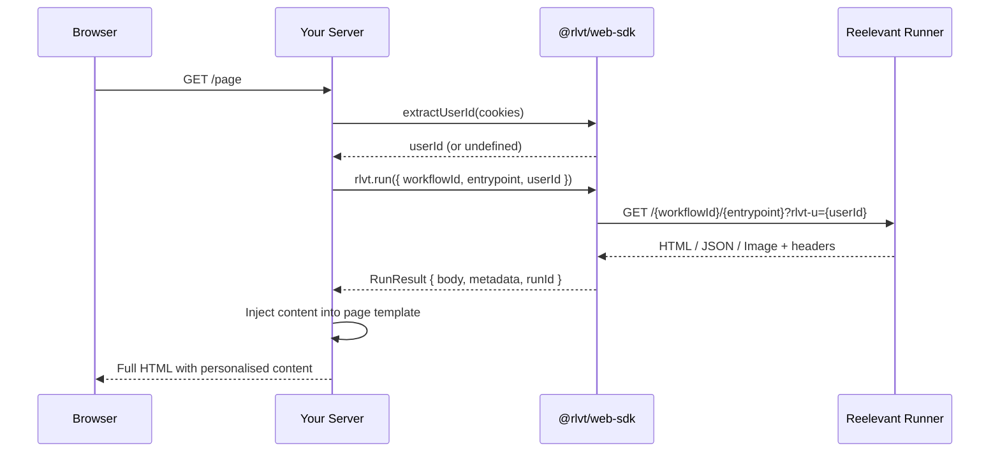

## Installation

```bash
npm install @rlvt/web-sdk
```

Le SDK core n'a aucune dépendance et fonctionne avec tout runtime prenant en charge la Web Fetch API (Node.js 18+, Bun, Deno, Cloudflare Workers).

## Configuration du client

```typescript
import { ReelevantClient } from '@rlvt/web-sdk'

const rlvt = new ReelevantClient({
  // timeout: 5000,        // default: 5000ms
  // fallback: 'empty',    // default: 'empty' — returns empty result on error
})
```

Aucune configuration n'est requise — le SDK utilise par défaut le Runner de production.

### Options de configuration

| Option | Type | Par défaut | Description |
|--------|------|---------|-------------|
| `runnerUrl` | `string` | `https://reelevant.run` | URL de l'endpoint du Runner |
| `timeout` | `number` | `5000` | Timeout global en millisecondes |
| `fallback` | `'empty' \| 'error' \| Function` | `'empty'` | Ce qui se passe lorsqu'un appel échoue |

## Récupérer du contenu personnalisé

### Un seul Workflow

```typescript
import { extractUserId } from '@rlvt/web-sdk'

// Extract user identity from cookies
const userId = extractUserId(req.headers.cookie ?? '')

const result = await rlvt.run({
  workflowId: 'your-workflow-id',
  entrypoint: '43a490a0',
  userId,
  userAgent: req.headers['user-agent'],
  ip: req.headers['x-forwarded-for']?.split(',')[0],
  referer: req.url,
})
```

### Plusieurs Workflows en parallèle

```typescript
const [hero, sidebar, footer] = await rlvt.runAll([
  { workflowId: 'wf-hero', entrypoint: '43a490a0', userId },
  { workflowId: 'wf-sidebar', entrypoint: 'b7e21f3c', userId },
  { workflowId: 'wf-footer', entrypoint: 'd9c84e1a', userId },
])
```

### Options d'exécution

| Option | Type | Description |
|--------|------|-------------|
| `workflowId` | `string` | ID du Workflow issu du dashboard Reelevant |
| `entrypoint` | `string` | shortId de l'entrypoint (8 caractères alphanumériques, par exemple `43a490a0`) |
| `userId` | `string?` | Identité du visiteur issue des cookies |
| `params` | `Record<string, string>?` | Paramètres d'URL transmis au Runner |
| `locale` | `string?` | Locale pour la résolution du contenu |
| `userAgent` | `string?` | Transmis pour la détection de l'appareil |
| `ip` | `string?` | Transmis pour la géolocalisation |
| `referer` | `string?` | URL de la page |
| `timeout` | `number?` | Remplacement du timeout par appel, en ms |

## Traiter la réponse

`run()` renvoie un `RunResult` dont le `body` est une union discriminée :

```typescript
const result = await rlvt.run({ workflowId: '...', entrypoint: '...' })

switch (result.body.type) {
  case 'html':
    // result.body.content is a string of HTML
    res.send(result.body.content)
    break

  case 'json':
    // result.body.content is a parsed JSON object
    res.json(result.body.content)
    break

  case 'image':
    // result.body.content is an ArrayBuffer
    res.setHeader('Content-Type', 'image/png')
    res.send(Buffer.from(result.body.content))
    break

  case 'empty':
    // No content returned — show your default
    res.send('<div>Default content</div>')
    break
}
```

### Champs de RunResult

| Champ | Type | Description |
|-------|------|-------------|
| `status` | `number` | Code de statut HTTP (0 pour le repli) |
| `source` | `'runner' \| 'fallback'` | Origine du résultat |
| `body` | `RunContent` | Contenu typé (voir ci-dessus) |
| `metadata` | `Record<string, unknown>` | Métadonnées issues de l'Output Node |
| `properties` | `Record<string, unknown>` | Propriétés de sortie |
| `runId` | `string \| null` | ID d'exécution du Workflow pour le tracking |
| `executionPath` | `string[]` | ID des Branches empruntées durant l'exécution |
| `redirectionUrl` | `string` | URL de redirection au clic préconstruite (Runner avec `mode=click`) |
| `trackClick` | `() => Promise<void>` | Callback fire-and-forget pour suivre le clic côté serveur |

## Tracking des clics

<Warning>
**Le tracking des clics doit toujours être configuré après l'affichage.** Le flux est le suivant : récupérer le contenu → l'afficher à l'utilisateur → suivre les clics lorsqu'il interagit. Chaque affichage de contenu doit avoir un mécanisme de tracking des clics correspondant, sinon vous perdez des données d'attribution.
</Warning>

Chaque `RunResult` inclut une `redirectionUrl` et un callback `trackClick()`. Cela garantit que le tracking des clics est toujours enregistré — les développeurs doivent utiliser l'un des deux patterns ci-dessous.

### Option 1 : Lien de redirection (recommandé pour les CTA)

Utilisez `redirectionUrl` comme `href` sur vos liens de call-to-action. Le navigateur gère tout — le Runner suit le clic et effectue une redirection 302 vers la destination finale.

```typescript
const result = await rlvt.run({ workflowId: 'wf-hero', entrypoint: '43a490a0', userId })

// In your template — always pair display with click tracking
// <a href="${result.redirectionUrl}">Shop now</a>
```

### Option 2 : Fire-and-forget côté serveur

Appelez `result.trackClick()` lorsque vous contrôlez la navigation et souhaitez suivre le clic en arrière-plan. Il appelle l'endpoint de clic du Runner avec `redirect: manual` et absorbe toutes les erreurs — il ne lève jamais d'exception.

```typescript
const result = await rlvt.run({ workflowId: 'wf-hero', entrypoint: '43a490a0', userId })

// User clicked a CTA (must be called after display) — track it server-side
await result.trackClick()
```

Aucun argument nécessaire — le callback est pré-lié à la `redirectionUrl` du résultat.

## Helpers d'identité

### `extractUserId(cookies)`

Extrait l'ID utilisateur Reelevant des cookies. Priorité : `rlvt_clientId` > `rlvt_tmpId`.

```typescript
import { extractUserId } from '@rlvt/web-sdk'

// From a cookie header string
const userId = extractUserId(req.headers.cookie ?? '')

// From a parsed cookies object
const userId = extractUserId(req.cookies)
```

### `generateTmpId()`

Génère un nouvel ID temporaire anonyme, au format utilisé par le tracker côté client.

```typescript
import { generateTmpId } from '@rlvt/web-sdk'

const tmpId = generateTmpId()
// Set as rlvt_tmpId cookie on the response
```

## Stratégies de repli

Configurez la manière dont le SDK gère les timeouts et les erreurs :

```typescript
// 'empty' (default) — returns an empty result, your page renders normally
const rlvt = new ReelevantClient({ fallback: 'empty' })

// 'error' — throws the original error, you handle it in your catch block
const rlvt = new ReelevantClient({ fallback: 'error' })

// Custom function — return your own fallback content
const rlvt = new ReelevantClient({
  fallback: (options, error) => ({
    status: 0,
    source: 'fallback',
    body: { type: 'html', content: '<div>Default banner</div>' },
    metadata: {},
    properties: {},
    runId: null,
    executionPath: [],
  }),
})
```

## Flux de requête



## Exemple avec Express

```typescript
import express from 'express'
import { ReelevantClient, extractUserId, generateTmpId } from '@rlvt/web-sdk'

const app = express()
const rlvt = new ReelevantClient()

app.get('/page', async (req, res) => {
  // Ensure identity cookie
  let userId = extractUserId(req.headers.cookie ?? '')
  if (!userId) {
    const tmpId = generateTmpId()
    res.cookie('rlvt_tmpId', tmpId, { maxAge: 365 * 24 * 60 * 60 * 1000 })
    userId = tmpId
  }

  const result = await rlvt.run({
    workflowId: 'wf-hero',
    entrypoint: '43a490a0',
    userId,
    userAgent: req.headers['user-agent'],
    ip: req.ip,
    referer: req.originalUrl,
  })

  const heroHtml = result.body.type === 'html' ? result.body.content : ''

  res.send(`
    <html>
      <body>
        <div data-rlvt-ssr="true">${heroHtml}</div>
      </body>
    </html>
  `)
})
```

## Constantes

Le SDK exporte des constantes couramment utilisées :

```typescript
import {
  DEFAULT_RUNNER_URL,   // 'https://reelevant.run'
  DEFAULT_TIMEOUT,      // 5000
  COOKIE_CLIENT_ID,     // 'rlvt_clientId'
  COOKIE_TMP_ID,        // 'rlvt_tmpId'
} from '@rlvt/web-sdk'
```
