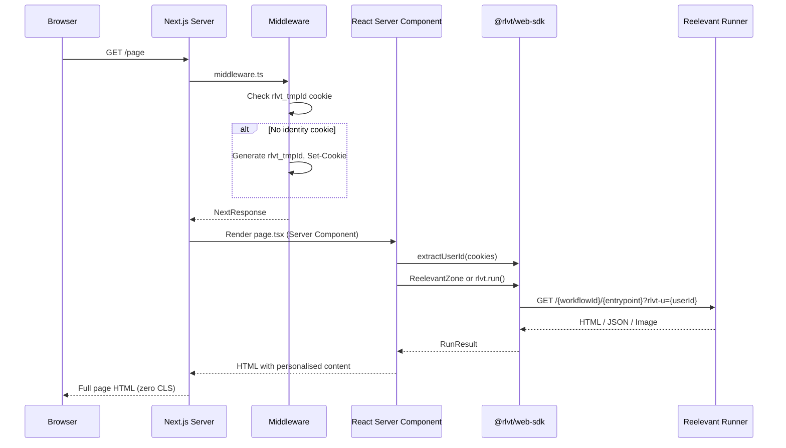

## Installation

```bash
npm install @rlvt/web-sdk react
```

## Mise en place

### 1. Créer l'instance du client

Créez une instance de client partagée dans un module réservé au serveur :

```typescript
// lib/reelevant.ts
import { ReelevantClient } from '@rlvt/web-sdk'

export const rlvt = new ReelevantClient({
  timeout: 50,  // tight timeout for SSR — falls back gracefully
})
```

### 2. Ajouter le middleware d'identité

Créez `middleware.ts` à la racine de votre projet :

```typescript
// middleware.ts
import { createMiddleware } from '@rlvt/web-sdk/next'
import { NextResponse } from 'next/server'
import type { NextRequest } from 'next/server'

const ensureIdentity = createMiddleware()

export function middleware(request: NextRequest) {
  const response = NextResponse.next()
  ensureIdentity(request, response)
  return response
}

export const config = {
  matcher: ['/((?!_next/static|_next/image|favicon.ico).*)'],
}
```

Cela garantit que chaque visiteur dispose d'un cookie `rlvt_tmpId` avant qu'aucun contenu personnalisé ne soit demandé.

## Flux de requête



## Utiliser ReelevantZone (recommandé)

`ReelevantZone` est un React Server Component asynchrone qui récupère et affiche du contenu personnalisé :

```tsx
// app/page.tsx
import { ReelevantZone } from '@rlvt/web-sdk/next'
import { extractUserId } from '@rlvt/web-sdk'
import { cookies } from 'next/headers'
import { rlvt } from '@/lib/reelevant'

export default async function Page() {
  const cookieStore = await cookies()
  const userId = extractUserId(cookieStore.toString())

  return (
    <main>
      <ReelevantZone
        client={rlvt}
        workflowId="wf-hero-banner"
        entrypoint="43a490a0"
        userId={userId}
        className="hero-section"
        fallback={<DefaultHero />}
      />
    </main>
  )
}

function DefaultHero() {
  return <div className="hero-section">Welcome to our store</div>
}
```

### ZoneProps

| Prop | Type | Description |
|------|------|-------------|
| `client` | `ReelevantClient` | Instance de client préconfigurée |
| `workflowId` | `string` | ID du Workflow |
| `entrypoint` | `string` | shortId de l'entrypoint (8 caractères alphanumériques, par exemple `43a490a0`) |
| `userId` | `string?` | Identité du visiteur |
| `params` | `Record<string, string>?` | Paramètres d'URL |
| `locale` | `string?` | Locale |
| `userAgent` | `string?` | User-Agent |
| `ip` | `string?` | IP du client |
| `referer` | `string?` | URL de la page |
| `className` | `string?` | Classe CSS sur le conteneur |
| `fallback` | `ReactNode?` | Affiché lorsque le contenu est vide |
| `render` | `(result: RunResult) => ReactNode` | Rendu personnalisé pour le JSON |

### Rendu personnalisé avec du JSON

Pour la personnalisation headless où vous souhaitez construire votre propre UI :

```tsx
<ReelevantZone
  client={rlvt}
  workflowId="wf-products"
  entrypoint="f6a83d09"
  userId={userId}
  render={(result) => {
    if (result.body.type !== 'json') return null
    const { products } = result.body.content as { products: Product[] }
    return (
      <div className="grid grid-cols-3 gap-4">
        {products.map(p => <ProductCard key={p.id} product={p} />)}
      </div>
    )
  }}
/>
```

## Utilisation manuelle (sans ReelevantZone)

Si vous préférez un contrôle direct :

```tsx
// app/page.tsx
import { rlvt } from '@/lib/reelevant'
import { extractUserId } from '@rlvt/web-sdk'
import { cookies, headers } from 'next/headers'

export default async function Page() {
  const cookieStore = await cookies()
  const headersList = await headers()
  const userId = extractUserId(cookieStore.toString())

  const result = await rlvt.run({
    workflowId: 'wf-hero',
    entrypoint: '43a490a0',
    userId,
    userAgent: headersList.get('user-agent') ?? undefined,
  })

  if (result.body.type === 'html') {
    return (
      <div
        data-rlvt-ssr="true"
        dangerouslySetInnerHTML={{ __html: result.body.content }}
      />
    )
  }

  return <DefaultContent />
}
```

## Plusieurs zones sur une page

Récupérez plusieurs zones en parallèle pour des performances optimales :

```tsx
export default async function Page() {
  const cookieStore = await cookies()
  const userId = extractUserId(cookieStore.toString())

  const [hero, sidebar] = await rlvt.runAll([
    { workflowId: 'wf-hero', entrypoint: '43a490a0', userId },
    { workflowId: 'wf-sidebar', entrypoint: 'e5f302b8', userId },
  ])

  return (
    <main>
      <ReelevantZone client={rlvt} workflowId="wf-hero" entrypoint="43a490a0" userId={userId} />
      <aside>
        <ReelevantZone client={rlvt} workflowId="wf-sidebar" entrypoint="e5f302b8" userId={userId} />
      </aside>
    </main>
  )
}
```

<Note>
Chaque `ReelevantZone` est un composant asynchrone indépendant qui récupère son contenu en parallèle lorsqu'il est rendu au même niveau. Vous n'avez pas besoin d'utiliser explicitement `runAll` avec les composants — Next.js gère automatiquement la récupération en parallèle.
</Note>

## Tracking des clics

<Warning>
**Le tracking des clics doit toujours être configuré après l'affichage.** Chaque affichage de contenu doit avoir un mécanisme de tracking des clics correspondant — soit un lien de redirection, soit un appel à `trackClick()`.
</Warning>

Chaque `RunResult` inclut `redirectionUrl` et `trackClick()`. Deux patterns :

### Lien de redirection

Utilisez `redirectionUrl` directement comme `<a href>` :

```tsx
export default async function Page() {
  const cookieStore = await cookies()
  const userId = extractUserId(cookieStore.toString())

  const result = await rlvt.run({ workflowId: 'wf-promo', entrypoint: '1a7bc4d2', userId })

  return (
    <div data-rlvt-ssr="true">
      {result.body.type === 'html' && (
        <>
          <div dangerouslySetInnerHTML={{ __html: result.body.content }} />
          <a href={result.redirectionUrl}>Shop now</a>
        </>
      )}
    </div>
  )
}
```

### Fire-and-forget côté serveur

Appelez `result.trackClick()` depuis une Server Action — elle enregistre le clic et absorbe toutes les erreurs :

```tsx
// app/actions.ts
'use server'
import { rlvt } from '@/lib/reelevant'

export async function handleClick(workflowId: string, entrypoint: string, userId: string) {
  const result = await rlvt.run({ workflowId, entrypoint, userId })
  await result.trackClick()
}
```

Consultez [SDK core — Tracking des clics](/fr/developer-docs/web-integration/server-side-sdk/core#click-tracking) pour tous les détails.

## Compatibilité avec le tracker client

Le SDK ajoute `data-rlvt-ssr="true"` aux éléments rendus. Le tracker Reelevant côté client ignore automatiquement les zones portant cet attribut, il n'y a donc ni double chargement ni scintillement.

Vous pouvez toujours utiliser le tracker client sur la même page pour :
- Le tracking d'événements (clics, impressions, conversions)
- Les zones uniquement côté client (contenu dépendant du consentement, overlays)
- Les intégrations on-site (déclencheurs datalayer, règles d'URL)
