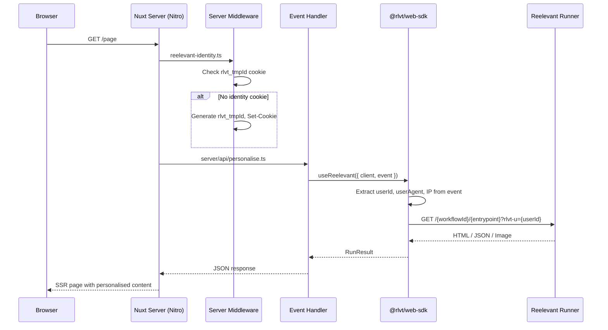

## Installation

```bash
npm install @rlvt/web-sdk
```

Aucune dépendance supplémentaire n'est nécessaire. L'adaptateur Nuxt utilise le typage structurel — il n'importe rien des packages `nuxt` ou `h3`.

## Mise en place

### 1. Créer l'instance du client

```typescript
// server/utils/reelevant.ts
import { ReelevantClient } from '@rlvt/web-sdk'

export const rlvt = new ReelevantClient({
  timeout: 50,
})
```

### 2. Ajouter le middleware d'identité

Créez un middleware serveur qui garantit que chaque visiteur dispose d'un cookie d'identité :

```typescript
// server/middleware/reelevant-identity.ts
import { ensureIdentity } from '@rlvt/web-sdk/nuxt'

export default defineEventHandler((event) => {
  ensureIdentity(event, useCookies(event))
})
```

## Flux de requête



## Utiliser useReelevant

Le helper `useReelevant` extrait automatiquement l'identité du visiteur, le user-agent, l'IP et le referer depuis l'événement H3 :

```typescript
// server/api/personalise.ts
import { useReelevant } from '@rlvt/web-sdk/nuxt'
import { rlvt } from '~/server/utils/reelevant'

export default defineEventHandler(async (event) => {
  const { run, runAll } = useReelevant({ client: rlvt, event })

  const hero = await run({ workflowId: 'wf-hero', entrypoint: '43a490a0' })
  return { hero }
})
```

### Récupérer plusieurs zones

```typescript
export default defineEventHandler(async (event) => {
  const { runAll } = useReelevant({ client: rlvt, event })

  const [hero, sidebar, footer] = await runAll([
    { workflowId: 'wf-hero', entrypoint: '43a490a0' },
    { workflowId: 'wf-sidebar', entrypoint: 'b7e21f3c' },
    { workflowId: 'wf-footer', entrypoint: 'd9c84e1a' },
  ])

  return { hero, sidebar, footer }
})
```

## Dans une page Nuxt (SSR)

Récupérez le contenu personnalisé dans une route ou un plugin serveur, puis utilisez-le dans votre page :

```vue
<!-- pages/index.vue -->
<script setup lang="ts">
const { data } = await useFetch('/api/personalise')
</script>

<template>
  <main>
    <div
      v-if="data?.hero?.body?.type === 'html'"
      data-rlvt-ssr="true"
      v-html="data.hero.body.content"
    />
    <DefaultHero v-else />
  </main>
</template>
```

## Helpers de plus bas niveau

### `extractUserIdFromEvent(event)`

Extrait l'ID utilisateur directement depuis l'en-tête de cookie d'un événement H3 :

```typescript
import { extractUserIdFromEvent } from '@rlvt/web-sdk/nuxt'

export default defineEventHandler((event) => {
  const userId = extractUserIdFromEvent(event)
  // ...
})
```

### `runOptionsFromEvent(event)`

Récupère tous les champs de contexte (userId, userAgent, ip, referer) depuis un événement :

```typescript
import { runOptionsFromEvent } from '@rlvt/web-sdk/nuxt'

export default defineEventHandler(async (event) => {
  const context = runOptionsFromEvent(event)
  const result = await rlvt.run({
    workflowId: 'wf-hero',
    entrypoint: '43a490a0',
    ...context,
  })
  return result
})
```

## Traiter les réponses JSON

Pour la personnalisation headless où le Workflow renvoie du JSON :

```vue
<script setup lang="ts">
const { data } = await useFetch('/api/personalise')
const products = computed(() => {
  if (data.value?.hero?.body?.type === 'json') {
    return (data.value.hero.body.content as { products: Product[] }).products
  }
  return []
})
</script>

<template>
  <div class="grid grid-cols-3 gap-4">
    <ProductCard v-for="p in products" :key="p.id" :product="p" />
  </div>
</template>
```

## Tracking des clics

<Warning>
**Le tracking des clics doit toujours être configuré après l'affichage.** Chaque affichage de contenu doit avoir un mécanisme de tracking des clics correspondant — soit un lien de redirection, soit un appel à `trackClick()`.
</Warning>

Chaque `RunResult` inclut `redirectionUrl` et `trackClick()`. Utilisez l'un des deux patterns :

```vue
<!-- Redirect link -->
<template>
  <div v-if="data?.hero?.body?.type === 'html'" data-rlvt-ssr="true">
    <div v-html="data.hero.body.content" />
    <a :href="data.hero.redirectionUrl">Shop now</a>
  </div>
</template>
```

```typescript
// Server-side fire-and-forget (in an API route)
export default defineEventHandler(async (event) => {
  const { run } = useReelevant({ client: rlvt, event })
  const result = await run({ workflowId: 'wf-hero', entrypoint: '43a490a0' })

  // Later, when the user clicks (must be after display):
  await result.trackClick()
})
```

Consultez [SDK core — Tracking des clics](/fr/developer-docs/web-integration/server-side-sdk/core#click-tracking) pour tous les détails.

## Compatibilité avec le tracker client

Les zones rendues côté serveur doivent inclure `data-rlvt-ssr="true"` dans l'élément conteneur. Le tracker côté client ignore automatiquement ces zones.
