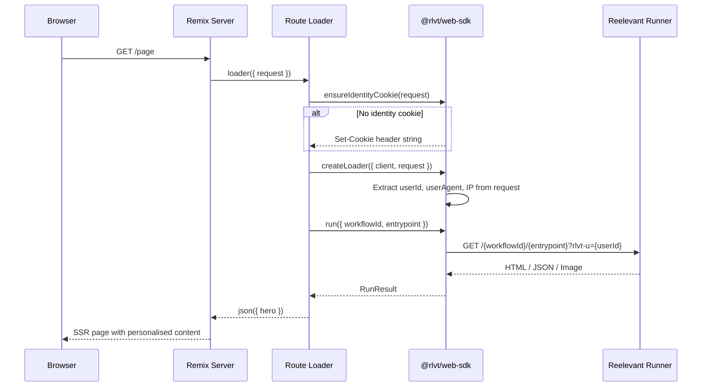

## Installation

```bash
npm install @rlvt/web-sdk
```

Aucune dépendance supplémentaire. L'adaptateur utilise le typage structurel — il n'importe rien de `@remix-run/node` ni de `@remix-run/server-runtime`.

## Mise en place

### 1. Créer l'instance du client

```typescript
// app/lib/reelevant.server.ts
import { ReelevantClient } from '@rlvt/web-sdk'

export const rlvt = new ReelevantClient({
  timeout: 50,
})
```

### 2. Garantir l'identité dans le loader racine

```typescript
// app/root.tsx
import { ensureIdentityCookie } from '@rlvt/web-sdk/remix'
import type { LoaderFunctionArgs } from '@remix-run/node'

export async function loader({ request }: LoaderFunctionArgs) {
  const identityCookie = ensureIdentityCookie(request)

  return new Response(JSON.stringify({}), {
    headers: identityCookie ? { 'Set-Cookie': identityCookie } : {},
  })
}
```

## Flux de requête



## Utiliser createLoader

Le helper `createLoader` extrait automatiquement l'identité et le contexte de la requête Remix :

```typescript
// app/routes/_index.tsx
import { json, type LoaderFunctionArgs } from '@remix-run/node'
import { useLoaderData } from '@remix-run/react'
import { createLoader } from '@rlvt/web-sdk/remix'
import { rlvt } from '~/lib/reelevant.server'

export async function loader({ request }: LoaderFunctionArgs) {
  const { run, runAll } = createLoader({ client: rlvt, request })

  const hero = await run({ workflowId: 'wf-hero', entrypoint: '43a490a0' })
  return json({ hero })
}

export default function Index() {
  const { hero } = useLoaderData<typeof loader>()

  if (hero.body.type === 'html') {
    return (
      <div
        data-rlvt-ssr="true"
        dangerouslySetInnerHTML={{ __html: hero.body.content }}
      />
    )
  }

  return <DefaultHero />
}
```

### Plusieurs zones

```typescript
export async function loader({ request }: LoaderFunctionArgs) {
  const { runAll } = createLoader({ client: rlvt, request })

  const [hero, sidebar] = await runAll([
    { workflowId: 'wf-hero', entrypoint: '43a490a0' },
    { workflowId: 'wf-sidebar', entrypoint: 'b7e21f3c' },
  ])

  return json({ hero, sidebar })
}
```

## Helpers de plus bas niveau

### `runOptionsFromRequest(request)`

Extrayez manuellement les champs d'identité et de contexte :

```typescript
import { runOptionsFromRequest } from '@rlvt/web-sdk/remix'

export async function loader({ request }: LoaderFunctionArgs) {
  const context = runOptionsFromRequest(request)
  // context = { userId, userAgent, ip, referer }

  const result = await rlvt.run({
    workflowId: 'wf-hero',
    entrypoint: '43a490a0',
    ...context,
  })

  return json({ result })
}
```

### `ensureIdentityCookie(request)`

Renvoie une chaîne d'en-tête `Set-Cookie` si aucune identité n'existe, ou `null` si le visiteur en a déjà une :

```typescript
import { ensureIdentityCookie } from '@rlvt/web-sdk/remix'

export async function loader({ request }: LoaderFunctionArgs) {
  const identity = ensureIdentityCookie(request)
  const data = { /* ... */ }

  return json(data, {
    headers: identity ? { 'Set-Cookie': identity } : {},
  })
}
```

## Traiter les réponses JSON

```tsx
export default function Page() {
  const { zone } = useLoaderData<typeof loader>()

  if (zone.body.type === 'json') {
    const { products } = zone.body.content as { products: Product[] }
    return (
      <div className="grid grid-cols-3 gap-4">
        {products.map(p => <ProductCard key={p.id} product={p} />)}
      </div>
    )
  }

  return <DefaultContent />
}
```

## Tracking des clics

<Warning>
**Le tracking des clics doit toujours être configuré après l'affichage.** Chaque affichage de contenu doit avoir un mécanisme de tracking des clics correspondant — soit un lien de redirection, soit un appel à `trackClick()`.
</Warning>

Chaque `RunResult` inclut `redirectionUrl` et `trackClick()`. Deux patterns :

```tsx
// Redirect link — use redirectionUrl as <a href>
export default function Page() {
  const { hero } = useLoaderData<typeof loader>()

  return (
    <div data-rlvt-ssr="true">
      {hero.body.type === 'html' && (
        <>
          <div dangerouslySetInnerHTML={{ __html: hero.body.content }} />
          <a href={hero.redirectionUrl}>Shop now</a>
        </>
      )}
    </div>
  )
}
```

```typescript
// Server-side fire-and-forget (in an action)
export async function action({ request }: ActionFunctionArgs) {
  const { run } = createLoader({ client: rlvt, request })
  const result = await run({ workflowId: 'wf-hero', entrypoint: '43a490a0' })
  await result.trackClick()
  return json({ ok: true })
}
```

Consultez [SDK core — Tracking des clics](/fr/developer-docs/web-integration/server-side-sdk/core#click-tracking) pour tous les détails.

## Compatibilité avec le tracker client

Ajoutez `data-rlvt-ssr="true"` à votre élément conteneur. Le tracker côté client ignore automatiquement les zones rendues côté serveur.
