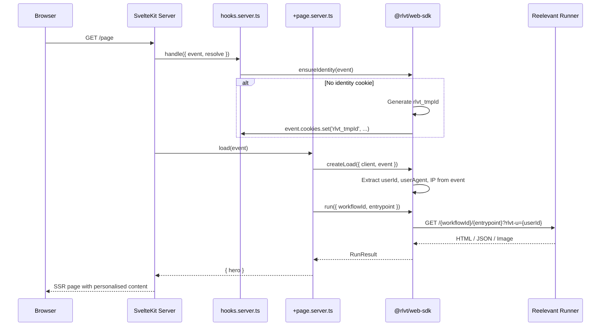

## Installation

```bash
npm install @rlvt/web-sdk
```

Aucune dépendance supplémentaire. L'adaptateur utilise le typage structurel — il n'importe rien de `@sveltejs/kit`.

## Mise en place

### 1. Créer l'instance du client

```typescript
// src/lib/server/reelevant.ts
import { ReelevantClient } from '@rlvt/web-sdk'

export const rlvt = new ReelevantClient({
  timeout: 50,
})
```

### 2. Ajouter le hook d'identité

Garantissez que chaque visiteur dispose d'un cookie d'identité à l'aide d'un hook serveur :

```typescript
// src/hooks.server.ts
import { ensureIdentity } from '@rlvt/web-sdk/sveltekit'

export async function handle({ event, resolve }) {
  ensureIdentity(event)
  return resolve(event)
}
```

## Flux de requête



## Utiliser createLoad

Le helper `createLoad` extrait automatiquement l'identité du visiteur et le contexte depuis l'événement SvelteKit :

```typescript
// src/routes/+page.server.ts
import { createLoad } from '@rlvt/web-sdk/sveltekit'
import { rlvt } from '$lib/server/reelevant'

export async function load(event) {
  const { run, runAll } = createLoad({ client: rlvt, event })

  const hero = await run({ workflowId: 'wf-hero', entrypoint: '43a490a0' })
  return { hero }
}
```

Utilisez ensuite les données dans votre page :

```svelte
<!-- src/routes/+page.svelte -->
<script lang="ts">
  let { data } = $props()
</script>

{#if data.hero.body.type === 'html'}
  <div data-rlvt-ssr="true">
    {@html data.hero.body.content}
  </div>
{:else}
  <DefaultHero />
{/if}
```

### Plusieurs zones

```typescript
export async function load(event) {
  const { runAll } = createLoad({ client: rlvt, event })

  const [hero, sidebar] = await runAll([
    { workflowId: 'wf-hero', entrypoint: '43a490a0' },
    { workflowId: 'wf-sidebar', entrypoint: 'b7e21f3c' },
  ])

  return { hero, sidebar }
}
```

## Helpers de plus bas niveau

### `runOptionsFromEvent(event)`

Extrayez manuellement les champs d'identité et de contexte :

```typescript
import { runOptionsFromEvent } from '@rlvt/web-sdk/sveltekit'

export async function load(event) {
  const context = runOptionsFromEvent(event)
  // context = { userId, userAgent, ip, referer }

  const result = await rlvt.run({
    workflowId: 'wf-hero',
    entrypoint: '43a490a0',
    ...context,
  })

  return { result }
}
```

### `ensureIdentity(event)`

Définit un cookie `rlvt_tmpId` sur l'événement si aucun cookie d'identité n'existe. À utiliser dans les hooks ou les fonctions de load :

```typescript
import { ensureIdentity } from '@rlvt/web-sdk/sveltekit'

export async function handle({ event, resolve }) {
  ensureIdentity(event)
  return resolve(event)
}
```

## Traiter les réponses JSON

```svelte
<script lang="ts">
  let { data } = $props()

  const products = $derived(
    data.zone.body.type === 'json'
      ? (data.zone.body.content as { products: Product[] }).products
      : []
  )
</script>

<div class="grid grid-cols-3 gap-4">
  {#each products as product (product.id)}
    <ProductCard {product} />
  {/each}
</div>
```

## Tracking des clics

<Warning>
**Le tracking des clics doit toujours être configuré après l'affichage.** Chaque affichage de contenu doit avoir un mécanisme de tracking des clics correspondant — soit un lien de redirection, soit un appel à `trackClick()`.
</Warning>

Chaque `RunResult` inclut `redirectionUrl` et `trackClick()`. Deux patterns :

```svelte
<!-- Redirect link -->
{#if data.hero.body.type === 'html'}
  <div data-rlvt-ssr="true">
    {@html data.hero.body.content}
    <a href={data.hero.redirectionUrl}>Shop now</a>
  </div>
{/if}
```

```typescript
// Server-side fire-and-forget (in a form action)
// src/routes/+page.server.ts
import { createLoad } from '@rlvt/web-sdk/sveltekit'
import { rlvt } from '$lib/server/reelevant'

export const actions = {
  trackClick: async (event) => {
    const { run } = createLoad({ client: rlvt, event })
    const result = await run({ workflowId: 'wf-hero', entrypoint: '43a490a0' })
    await result.trackClick()
  }
}
```

Consultez [SDK core — Tracking des clics](/fr/developer-docs/web-integration/server-side-sdk/core#click-tracking) pour tous les détails.

## Compatibilité avec le tracker client

Ajoutez `data-rlvt-ssr="true"` à votre élément conteneur. Le tracker côté client ignore automatiquement les zones rendues côté serveur.
