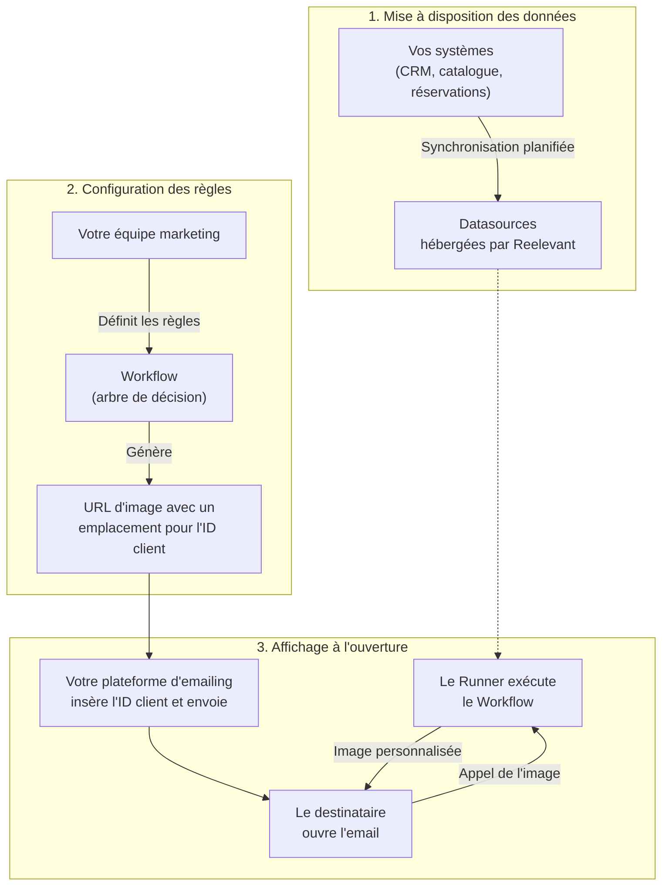
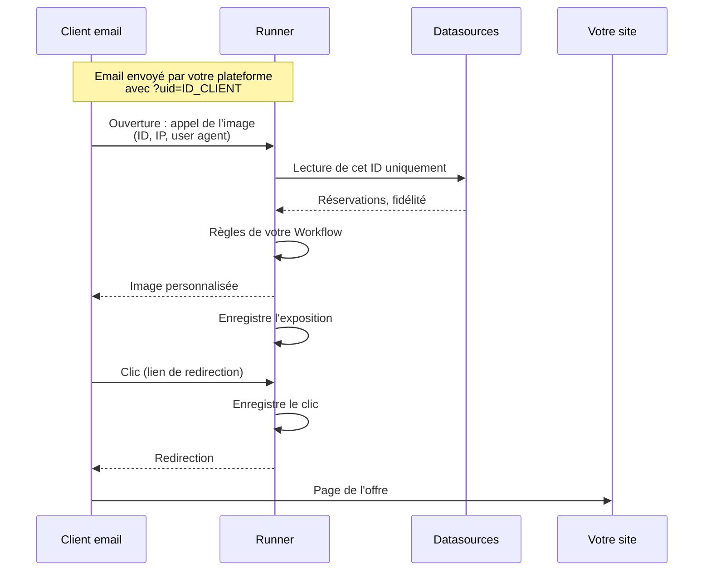
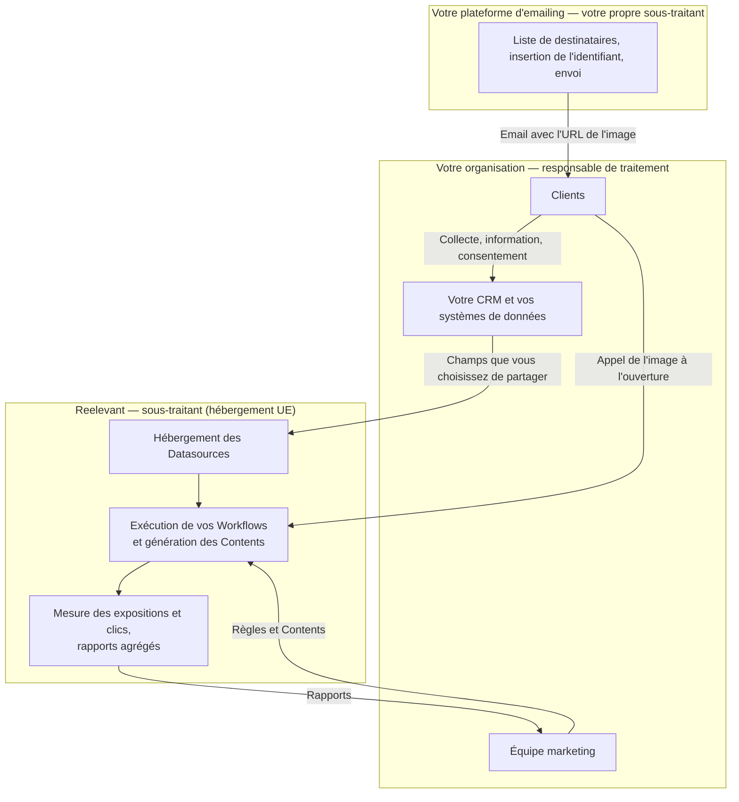
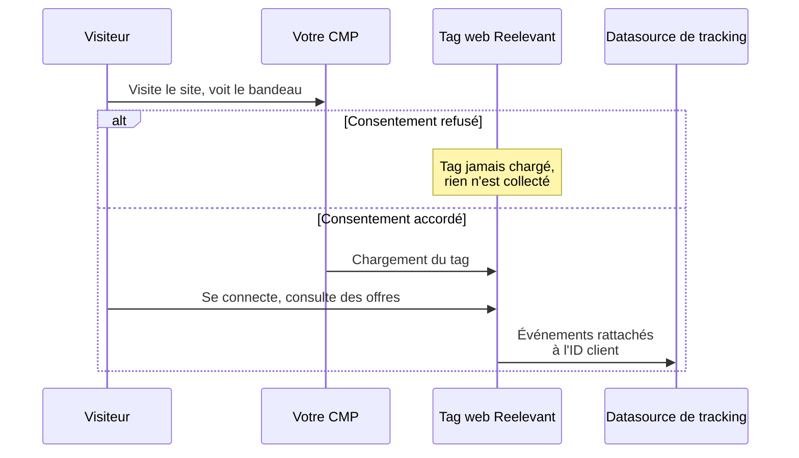

## Reelevant en un paragraphe

Reelevant est une plateforme SaaS qui personnalise les Contents marketing que votre organisation envoie déjà — principalement des images et des blocs dans les emails, les pages web et les applications. Votre équipe marketing définit des règles, par exemple « si la dernière réservation de ce client est un séjour au ski, afficher les offres d'hiver ». Reelevant applique ces règles à vos données clients au moment où l'email est ouvert ou la page consultée, et renvoie le Content correspondant.

Reelevant n'envoie pas d'emails, ne détient pas la liste des destinataires et ne décide pas seul de ce qu'une personne voit. C'est un outil que vos équipes configurent et pilotent.

<Info>
Cette page s'adresse aux délégués à la protection des données, juristes et équipes achats. Elle décrit le fonctionnement dont vous avez besoin pour qualifier le traitement. Pour les certifications, le chiffrement et les engagements contractuels, consultez [Sécurité et conformité](/fr/why-reelevant/technical-evaluators/security).
</Info>

## Les trois phases

La personnalisation avec Reelevant suit toujours les mêmes trois phases.

### 1. Mise à disposition des données

Votre organisation connecte ses propres systèmes à Reelevant — généralement un export CRM, un catalogue de produits ou d'offres, et un historique de réservations ou d'achats. Chaque connexion est une Datasource (un jeu de données synchronisé dans Reelevant). Vous choisissez les champs envoyés ; seuls les champs mappés sont utilisables dans la plateforme.

Reelevant n'achète pas de données, ne les enrichit pas et ne les croise pas avec des données tierces.

### 2. Configuration des règles

Votre équipe marketing construit un Workflow — un arbre de décision qui traduit votre stratégie marketing en règles. Un Workflow interroge vos données (« quelle est la dernière destination réservée ? », « le client est-il membre du programme de fidélité ? ») et choisit le Content à afficher pour chaque réponse.

Le Workflow est un modèle : il est configuré une seule fois, avant tout envoi, et ne contient aucune donnée personnelle. Reelevant peut aider votre équipe à le paramétrer, mais chaque règle reflète une décision de votre organisation.

Une fois le Workflow prêt, la plateforme génère une URL à coller dans le modèle d'email. Cette URL contient un emplacement pour l'identifiant client. Reelevant ne le renseigne pas.

### 3. Affichage à l'ouverture

Votre plateforme d'emailing remplace l'emplacement par l'identifiant de chaque destinataire et envoie la campagne. Reelevant ne sait pas qui a reçu l'email.

Quand un destinataire ouvre l'email, son client de messagerie appelle l'image. C'est seulement à ce moment que le Runner (le service Reelevant qui exécute les Workflows) lit les données de ce client, parcourt l'arbre de décision et renvoie le Content correspondant. Rien n'est pré-calculé par personne au moment de l'envoi : le Content reflète les données les plus récentes au moment de l'ouverture.

Un clic sur le Content passe par un lien de redirection Reelevant, qui enregistre le clic avant d'envoyer le destinataire vers votre site.

## Qui fait quoi

| Étape | Votre organisation | Reelevant | Votre plateforme d'emailing / web |
|-------|--------------------|-----------|-----------------------------------|
| Collecter les données clients | Les collecte auprès des clients, sur sa propre base légale et avec sa propre mention d'information | Ne les collecte pas | — |
| Transmettre les données à Reelevant | Choisit les jeux de données et les champs partagés | Héberge les données dans l'UE | — |
| Définir les règles de ciblage et de profilage | Décide des règles et des offres à mettre en avant | Fournit l'outil ; peut aider au paramétrage sur vos instructions | — |
| Choisir les destinataires et envoyer l'email | Décide qui reçoit quoi et quand | N'intervient pas | Envoie l'email et insère l'identifiant client |
| Sélectionner le Content à l'ouverture | — | Exécute automatiquement vos règles pour l'identifiant reçu | Affiche l'image renvoyée |
| Mesurer les résultats | Consulte les rapports | Enregistre les ouvertures et clics sur le Content, calcule des résultats agrégés | — |

## Rôles de responsable de traitement et de sous-traitant

La position contractuelle standard de Reelevant est la suivante : votre organisation est **responsable de traitement** et Reelevant est **sous-traitant** au sens de l'article 28 du RGPD, pour l'ensemble des traitements réalisés via la plateforme :

- **Hébergement** des données que vous transmettez à la plateforme
- **Génération** du Content personnalisé lors de l'appel de l'image ou de la page, en exécutant les règles que vous avez configurées
- **Mesure** des expositions et des clics sur le Content, et calcul de rapports de performance agrégés
- **Collecte du comportement sur le site**, si vous choisissez de déployer le tag web Reelevant (voir ci-dessous)

Reelevant traite les données personnelles uniquement sur vos instructions documentées — les Datasources que vous connectez et les Workflows que vos équipes configurent — et jamais pour son propre compte. Le Data Processing Agreement (DPA) liste les sous-traitants ultérieurs (OVHcloud en France et Google Cloud en Belgique), tous situés dans l'UE.

## Profilage

Sélectionner un Content en fonction de l'historique d'un client constitue un profilage au sens de l'article 4(4) du RGPD. Avec Reelevant :

- **Les critères sont les vôtres.** La plateforme ne déduit ni segments, ni scores, ni préférences de manière autonome. Chaque règle est une condition explicite écrite par vos équipes.
- **Aucune intelligence artificielle n'est appliquée à vos données clients.** Reelevant n'entraîne ni n'exécute de modèles d'IA sur les données clients.
- **Le résultat est un Content marketing.** La décision change uniquement l'offre, le produit ou le visuel affiché dans une communication que vous avez déjà décidé d'envoyer.

L'analyse de la base légale de ce profilage, et de ses éventuels effets significatifs au sens de l'article 22, relève du responsable de traitement. En pratique, il est généralement couvert par la même base que votre segmentation CRM et vos campagnes email existantes.

## Identification du client

L'URL placée dans l'email contient un identifiant client pour que le Runner retrouve les bonnes données. Cet identifiant :

- Est choisi par vous — utilisez un identifiant interne et opaque (numéro CRM ou valeur hachée), jamais une adresse email ou un nom
- Est inséré par votre plateforme d'emailing, pas par Reelevant
- Est visible dans le code HTML de l'email : il ne doit rien révéler à lui seul

Lors d'un appel, le client de messagerie ou le navigateur transmet aussi des données techniques, comme l'adresse IP et le user agent. Reelevant les utilise pour servir la requête (par exemple type d'appareil, client de messagerie ou localisation approximative si un Workflow l'utilise). Les événements comportementaux stockent l'identifiant client et le contexte dérivé, pas l'adresse IP brute.

## Collecte du comportement sur le site (optionnelle)

Certains Use Cases s'appuient sur ce qu'un client connecté a fait sur votre site, comme des recherches abandonnées ou des offres consultées. Si ces données n'existent pas déjà dans vos systèmes, vous pouvez déployer le tag web Reelevant sur votre site.

| Sujet | Fonctionnement |
|-------|----------------|
| Qui déploie le tag | Vos équipes, généralement via votre gestionnaire de tags |
| Consentement | Le tag ne lit pas lui-même le consentement. Vous le chargez uniquement après consentement, via votre plateforme de gestion du consentement (CMP), où Reelevant est listé comme destinataire avec sa finalité |
| Identification | La navigation n'est rattachée à un client connu qu'une fois celui-ci connecté et son identifiant transmis par votre site |
| Cookies | Cookies first-party sur votre domaine : identifiant anonyme de l'appareil (365 jours), identifiant du client connu (180 jours), et identifiant porté par un lien Reelevant (30 jours) |
| Conservation | 90 jours par défaut dans la Datasource de tracking |

L'alternative consiste à collecter ce comportement dans votre propre outil d'analytics et à le partager avec Reelevant sous forme de Datasource, comme tout autre jeu de données. Les deux approches sont possibles. Les détails techniques sont dans [Collecte sur site web](/fr/developer-docs/data-collection/web).

## Ce que Reelevant ne fait pas

- Envoyer des emails, SMS ou notifications, ni gérer les listes de destinataires et les désinscriptions
- Collecter le consentement — votre CMP et votre plateforme d'emailing conservent ce rôle
- Acheter, vendre ou enrichir des données personnelles avec des sources tierces
- Utiliser vos données clients pour entraîner des modèles ou pour un autre client
- Transférer des données personnelles hors de l'UE

## Prochaines étapes

<CardGroup cols={2}>
<Card title="Description du traitement" icon="file-contract" href="/fr/why-reelevant/data-protection/processing-details">
Finalités, catégories de données, durées de conservation et destinataires, prêts pour votre registre.
</Card>
<Card title="Sécurité et conformité" icon="shield-check" href="/fr/why-reelevant/technical-evaluators/security">
SOC 2 Type 2, chiffrement, engagements du DPA, sous-traitants ultérieurs et contact sécurité.
</Card>
</CardGroup>
