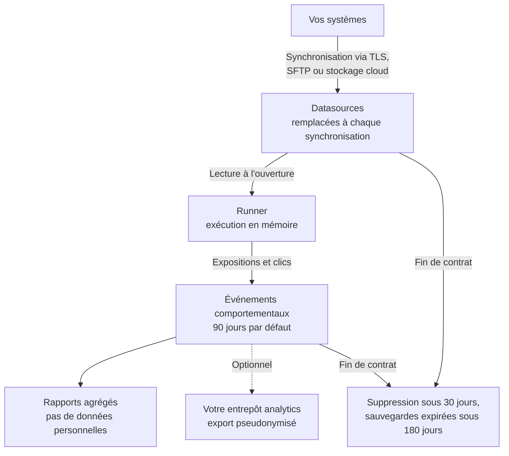

Cette page décrit les traitements réalisés par Reelevant en qualité de sous-traitant, selon la structure habituellement attendue dans une annexe DPA ou un registre des activités de traitement (article 30 du RGPD). Le DPA signé et ses annexes prévalent sur cette page.

## Cycle de vie des données

## Nature et finalité

| Élément | Description |
|---------|-------------|
| **Nature** | Hébergement des jeux de données du client, exécution automatisée des règles de personnalisation définies par le responsable de traitement, génération de Contents marketing personnalisés, mesure des expositions et des clics |
| **Finalité** | Afficher à chaque destinataire le Content marketing sélectionné par les règles du responsable de traitement, dans les emails, sites et applications qu'il opère, et en mesurer la performance |
| **Instructions** | Les Datasources connectées et les Workflows configurés par les utilisateurs du responsable de traitement dans la plateforme |
| **Durée** | La durée du contrat, suivie d'une suppression selon les modalités décrites dans [Conservation](#conservation) |

## Personnes concernées

- Clients et prospects du responsable de traitement qui reçoivent ses communications marketing
- Visiteurs du site ou de l'application du responsable de traitement, si la collecte web ou mobile optionnelle est déployée
- Utilisateurs de la plateforme Reelevant chez le responsable de traitement (données de compte : nom, email professionnel, rôle)

## Catégories de données personnelles

| Catégorie | Exemples | Source |
|-----------|----------|--------|
| Identification | Identifiant client pseudonyme (numéro CRM, valeur hachée) | Systèmes du responsable de traitement et plateforme d'emailing |
| Profil client | Statut de fidélité, préférences, langue, pays — uniquement les champs mappés par le responsable de traitement | Datasources du responsable de traitement |
| Historique de transactions | Réservations ou achats passés, produits, dates, montants | Datasources du responsable de traitement |
| Interaction avec le Content | Événements d'exposition (ouverture) et de clic, Content et Branch affichés, date | Générés par le Runner |
| Données techniques de la requête | User agent, type d'appareil, client de messagerie, referrer, localisation approximative déduite de l'adresse IP | Transmises par le client de messagerie ou le navigateur |
| Comportement sur le site (optionnel) | Pages et offres consultées, recherches, événements de panier et d'achat | Collecte web ou mobile Reelevant, après consentement |

Le service ne nécessite aucune donnée sensible (article 9). Le responsable de traitement ne doit pas mapper de tels champs dans ses Datasources.

<Warning>
Utilisez un identifiant opaque dans l'URL du Content. L'identifiant est visible dans le code HTML de l'email, dans l'historique du navigateur et dans les logs : il ne doit jamais être une adresse email, un numéro de téléphone ou un nom.
</Warning>

## Conservation

| Données | Durée de conservation |
|---------|-----------------------|
| Enregistrements des Datasources | Remplacés à chaque synchronisation ; un enregistrement supprimé à la source n'est plus traité à la synchronisation suivante. Un effacement unitaire est disponible à la demande via l'[anonymisation](/fr/advanced-guide/datahub/anonymise-customer-records) |
| Événements comportementaux (expositions, clics, événements du site) | 90 jours par défaut, configurable par Datasource |
| Logs de sécurité | 1 an, conformément à la recommandation de la CNIL |
| Sauvegardes | Chiffrées, expirées au plus tard 180 jours après la suppression |
| Fin de contrat | Suppression de toutes les données personnelles sous 30 jours ; une attestation écrite de suppression est fournie sur demande |

## Destinataires et localisation

| Destinataire | Rôle | Localisation |
|--------------|------|--------------|
| Utilisateurs habilités du responsable de traitement | Configurent les Workflows, consultent les rapports | — |
| Équipes Reelevant | Support, diagnostic à la demande du responsable de traitement et maintenance — selon le moindre privilège, avec MFA et journalisation | UE |
| OVH SAS (OVHcloud) | Sous-traitant ultérieur — hébergement de la plateforme sur serveurs dédiés | France |
| Google Cloud EMEA Limited | Sous-traitant ultérieur — entrepôt analytics contenant des événements pseudonymisés et des agrégats | Belgique (`europe-west1`) |

Aucune donnée personnelle n'est transférée hors de l'UE. Consultez [Gestion des fournisseurs](/fr/why-reelevant/technical-evaluators/security#gestion-des-fournisseurs) pour la liste complète des fournisseurs.

## Mesures de sécurité

Un résumé des mesures techniques et organisationnelles. Le détail est disponible dans [Sécurité et conformité](/fr/why-reelevant/technical-evaluators/security) et sur le [Trust Centre](https://trust.reelevant.com).

| Domaine | Mesure |
|---------|--------|
| Assurance | Attestation SOC 2 Type 2 (annuelle), test d'intrusion externe annuel |
| Chiffrement | TLS 1.2+ en transit, AES-256 au repos |
| Accès | SSO SAML, double authentification TOTP, permissions par rôle et par Team, revues d'accès trimestrielles |
| Isolation | Isolation logique des tenants ; les données de chaque client sont cloisonnées à son entreprise et à ses Teams |
| Traçabilité | Journal d'audit dans le produit, logs de sécurité conservés 1 an |
| Incidents | Notification des violations de données personnelles sous 48 heures après leur détection |

## Droits des personnes

Le responsable de traitement reste l'interlocuteur des personnes concernées. Reelevant l'assiste de la manière suivante :

| Droit | Traitement |
|-------|------------|
| Accès et portabilité | Le responsable de traitement détient déjà les données sources ; Reelevant l'assiste sur demande pour les événements rattachés à un identifiant |
| Effacement | Supprimer l'enregistrement à la source, ou utiliser l'[anonymisation unitaire](/fr/advanced-guide/datahub/anonymise-customer-records) pour un effet immédiat ; les événements expirent avec leur durée de conservation |
| Opposition au marketing et au profilage | Gérée par la désinscription du responsable de traitement : une personne qui ne reçoit plus d'emails ne déclenche plus aucun traitement. Une condition de Workflow peut aussi exclure un identifiant |
| Retrait du consentement (collecte web) | Géré par la CMP du responsable de traitement, qui cesse de charger le tag web Reelevant |

Les demandes adressées à Reelevant sont à envoyer à [security@reelevant.com](mailto:security@reelevant.com).

## Check-list pour le responsable de traitement

- Ajouter Reelevant comme sous-traitant dans votre registre des traitements, avec les finalités ci-dessus
- Mentionner la personnalisation des communications marketing et la mesure des ouvertures et clics dans votre politique de confidentialité
- Si vous déployez le tag web, ajouter Reelevant comme destinataire dans votre CMP et ne charger le tag qu'après consentement
- Choisir un identifiant client opaque pour les URL des Contents
- Ne mapper dans chaque Datasource que les champs nécessaires à vos Use Cases

## Documents disponibles

| Document | Où le trouver |
|----------|---------------|
| Data Processing Agreement (DPA) et liste des sous-traitants ultérieurs | Fournis avec le contrat |
| Rapport SOC 2 Type 2, synthèse du test d'intrusion | [Trust Centre](https://trust.reelevant.com), sous NDA |
| Questionnaire de sécurité / auto-évaluation | Sur demande auprès de votre équipe commerciale |

## Prochaines étapes

<CardGroup cols={2}>
<Card title="Comprendre Reelevant pour les DPO" icon="scale-balanced" href="/fr/why-reelevant/data-protection/overview">
Les trois phases, qui fait quoi, et les rôles de responsable de traitement et de sous-traitant.
</Card>
<Card title="Sécurité et conformité" icon="shield-check" href="/fr/why-reelevant/technical-evaluators/security">
Certifications, chiffrement, contrôle d'accès et réponse aux incidents.
</Card>
</CardGroup>
