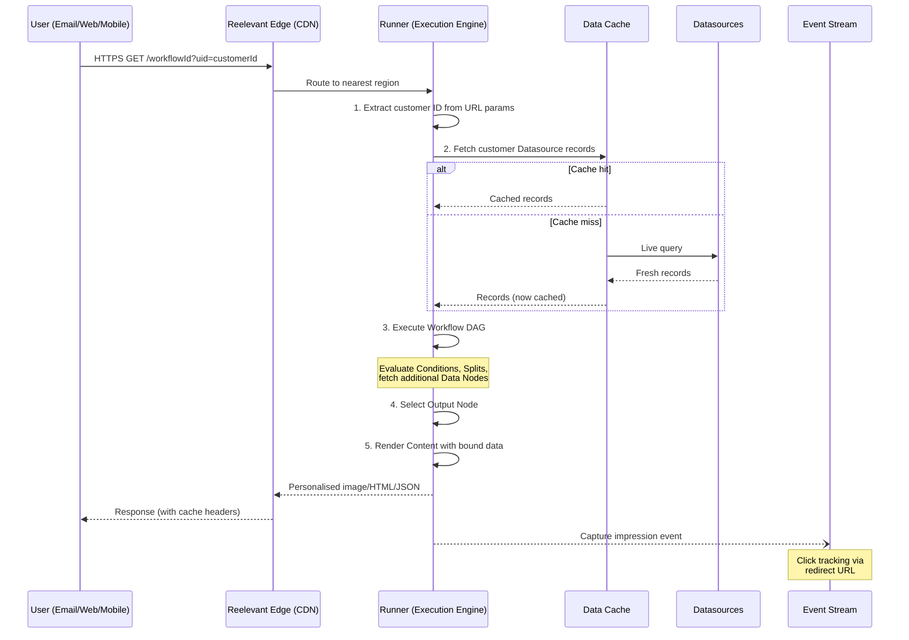

## Cycle de vie d'une requête

Reelevant est le seul **moteur de personnalisation content-first**. Concevez votre Content une seule fois — la plateforme crée des millions de versions individualisées au moment de l'interaction, pas au moment de l'envoi.

Le diagramme de séquence suivant montre le flux de bout en bout, depuis l'ouverture d'un email (ou la visite d'une page) par un utilisateur jusqu'à la réception du Content personnalisé.

## Étapes du cycle de vie en détail

1. **Requête :** Votre ESP/site web/application inclut une URL Reelevant (`https://reelevant.run/{workflowId}?uid={customerId}`). Le client de l'utilisateur la demande.
2. **Routage edge :** Le CDN termine le TLS et route vers la région d'exécution la plus proche.
3. **Identification du client :** L'URL contient un identifiant client (paramètre de requête) associé aux enregistrements de la Datasource. Cet identifiant est public par conception — utilisez des identifiants opaques.
4. **Récupération des données :** Le Runner récupère les données actuelles du client depuis les Datasources connectées (depuis le cache en mémoire avec fallback en direct).
5. **Exécution du Workflow :** Le DAG évalue les Conditions, récupère des données supplémentaires via les Data Nodes, et parcourt les Branches pour sélectionner l'Output Node approprié.
6. **Rendu du Content :** Le Content sélectionné est rendu avec les données individuelles (images produit, prix, offres, texte) et retourné sous forme d'image, HTML ou JSON.
7. **Capture d'événement :** Un événement d'impression est enregistré. Les interactions de clic sont capturées via des URL de redirection pour la logique future du Workflow et l'Analytics.

## Garanties d'infrastructure

| Métrique | Garantie |
|----------|----------|
| Disponibilité | SLA 99,9 % (mesuré mensuellement) |
| Chiffrement des données au repos | AES-256 |
| Chiffrement des données en transit | TLS 1.3 |
| Résidence des données | UE (régions supplémentaires prévues) |
| Débit | 100 M+ rendus de Content personnalisé/mois par client |
| Failover | Multi-région actif-actif |

## Prochaines étapes

<CardGroup cols={2}>
<Card title="Ingestion de données" icon="database" href="/fr/why-reelevant/technical-evaluators/data-ingestion">
Types de sources DataHub et modes d'ingestion.
</Card>
<Card title="Canaux d'intégration" icon="plug" href="/fr/why-reelevant/technical-evaluators/integrations">
Patterns d'intégration email, web, mobile et JSON API.
</Card>
</CardGroup>
