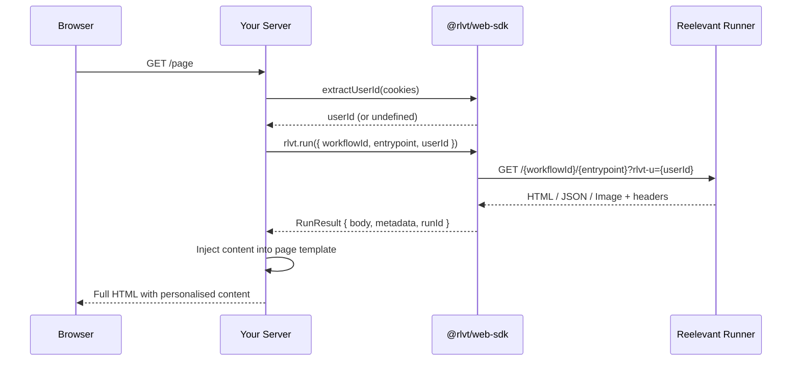

## Installation

```bash
npm install @rlvt/web-sdk
```

The core SDK has zero dependencies and works with any runtime that supports the Web Fetch API (Node.js 18+, Bun, Deno, Cloudflare Workers).

## Client setup

```typescript
import { ReelevantClient } from '@rlvt/web-sdk'

const rlvt = new ReelevantClient({
  // timeout: 5000,        // default: 5000ms
  // fallback: 'empty',    // default: 'empty' — returns empty result on error
})
```

No configuration is required — the SDK defaults to the production runner.

### Configuration options

| Option | Type | Default | Description |
|--------|------|---------|-------------|
| `runnerUrl` | `string` | `https://reelevant.run` | Runner endpoint URL |
| `timeout` | `number` | `5000` | Global timeout in milliseconds |
| `fallback` | `'empty' \| 'error' \| Function` | `'empty'` | What happens when a call fails |

## Fetching personalised content

### Single workflow

```typescript
import { extractUserId } from '@rlvt/web-sdk'

// Extract user identity from cookies
const userId = extractUserId(req.headers.cookie ?? '')

const result = await rlvt.run({
  workflowId: 'your-workflow-id',
  entrypoint: 'hero',
  userId,
  userAgent: req.headers['user-agent'],
  ip: req.headers['x-forwarded-for']?.split(',')[0],
  referer: req.url,
})
```

### Multiple workflows in parallel

```typescript
const [hero, sidebar, footer] = await rlvt.runAll([
  { workflowId: 'wf-hero', entrypoint: 'hero', userId },
  { workflowId: 'wf-sidebar', entrypoint: 'sidebar', userId },
  { workflowId: 'wf-footer', entrypoint: 'footer', userId },
])
```

### Run options

| Option | Type | Description |
|--------|------|-------------|
| `workflowId` | `string` | Workflow ID from the Reelevant dashboard |
| `entrypoint` | `string` | Entrypoint shortId within the workflow |
| `userId` | `string?` | Visitor identity from cookies |
| `params` | `Record<string, string>?` | URL parameters forwarded to the runner |
| `locale` | `string?` | Locale for content resolution |
| `userAgent` | `string?` | Forwarded for device detection |
| `ip` | `string?` | Forwarded for geolocation |
| `referer` | `string?` | Page URL |
| `timeout` | `number?` | Per-call timeout override in ms |

## Handling the response

`run()` returns a `RunResult` with a discriminated union `body`:

```typescript
const result = await rlvt.run({ workflowId: '...', entrypoint: '...' })

switch (result.body.type) {
  case 'html':
    // result.body.content is a string of HTML
    res.send(result.body.content)
    break

  case 'json':
    // result.body.content is a parsed JSON object
    res.json(result.body.content)
    break

  case 'image':
    // result.body.content is an ArrayBuffer
    res.setHeader('Content-Type', 'image/png')
    res.send(Buffer.from(result.body.content))
    break

  case 'empty':
    // No content returned — show your default
    res.send('<div>Default content</div>')
    break
}
```

### RunResult fields

| Field | Type | Description |
|-------|------|-------------|
| `status` | `number` | HTTP status code (0 for fallback) |
| `source` | `'runner' \| 'fallback'` | Where the result came from |
| `body` | `RunContent` | Typed content (see above) |
| `metadata` | `Record<string, unknown>` | Metadata from the output node |
| `properties` | `Record<string, unknown>` | Output properties |
| `runId` | `string \| null` | Workflow run ID for tracking |
| `executionPath` | `string[]` | Branch IDs taken during execution |
| `clickUrl` | `string` | Pre-built click-through URL for tracking clicks |

## Click tracking

Every `RunResult` includes a `clickUrl` — a pre-built URL that, when visited, tells the runner to record a click and redirect the user to the final destination. There are two ways to use it:

### Option 1: Redirect link (recommended for CTAs)

Use `clickUrl` as the `href` on your call-to-action links. When the user clicks, they are redirected through the runner (which records the click) to the final destination.

```typescript
const result = await rlvt.run({ workflowId: 'wf-hero', entrypoint: 'hero', userId })

// In your template
// <a href="${result.clickUrl}">Shop now</a>
```

This is the simplest approach — the browser handles everything. The runner tracks the click and issues a 302 redirect to the target URL.

### Option 2: Server-side fire-and-forget

Use `client.trackClick()` when you control navigation and want to track the click in the background without redirecting through the runner.

```typescript
// User clicked a CTA — track it server-side
await rlvt.trackClick({ clickUrl: result.clickUrl })

// Then redirect the user yourself
res.redirect(destinationUrl)
```

`trackClick()` calls the runner click endpoint with `redirect: manual` (no redirect followed) and swallows all errors — it never throws.

| Option | Type | Default | Description |
|--------|------|---------|-------------|
| `clickUrl` | `string` | *required* | The `clickUrl` from a `RunResult` |
| `timeout` | `number` | Client default | Per-call timeout override in ms |

## Identity helpers

### `extractUserId(cookies)`

Extracts the Reelevant user ID from cookies. Priority: `rlvt_clientId` > `rlvt_tmpId`.

```typescript
import { extractUserId } from '@rlvt/web-sdk'

// From a cookie header string
const userId = extractUserId(req.headers.cookie ?? '')

// From a parsed cookies object
const userId = extractUserId(req.cookies)
```

### `generateTmpId()`

Generates a new anonymous temporary ID, matching the format used by the client-side tracker.

```typescript
import { generateTmpId } from '@rlvt/web-sdk'

const tmpId = generateTmpId()
// Set as rlvt_tmpId cookie on the response
```

## Fallback strategies

Configure how the SDK handles timeouts and errors:

```typescript
// 'empty' (default) — returns an empty result, your page renders normally
const rlvt = new ReelevantClient({ companyId: '...', fallback: 'empty' })

// 'error' — throws the original error, you handle it in your catch block
const rlvt = new ReelevantClient({ companyId: '...', fallback: 'error' })

// Custom function — return your own fallback content
const rlvt = new ReelevantClient({
  companyId: '...',
  fallback: (options, error) => ({
    status: 0,
    source: 'fallback',
    body: { type: 'html', content: '<div>Default banner</div>' },
    metadata: {},
    properties: {},
    runId: null,
    executionPath: [],
  }),
})
```

## Request flow



## Express example

```typescript
import express from 'express'
import { ReelevantClient, extractUserId, generateTmpId } from '@rlvt/web-sdk'

const app = express()
const rlvt = new ReelevantClient()

app.get('/page', async (req, res) => {
  // Ensure identity cookie
  let userId = extractUserId(req.headers.cookie ?? '')
  if (!userId) {
    const tmpId = generateTmpId()
    res.cookie('rlvt_tmpId', tmpId, { maxAge: 365 * 24 * 60 * 60 * 1000 })
    userId = tmpId
  }

  const result = await rlvt.run({
    workflowId: 'wf-hero',
    entrypoint: 'hero',
    userId,
    userAgent: req.headers['user-agent'],
    ip: req.ip,
    referer: req.originalUrl,
  })

  const heroHtml = result.body.type === 'html' ? result.body.content : ''

  res.send(`
    <html>
      <body>
        <div data-rlvt-ssr="true">${heroHtml}</div>
      </body>
    </html>
  `)
})
```

## Constants

The SDK exports commonly used constants:

```typescript
import {
  DEFAULT_RUNNER_URL,   // 'https://reelevant.run'
  DEFAULT_TIMEOUT,      // 5000
  COOKIE_CLIENT_ID,     // 'rlvt_clientId'
  COOKIE_TMP_ID,        // 'rlvt_tmpId'
} from '@rlvt/web-sdk'
```
