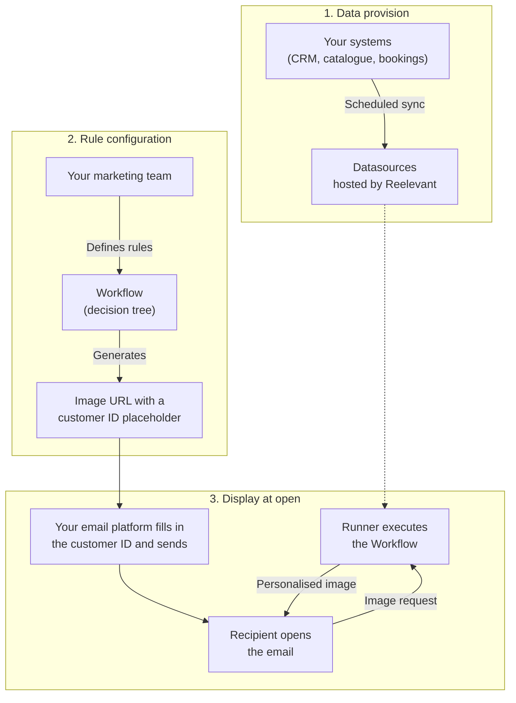
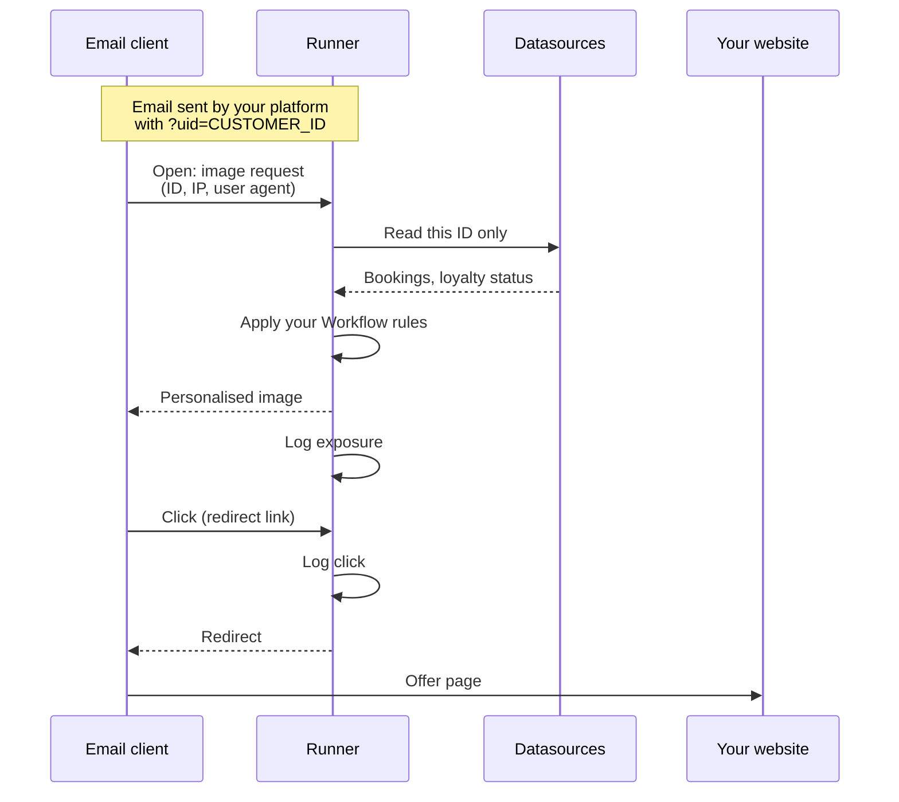
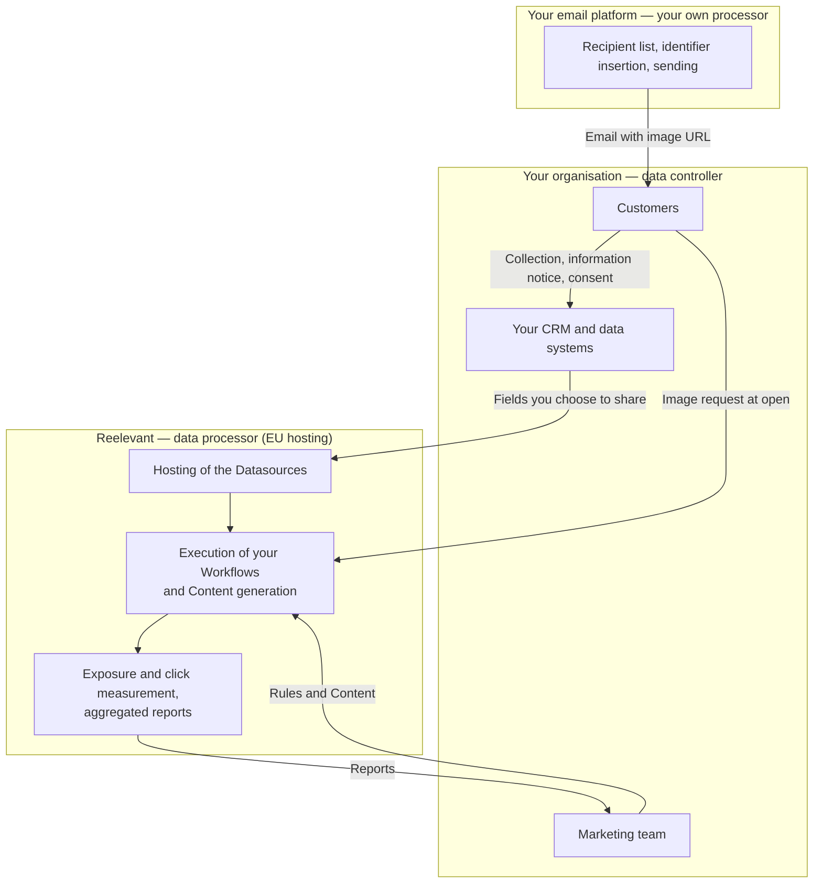
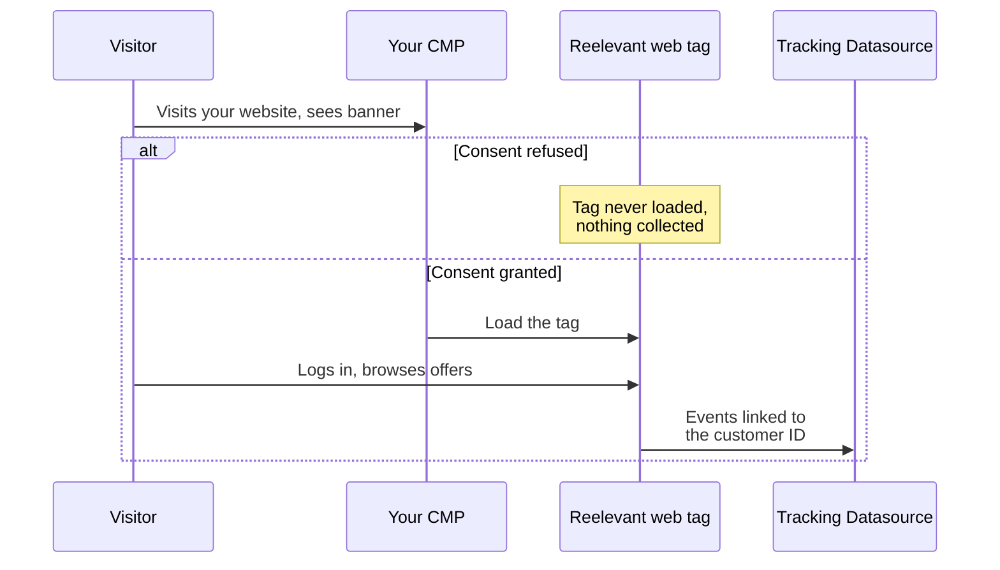

## Reelevant in One Paragraph

Reelevant is a SaaS platform that personalises the marketing Content your organisation already sends — mainly images and blocks inside emails, web pages and apps. Your marketing team defines rules such as "if this customer's last booking was a ski holiday, show winter offers". Reelevant applies those rules to your customer data at the moment the email is opened or the page is viewed, and returns the matching Content.

Reelevant does not send emails, does not own the recipient list, and does not decide on its own what a person sees. It is a tool your teams configure and operate.

<Info>
This page is written for Data Protection Officers, privacy counsel and procurement teams. It explains the mechanics you need to qualify the processing. For certifications, encryption and contractual terms, see [Security & Compliance](/why-reelevant/technical-evaluators/security).
</Info>

## The Three Phases

Personalisation with Reelevant always follows the same three phases.

### 1. Data provision

Your organisation connects its own systems to Reelevant — typically a CRM export, a product or offer catalogue, and a booking or purchase history. Each connection is a Datasource (a dataset synchronised into Reelevant). You choose which fields are sent; only mapped fields are usable in the platform.

Reelevant does not buy, enrich or combine your data with third-party data.

### 2. Rule configuration

Your marketing team builds a Workflow — a decision tree that turns your marketing strategy into rules. A Workflow asks questions of your data ("what was the last destination booked?", "is the customer a loyalty member?") and picks the Content to show for each answer.

The Workflow is a template: it is configured once, before any email is sent, and contains no personal data. Reelevant can help your team set it up, but every rule reflects a decision made by your organisation.

Once the Workflow is ready, the platform generates a URL to paste into the email template. The URL contains a placeholder for the customer identifier. Reelevant does not fill it in.

### 3. Display at open

Your email platform replaces the placeholder with each recipient's identifier and sends the campaign. Reelevant does not know who received the email.

When a recipient opens the email, their email client requests the image. Only then does the Runner (the Reelevant service that executes Workflows) read that customer's data, walk through the decision tree, and return the matching Content. Nothing is pre-computed per person at send time, so the Content reflects the latest data available at the moment of opening.

A click on the Content goes through a Reelevant redirect link, which records the click before sending the recipient to your website.

## Who Does What

| Step | Your organisation | Reelevant | Your email / web platform |
|------|-------------------|-----------|---------------------------|
| Collect customer data | Collects it from customers, under your own legal basis and information notice | Does not collect it | — |
| Send data to Reelevant | Chooses the datasets and fields to share | Hosts the data in the EU | — |
| Define targeting and profiling rules | Decides the rules and the offers to promote | Provides the tool; may assist with configuration on your instructions | — |
| Choose recipients and send the email | Decides who receives what and when | Not involved | Sends the email and inserts the customer identifier |
| Select Content at open | — | Executes your rules automatically for the identifier received | Displays the image returned |
| Measure results | Reads the reports | Records opens and clicks on the Content, computes aggregated results | — |

## Controller and Processor Roles

Reelevant's standard contractual position is that your organisation is the **data controller** and Reelevant is the **data processor** under Article 28 GDPR, for all processing performed through the platform:

- **Hosting** of the data you send to the platform
- **Generation** of the personalised Content when the image or page is requested, by executing the rules you configured
- **Measurement** of exposures and clicks on the Content, and computation of aggregated performance reports
- **Website behaviour collection**, when you choose to deploy the Reelevant web tag (see below)

Reelevant processes personal data only on your documented instructions — the Datasources you connect and the Workflows your teams configure — and never for its own purposes. The Data Processing Agreement (DPA) lists the subprocessors (OVHcloud in France and Google Cloud in Belgium), all located in the EU.

## Profiling

Selecting Content based on a customer's history is a form of profiling within the meaning of Article 4(4) GDPR. With Reelevant:

- **The criteria are yours.** The platform does not infer segments, scores or preferences on its own. Every rule is an explicit condition written by your teams.
- **No artificial intelligence runs on your customer data.** Reelevant does not train or run AI models on customer data.
- **The outcome is marketing Content.** The decision only changes which offer, product or visual is displayed in a communication you already chose to send.

Assessing the legal basis for this profiling, and whether it has significant effects on individuals under Article 22, remains the controller's responsibility. In practice, it is usually covered by the same basis as your existing CRM segmentation and email campaigns.

## Customer Identification

The URL placed in the email carries a customer identifier so that the Runner can find the right data. This identifier:

- Is chosen by you — use an internal, opaque ID (a CRM number or a hashed value), never an email address or a name
- Is inserted by your email platform, not by Reelevant
- Is visible in the email HTML, so it must not reveal anything on its own

When a request arrives, the email client or browser also transmits technical data, such as the IP address and the user agent. Reelevant uses them to serve the request (for example device type, email client or approximate location when a Workflow uses it). Behavioural events store the customer identifier and derived context, not the raw IP address.

## Website Behaviour Collection (Optional)

Some Use Cases rely on what a logged-in customer did on your website, such as abandoned searches or viewed offers. When this data does not already exist in your systems, you can deploy the Reelevant web tag on your website.

| Topic | How it works |
|-------|--------------|
| Who deploys the tag | Your teams, usually through your tag manager |
| Consent | The tag does not read consent itself. You load it only after consent, through your consent management platform (CMP), where Reelevant is listed as a recipient with its purpose |
| Identification | Browsing is linked to a known customer only once they log in and your site passes their identifier |
| Cookies | First-party cookies on your domain: an anonymous device ID (365 days), the known customer ID (180 days), and the ID carried by a Reelevant link (30 days) |
| Retention | 90 days by default in the tracking Datasource |

The alternative is to collect this behaviour in your own analytics stack and share it with Reelevant as a Datasource, like any other dataset. Both approaches are supported. Technical details are in [Website Collection](/developer-docs/data-collection/web).

## What Reelevant Does Not Do

- Send emails, SMS or notifications, or manage recipient lists and opt-outs
- Collect consent — your CMP and your email platform keep that role
- Buy, sell or enrich personal data with third-party sources
- Use your customer data to train models or for any other customer
- Transfer personal data outside the EU

## Next Steps

<CardGroup cols={2}>
<Card title="Description of Processing" icon="file-contract" href="/why-reelevant/data-protection/processing-details">
Purposes, data categories, retention and recipients, ready for your record of processing.
</Card>
<Card title="Security & Compliance" icon="shield-check" href="/why-reelevant/technical-evaluators/security">
SOC 2 Type 2, encryption, DPA commitments, subprocessors and security contact.
</Card>
</CardGroup>
