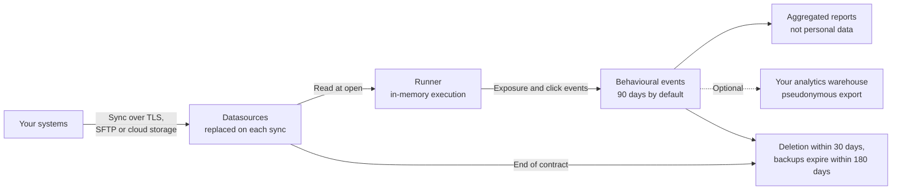

This page describes the processing Reelevant performs as a data processor, in the structure usually expected in a DPA annex or a record of processing activities (Article 30 GDPR). The signed DPA and its annexes prevail over this page.

## Data Lifecycle

## Nature and Purpose

| Item | Description |
|------|-------------|
| **Nature** | Hosting of customer datasets, automated execution of personalisation rules defined by the controller, generation of personalised marketing Content, measurement of exposures and clicks |
| **Purpose** | Display to each recipient the marketing Content selected by the controller's rules, in emails, websites and apps operated by the controller, and measure its performance |
| **Instructions** | The Datasources connected and the Workflows configured by the controller's users in the platform |
| **Duration** | The term of the contract, followed by deletion as described in [Retention](#retention) |

## Data Subjects

- Customers and prospects of the controller who receive its marketing communications
- Visitors of the controller's website or app, when the optional web or mobile collection is deployed
- The controller's own users of the Reelevant platform (account data: name, professional email, role)

## Categories of Personal Data

| Category | Examples | Source |
|----------|----------|--------|
| Identification | Pseudonymous customer identifier (CRM number, hashed value) | Controller's systems and email platform |
| Customer profile | Loyalty status, preferences, language, country — only the fields the controller maps | Controller's Datasources |
| Transaction history | Past bookings or purchases, products, dates, amounts | Controller's Datasources |
| Interaction with the Content | Exposure (open) and click events, Content and Branch displayed, date | Generated by the Runner |
| Technical request data | User agent, device type, email client, referrer, approximate location derived from the IP address | Transmitted by the email client or browser |
| Website behaviour (optional) | Pages and offers viewed, searches, cart and purchase events | Reelevant web or mobile collection, after consent |

No special category data (Article 9) is required by the service. The controller should not map such fields into its Datasources.

<Warning>
Use an opaque identifier in the Content URL. The identifier is visible in the email HTML, in browser history and in logs, so it must never be an email address, a phone number or a name.
</Warning>

## Retention

| Data | Retention |
|------|-----------|
| Datasource records | Replaced on each synchronisation; a record deleted at source stops being processed at the next sync. Record-level erasure is available on demand through [anonymisation](/advanced-guide/datahub/anonymise-customer-records) |
| Behavioural events (exposures, clicks, website events) | 90 days by default, configurable per Datasource |
| Security logs | 1 year, in line with the CNIL recommendation |
| Backups | Encrypted, expire no later than 180 days after deletion |
| End of contract | All personal data deleted within 30 days; a written deletion attestation is provided on request |

## Recipients and Location

| Recipient | Role | Location |
|-----------|------|----------|
| Controller's authorised users | Configure Workflows, read reports | — |
| Reelevant staff | Support, troubleshooting at the controller's request and maintenance — under least privilege, MFA and audit logging | EU |
| OVH SAS (OVHcloud) | Subprocessor — hosting of the platform on dedicated servers | France |
| Google Cloud EMEA Limited | Subprocessor — analytics warehouse holding pseudonymous events and aggregates | Belgium (`europe-west1`) |

No personal data is transferred outside the EU. See [Vendor Management](/why-reelevant/technical-evaluators/security#vendor-management) for the full vendor list.

## Security Measures

A summary of the technical and organisational measures. Full details are on [Security & Compliance](/why-reelevant/technical-evaluators/security) and in the [Trust Centre](https://trust.reelevant.com).

| Area | Measure |
|------|---------|
| Assurance | SOC 2 Type 2 attestation (annual), annual external penetration test |
| Encryption | TLS 1.2+ in transit, AES-256 at rest |
| Access | SAML SSO, TOTP two-factor authentication, role- and Team-based permissions, quarterly access reviews |
| Isolation | Logical tenant isolation; each customer's data scoped to its company and Teams |
| Traceability | In-product audit log, security logs retained 1 year |
| Incidents | Personal data breach notification within 48 hours of detection |

## Data Subject Rights

The controller remains the point of contact for data subjects. Reelevant assists as follows:

| Right | How it is handled |
|-------|-------------------|
| Access and portability | The controller already holds the source data; Reelevant assists on request for the events tied to an identifier |
| Erasure | Delete the record at source, or use [record-level anonymisation](/advanced-guide/datahub/anonymise-customer-records) for immediate effect; events expire with their retention period |
| Objection to marketing and profiling | Handled by the controller's opt-out: a person who no longer receives emails no longer triggers any processing. A Workflow condition can also exclude an identifier |
| Withdrawal of consent (web collection) | Handled by the controller's CMP, which stops loading the Reelevant web tag |

Requests to Reelevant go to [security@reelevant.com](mailto:security@reelevant.com).

## Checklist for the Controller

- Add Reelevant as a processor in your record of processing, with the purposes above
- Mention personalisation of marketing communications and open and click measurement in your privacy notice
- If you deploy the web tag, add Reelevant as a recipient in your CMP and load the tag only after consent
- Choose an opaque customer identifier for the Content URLs
- Map only the fields your Use Cases need in each Datasource

## Documents Available

| Document | Where |
|----------|-------|
| Data Processing Agreement (DPA) and subprocessor list | Provided with the contract |
| SOC 2 Type 2 report, penetration test summary | [Trust Centre](https://trust.reelevant.com), under NDA |
| Security questionnaire / self-assessment | On request to your account team |

## Next Steps

<CardGroup cols={2}>
<Card title="How Reelevant Works for DPOs" icon="scale-balanced" href="/why-reelevant/data-protection/overview">
The three phases, who does what, and the controller and processor roles.
</Card>
<Card title="Security & Compliance" icon="shield-check" href="/why-reelevant/technical-evaluators/security">
Certifications, encryption, access control and incident response.
</Card>
</CardGroup>
