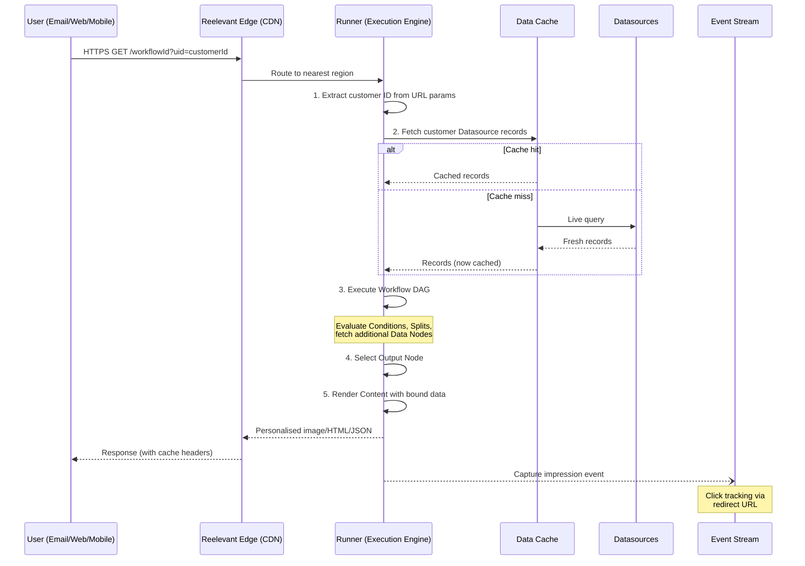

## System Architecture

Reelevant is the only **content-first personalisation engine**. Build Content once — the platform creates millions of individualised versions at the moment of interaction, not at send time.

```
┌─────────────────────────────────────────────────────────────┐
│                     CLIENT (Email / Web / Mobile)            │
│  User interaction → requests Reelevant resource             │
└──────────────────────────────┬──────────────────────────────┘
                               │ HTTPS request
                               ▼
┌─────────────────────────────────────────────────────────────┐
│                    REELEVANT EDGE (CDN)                      │
│  Route to nearest region, TLS 1.3 termination               │
└──────────────────────────────┬──────────────────────────────┘
                               │
                               ▼
┌─────────────────────────────────────────────────────────────┐
│                   RUNNER (Execution Engine)                  │
│                                                             │
│  1. Identify customer (ID from URL params)                  │
│  2. Fetch Datasource records (cache + live fallback)        │
│  3. Execute Workflow DAG (Conditions, Splits, Data Nodes)   │
│  4. Resolve Output Node → render Content                    │
│  5. Return personalised image/HTML/JSON                     │
│                                                             │
│  Availability: 99.9% SLA                                   │
└──────────────────────────────┬──────────────────────────────┘
                               │
                               ▼
┌─────────────────────────────────────────────────────────────┐
│                      DATA LAYER                              │
│                                                             │
│  ┌─────────────┐  ┌──────────────┐  ┌───────────────────┐  │
│  │ Datasources │  │ Workflow      │  │ Event             │  │
│  │ (CRM, Prod, │  │ Definitions  │  │ Stream            │  │
│  │  Stock...)  │  │ (DAG logic)  │  │ (impressions,     │  │
│  └─────────────┘  └──────────────┘  │  clicks, polls)   │  │
│                                      └───────────────────┘  │
└─────────────────────────────────────────────────────────────┘
```

## Request Lifecycle

The following sequence diagram shows the end-to-end flow from a user opening an email (or visiting a page) to receiving personalised Content.



## Lifecycle Steps in Detail

1. **Request:** Your ESP/website/app includes a Reelevant URL (`https://reelevant.run/{workflowId}?uid={customerId}`). The user's client requests it.
2. **Edge routing:** The CDN terminates TLS and routes to the nearest execution region.
3. **Customer identification:** The URL contains a customer identifier (query parameter) mapped to Datasource records. This identifier is public by design — use opaque IDs.
4. **Data retrieval:** The Runner fetches the customer's current data from connected Datasources (from in-memory cache with live fallback).
5. **Workflow execution:** The DAG evaluates Conditions, retrieves additional data via Data Nodes, and traverses Branches to select the appropriate Output Node.
6. **Content rendering:** The selected Content is rendered with individual data (product images, prices, offers, text) and returned as image, HTML, or JSON.
7. **Event capture:** An impression event is recorded. Click interactions are captured via redirect URLs for future Workflow logic and analytics.

## Infrastructure Guarantees

| Metric | Guarantee |
|--------|-----------|
| Availability | 99.9% SLA (measured monthly) |
| Data encryption at rest | AES-256 |
| Data encryption in transit | TLS 1.3 |
| Data residency | EU (primary), configurable |
| Throughput | 100M+ personalised Content renders/month per client |
| Failover | Multi-region active-active |

## Next Steps

<CardGroup cols={2}>
<Card title="Data Ingestion" icon="database" href="/why-reelevant/technical-evaluators/data-ingestion">
DataHub source types and ingestion modes.
</Card>
<Card title="Integration Channels" icon="plug" href="/why-reelevant/technical-evaluators/integrations">
Email, web, mobile, and JSON API patterns.
</Card>
</CardGroup>
